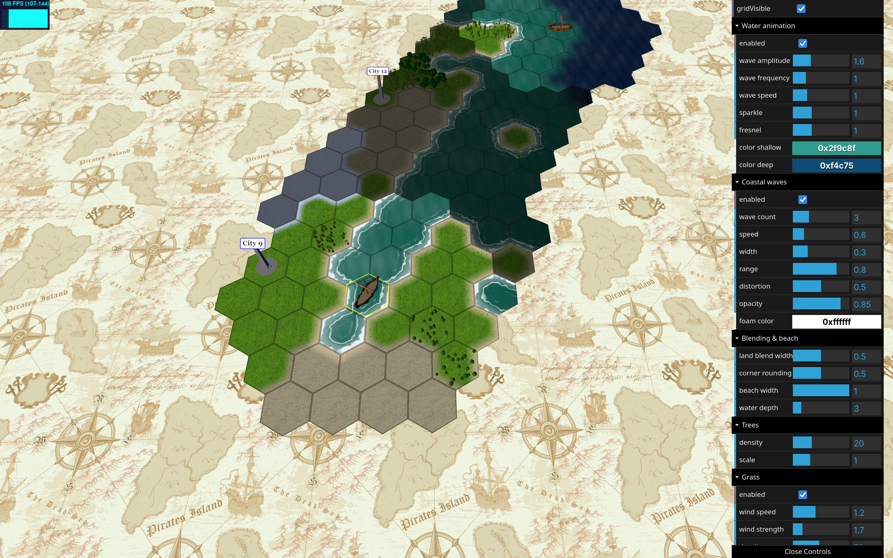

# three-hex-map

[English](README.md) | 简体中文

一个基于 [three.js](https://threejs.org/) 的浏览器端 3D 六边形世界渲染器与
流式世界运行时。项目使用实例化渲染和自定义 Shader 表现《文明》风格地形，
同时通过明确的运行时边界组织世界生成、持久化、寻路和模拟。

本仓库是 [lanyik/lanyik](https://github.com/lanyik/lanyik) 定制分支，源自
[gunyakov/three-hex-map](https://github.com/gunyakov/three-hex-map)。

[更新日志](CHANGELOG.md) · [文档索引](docs/README.md)



## 项目现况

| 范围 | 当前状态 |
|---|---|
| 包版本 | 元数据仍为 `0.5.0`；当前分支还包含更新日志中 **Unreleased** 下的未发布改动 |
| 渲染 | 生产路径为 WebGL2，包含实例化地形、水面和植被、源区块流送、12x12 渲染块和三档 LOD |
| 世界运行时 | 有界静态地图、有限环形流式地图、确定性无限世界和自定义 `WorldSource` 共用 `HexMap.loadWorld()` 入口 |
| 玩法服务 | 稀疏世界增量、可恢复世代存档、分层寻路和与镜头无关的模拟已通过可选子路径提供 |
| 演示 | 有限环形世界、无限世界和持久化战役共用一个页面，模式选择会跨刷新保存 |
| 基础设施 | v1 已冻结；生命周期、所有权、调度、持久化和资源预算合同已有自动化验证 |
| 世界风格 | 生成 v1 现包含大尺度连通海域、确定性粗网格汇流河网、气候雪线、连续地貌和区域森林 |
| 下一阶段 | 在冻结的运行时与地表合同上构建第一批真实玩法和内容系统 |

开发环境要求 Node.js 20 或更高版本；作为库使用时，应用需要提供
`^0.185.0` 的 `three` peer dependency。

## 当前已经具备的能力

- 有界、环形和无限拓扑共用确定性地貌场，包括高度、大陆度、山脊、山谷、
  粗糙度、湿度和温度。
- 地形、水面、草地和 glTF 森林按区块流送，支持距离/视锥剔除、稳定 LOD、
  不透明地平线融合、有界 CPU/GPU 驻留和浮动原点。
- 四向周期地图支持跨接缝渲染、选择、邻居查询、迷雾和最短路径移动。
- 程序化汇流河网、大尺度海域、手工湖泊/河流、连续山体、地表纹理去重复、大气天空、城市、单位和战争迷雾。
- Worker 地形/植被生成、可选 IndexedDB 基础区块缓存，以及稀疏持久化格子覆盖。
- 分页数据驱动小地图，包含有界 Canvas/LRU 缓存、平滑缩放、右键捕获平移、相机位置复位、两圈后台概览预取和明确的目的地确认。
- 按世代取消异步工作、WebGL 上下文恢复、资源计费、队列背压和可观测生命周期释放。
- 可选 `GameEngine`、跨未加载区块的分层寻路、后台世界模拟，以及持久化战役集成切片。
- 中英文演示界面、实时视觉控制和帧、Worker、缓存、驻留状态诊断。

## 运行演示

```bash
git clone https://github.com/lanyik/lanyik.git three-hex-map
cd three-hex-map
npm ci
npm start
```

打开 <http://127.0.0.1:3000>。控制面板提供三种世界模式：

| 模式 | 用途 |
|---|---|
| 有限环形世界 | 由种子和宽高定义，通过 Worker 流送，不需要物化完整地图 |
| 无限世界 | 没有逻辑边界，只保留镜头附近的驻留窗口 |
| 持久化战役 | 在无限流送上组合 IndexedDB 增量、世代存档、分层寻路和镜头外军队模拟 |

模式选择会跨刷新保存。旧的 `?infinite`、`?campaign`、坐标参数和
`?autostart` 仍用于自动化测试和旧书签。

先点击画布，再用 **WASD** 移动；左键选择格子，按住右键拖动旋转镜头，
滚轮缩放。有限/无限模式默认只是世界查看器，只有“持久化战役”会启动集成场景。

## 作为库使用

当前仓库状态领先于 `0.5.0` 发布元数据；需要未发布 API 时，应使用仓库检出
或 workspace 依赖。应用还需要提供一份兼容的 `three`。

### 静态或应用自有地图

```ts
import { HexMap, StaticWorldSource } from "three-hex-map";

const map = new HexMap({
    element: "#world",
    size: 40,
    texturesBaseUrl: "/hex-assets/textures/"
});

await map.loadWorld({
    source: new StaticWorldSource(mapData)
});

map.on("click", ({ x, y, tile }) => console.log(x, y, tile));

// 永久移除画布时：
await map.disposeAsync();
```

`HexMap`、`Unit` 和 `GameEngine` 分别暴露独立的类型化事件映射，事件名会
自动确定 payload 类型；没有监听器的 `error` 事件会直接抛出，不会静默丢失。
详见[事件契约](docs/event-contracts.md)。

`await map.load(mapData)` 仍是有限 `StaticWorldSource` 的兼容包装。
`loadWorld()` 是所有数据源的推荐入口；地图被替换或销毁前，该会话拥有传入的数据源。

### 流式程序化世界

```ts
import { HexMap, ProceduralWorldSource } from "three-hex-map";
import {
    IndexedDbWorldChunkCache,
    IndexedDbWorldDeltaStore
} from "three-hex-map/persistence";

const map = new HexMap({ element: "#world", texturesBaseUrl: "/hex-assets/textures/" });
const source = new ProceduralWorldSource({
    seed: "endless-continent",
    workerUrl: "/hex-assets/world-generator.worker.mjs",
    workerCount: 4,
    chunkSize: 24,
    cache: new IndexedDbWorldChunkCache(),
    deltaStore: new IndexedDbWorldDeltaStore()
});

await map.loadWorld({
    source,
    initialTile: { x: 0, y: 0 },
    loadRadius: 2,
    retentionRadius: 3,
    frameBudgetMs: 3,
    maxMountsPerFrame: 2
});

await map.setTileOverride(12, -4, {
    city: { name: "Outpost", model: "Assets/models/monument" }
});
await source.flushDeltas();
```

持久化实现只存在于可选的 `persistence` 子路径中。通过数据源 options
传入的存储由该数据源持有并随之释放；构造器 dependencies 注入仅用于
调用方持有的资源和测试替身。

包通过 `three-hex-map/world-generator.worker` 导出
`dist/world-generator.worker.mjs`。需要让构建或资源流水线发布这个模块，
再把公开 URL 传给数据源。源区块默认大小为 24，可接受 1–128 的整数；
渲染器会独立把驻留内容分成固定的 12x12 渲染块。

需要有限周期边界时使用 `ToroidalWorldSource`。其宽度必须为偶数，宽高范围为
8–512。HTTP、编辑器、IndexedDB 或服务器权威数据可以直接实现 `WorldSource`。

### 包入口

| 导入路径 | 职责 |
|---|---|
| `three-hex-map` | `HexMap`、`GameEngine`、世界数据源、流送、运行时所有权和核心工具 |
| `three-hex-map/persistence` | 基础区块缓存、稀疏世界增量和可恢复存档 |
| `three-hex-map/pathfinding` | 带版本的导航摘要和分层寻路 |
| `three-hex-map/simulation` | 与镜头无关的区块模拟、快照存储和军队行军 |
| `three-hex-map/world-generator.worker` | 程序化数据源使用的浏览器模块 Worker |

## 地图数据与编辑

`StaticWorldSource` 和 `GameEngine.init()` 接收 `MapInfo` 对象。完整样例见
[public/gameInfo/map.json](public/gameInfo/map.json)。

```jsonc
{
  "w": 40,
  "h": 34,
  "wrapX": true,
  "wrapY": true,
  "data": {
    "0": {
      "0": {
        "type": "land",
        "modifiers": ["wood", "river"],
        "treeModel": "Assets/models/oak",
        "city": { "name": "Rome", "model": "Assets/models/monument" }
      }
    }
  }
}
```

内置地形值为 `sea`、`coastal`、`land`、`sand`、`tundra` 和 `snow`；
内置修饰符包括 `hill`、`wood`、`river` 和 `lake`，自定义图层仍可使用其他字符串。

可变程序化数据源保持基础生成地形不可变，只保存稀疏坐标覆盖。应通过
`HexMap` 的 `setTileOverride()`、`setTileOverrides()` 和
`clearTileOverride()` 修改数据，使驻留画面同步刷新。

构造和世界加载配置统一定义在
[src/HexMapOptions.ts](src/HexMapOptions.ts)。演示控制面板最适合查看实时 Shader、
水面、植被、LOD、缓存和自适应流送参数。

## 可选游戏循环

`GameEngine` 继续提供单位选择、移动和单位视野驱动的战争迷雾：

```ts
import { GameEngine } from "three-hex-map";

const game = new GameEngine({ element: "#world", fogOfWar: true });
await game.init(mapData, unitsData);
game.on("end_move", event => console.log("arrived", event));

// 稍后：
game.dispose();
```

它是兼容玩法层，不是一套完整的《文明》规则。新的大型世界玩法应把权威状态放在
持久化、寻路和模拟服务中，而不是让状态依赖镜头附近的渲染驻留。

## 开发与验证

| 命令 | 作用 |
|---|---|
| `npm run build:lib` | 在 `dist/` 生成 ESM、CJS、全局包和类型声明 |
| `npm run build` | 构建库，并把可运行演示资源复制到 `public/` |
| `npm run server` | 不重新构建，直接在 3000 端口提供 `public/` |
| `npm start` | 构建后启动演示服务器 |
| `npm test` | 运行确定性的 Vitest 合同与稳定性测试 |
| `npm run typecheck` | 仅执行 TypeScript 检查，不输出文件 |
| `npm run test:e2e` | 构建并运行 Chromium 集成测试；普通运行跳过可选 soak |
| `npm run test:soak` | 按 `FOUNDATION_SOAK_ITERATIONS` 运行替换/资源 soak |
| `npm run benchmark:check` | 构建并执行热路径回归阈值检查 |
| `npm run check:generated` | 重建并验证 `public/js` 中提交的生成物 |

普通改动应通过：

```bash
npm test
npm run typecheck
npm run build
npm run test:e2e
```

涉及生命周期、Worker、WebGL 恢复、调度、驻留或资源计费的改动还必须运行
500 次 soak。准确策略和 CI 行为见 [docs/testing.md](docs/testing.md)。

## 文档与路线

[文档索引](docs/README.md) 已按当前架构、冻结合同、专项说明、技术决策和未来设计分类。

当前有意保留的边界：

- [世界风格生成 v1](docs/world-style-generation-v1.md) 已包含大尺度海域与粗网格汇流修订。
- WebGPU/GPU culling 仍保持延后；自动河流门槛已依据记录证据和设计决策转为实现，
  详见[机器校验的优化门槛](docs/optimization-gates.md)。
- 多人冲突合并、云存档、服务器权威状态以及完整经济/战斗规则属于应用层工作，
  不是当前库能力。

## 致谢与许可证

- 原始项目：[gunyakov/three-hex-map](https://github.com/gunyakov/three-hex-map)。
- 灵感来源：[threejs-hex-map](https://github.com/Bunkerbewohner/threejs-hex-map)。
- 旧版局部寻路源自 weixiaofan 的
  [hexpath](https://github.com/weixiaofan/hexpath)，后续已针对 TypeScript、
  地形限制和环形地图重构。

项目采用 [Mozilla Public License 2.0](LICENSE)。
