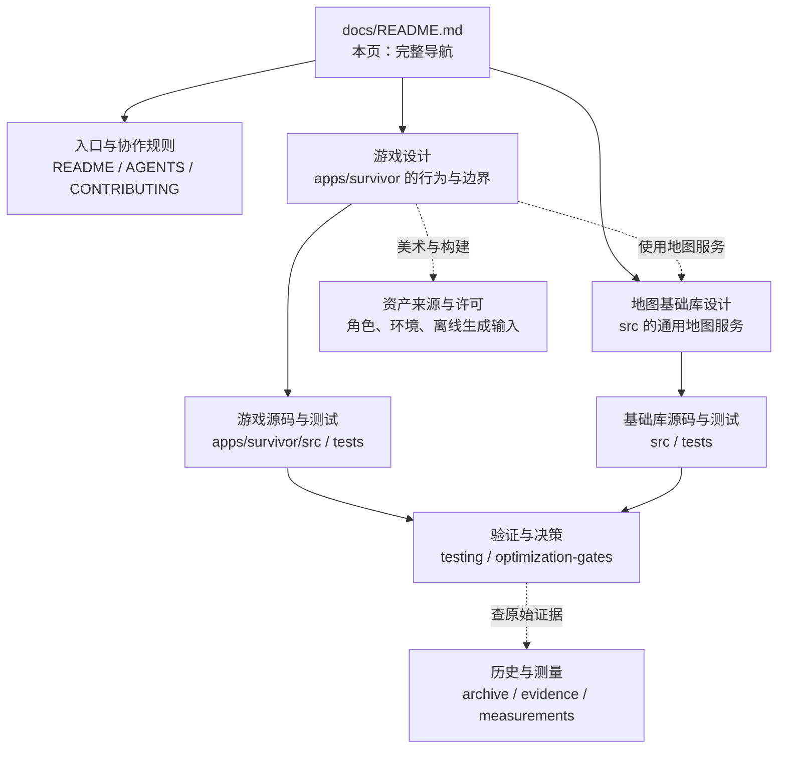
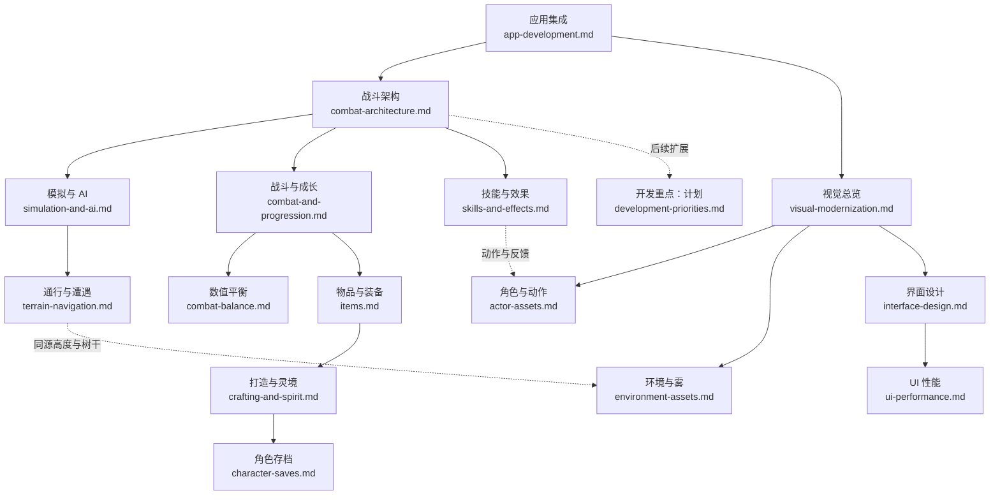
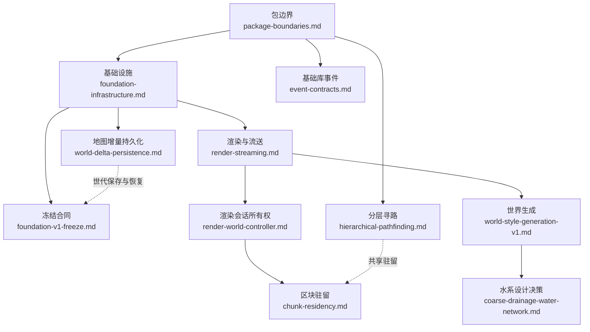

# 项目文档总导航

**找设计只需从这一页开始。** 本页列出项目维护的全部 Markdown 文档、原始测量入口和主要源码位置，可以直接打开具体文件。子目录 README 是局部速查，不是必须逐页经过的阅读关卡。

页内直达：[总关系图](#overview) · [各入口做什么](#entrypoints) · [按任务阅读](#routes) · [游戏设计](#game) · [地图基础库](#foundation) · [验证与性能决策](#verification) · [历史与测量](#evidence) · [资产来源与许可](#assets) · [维护规则](#maintenance)

“合同”指**当前实现必须遵守的规则与边界**。未来计划、旧调研和历史测量会单独标出，不能把它们当成已实现能力。

## 1. 总关系图

图中的实线表示内容归属或主要阅读方向，虚线表示按需参考，**不是代码调用关系，也不是要求把所有文档顺序读完**。每张图下方都有可直接打开的文件链接；阅读器未渲染 Mermaid 时也可以直接使用表格。

仓库有两个实现层：**Survivor 游戏**拥有战斗、物品、成长和角色存档；**three-hex-map 基础库**提供地形、渲染、加载、通用持久化与寻路服务。基础库提供一种能力，不代表游戏已经接入对应玩法。

## 2. 各入口到底做什么

| 文件，点击直达 | 回答的问题 | 什么时候读 |
|---|---|---|
| [README.zh-CN.md](../README.zh-CN.md) / [README.md](../README.md) | 项目是什么、如何安装运行、公开 API 怎么用 | 初次运行或作为库使用；两者分别为中文和英文入口 |
| [AGENTS.md](../AGENTS.md) | 开发必须遵守哪些项目约束 | 开始开发前；五条项目要求是约束 |
| [CONTRIBUTING.md](../CONTRIBUTING.md) | 如何修改、清理、同步文档和提交 | 开发与评审；这里放工作规则，不定义战斗规则 |
| [游戏想法.md](../游戏想法.md) | 玩家体验与当前玩法范围是什么 | 了解产品；具体数值和实现边界读领域设计 |
| [docs/game/README.md](game/README.md) | 只看游戏时有哪些设计 | 游戏局部速查；完整内容已列在本页[游戏章节](#game) |
| [apps/survivor/README.md](../apps/survivor/README.md) | 游戏怎样启动、各源码目录负责什么 | 查应用分层和构建；本页也提供主要源码直达链接 |
| [src/README.md](../src/README.md) | 基础库各目录由哪份设计约束 | 查基础库分层；完整设计见本页[基础库章节](#foundation) |
| [CHANGELOG.md](../CHANGELOG.md) | 已发布版本发生过哪些变化 | 查发布历史；当前行为以设计和代码为准 |

## 3. 按这次任务选择阅读链

开发前遵守 [AGENTS](../AGENTS.md) 和 [CONTRIBUTING](../CONTRIBUTING.md)。之后从下表选一行，直接读具体设计和代码，完成后按[验证矩阵](testing.md#change-based-local-validation)检查。箭头后的补充设计只在涉及该边界时阅读。

| 要做的事 | 主要设计 → 需要联动的设计 | 代码起点 |
|---|---|---|
| 技能树、Buff、被动、伤害效果 | [战斗架构](game/combat-architecture.md) → [技能与效果](game/skills-and-effects.md)、[战斗与成长](game/combat-and-progression.md)；范围与顺序见[开发重点](game/development-priorities.md) | [StatusSystem](../apps/survivor/src/core/StatusSystem.ts)、[SkillSystem](../apps/survivor/src/core/SkillSystem.ts)、[CombatResolution](../apps/survivor/src/core/CombatResolution.ts) |
| 装备、套装、连携与构筑 | [物品合同](game/items.md) → [打造与灵境](game/crafting-and-spirit.md)、[战斗架构](game/combat-architecture.md) | [Equipment](../apps/survivor/src/core/Equipment.ts)、[Crafting](../apps/survivor/src/core/Crafting.ts)；套装/连携尚未完整实现 |
| 怪物行为、攻击节奏与难度 | [模拟与 AI](game/simulation-and-ai.md) → [数值平衡](game/combat-balance.md)、[技能与效果](game/skills-and-effects.md) | [EnemyBehavior](../apps/survivor/src/core/EnemyBehavior.ts)、[EnemyDefinitions](../apps/survivor/src/core/EnemyDefinitions.ts)、[EnemyActions](../apps/survivor/src/core/EnemyActions.ts) |
| 任务、剧情、据点长期进度 | [开发重点](game/development-priorities.md) → [战斗架构](game/combat-architecture.md)、[角色存档](game/character-saves.md) | 现有接点：[CombatEvents](../apps/survivor/src/core/CombatEvents.ts)、[CharacterCheckpoint](../apps/survivor/src/core/CharacterCheckpoint.ts)；任务/剧情系统尚未实现 |
| 卡坡、树林碰撞、刷怪落点 | [地形通行](game/terrain-navigation.md) → 改高度/水系时读[世界生成](world-style-generation-v1.md)，改 AI 时读[模拟与 AI](game/simulation-and-ai.md) | [SurfaceMotion](../apps/survivor/src/core/SurfaceMotion.ts)、[EncounterNavigation](../apps/survivor/src/core/EncounterNavigation.ts)、[ProceduralCombatTerrain](../apps/survivor/src/adapters/ProceduralCombatTerrain.ts) |
| 背包、HUD、快捷键与卡顿 | [界面设计](game/interface-design.md) → [UI 性能](game/ui-performance.md)、[应用集成](app-development.md)；改物品行为时读[物品合同](game/items.md) | [App](../apps/survivor/src/presentation/App.tsx)、[VirtualItemGrid](../apps/survivor/src/presentation/VirtualItemGrid.tsx)、[CombatSession](../apps/survivor/src/app/CombatSession.ts) |
| 模型、动作、树木、天空与雾 | [视觉总览](game/visual-modernization.md) → [角色资产](game/actor-assets.md)或[环境资产](game/environment-assets.md)；特效读[技能与效果](game/skills-and-effects.md) | [ActorModels](../apps/survivor/src/presentation/ActorModels.ts)、[CombatEnvironment](../apps/survivor/src/adapters/CombatEnvironment.ts)、[着色器](../src/shaders/) |
| 地图库 API、加载、恢复与资源释放 | [包边界](package-boundaries.md) → [基础设施](foundation-infrastructure.md)、[冻结合同](foundation-v1-freeze.md) → [对应专项](#foundation) | [HexMap](../src/HexMap.ts)、[runtime](../src/runtime/)、[rendering](../src/rendering/) |

例：做 Buff 刷新规则，先读战斗架构中的[状态合同](game/combat-architecture.md#状态合同)，查看 `StatusSystem` 及测试，再检查技能消费者；不需要先阅读资产调研、基础库寻路和所有历史测量。

## 4. 游戏设计的完整链路

先看应用和战斗的所有权，再按任务进入玩法或表现分支。图中**开发重点**包含后续计划；其他设计也会明确列出各自尚未实现的边界。

### 游戏合同与代码直达

| 设计文件 | 主要负责什么 | 实现入口 |
|---|---|---|
| [app-development.md](app-development.md) | 会话、主线程/Worker 边界、输入、暂停、快照、生命周期和诊断 | [CombatSession](../apps/survivor/src/app/CombatSession.ts)、[CombatWorkerHost](../apps/survivor/src/worker/CombatWorkerHost.ts)、[bootstrap](../apps/survivor/src/app/bootstrap.tsx) |
| [combat-architecture.md](game/combat-architecture.md) | 结算、实际生命提交、状态、奖励、表现分离；后续领域接入边界 | [CombatResolution](../apps/survivor/src/core/CombatResolution.ts)、[CombatVitality](../apps/survivor/src/core/CombatVitality.ts)、[CombatEvents](../apps/survivor/src/core/CombatEvents.ts)、[StatusSystem](../apps/survivor/src/core/StatusSystem.ts) |
| [simulation-and-ai.md](game/simulation-and-ai.md) | ECS 身份、固定步骤、AI、行动中断、查询线程与性能预算 | [EntityWorld](../apps/survivor/src/core/EntityWorld.ts)、[CombatWorld](../apps/survivor/src/core/CombatWorld.ts)、[EnemyBehavior](../apps/survivor/src/core/EnemyBehavior.ts)、[worker](../apps/survivor/src/worker/) |
| [combat-and-progression.md](game/combat-and-progression.md) | 当前战斗循环、区域人口、经验、属性、奖励和容量 | [CombatSimulation](../apps/survivor/src/core/CombatSimulation.ts)、[CombatStats](../apps/survivor/src/core/CombatStats.ts)、[RegionalWorld](../apps/survivor/src/core/RegionalWorld.ts)、[CombatRewards](../apps/survivor/src/core/CombatRewards.ts) |
| [combat-balance.md](game/combat-balance.md) | 参考装备、承伤与击杀时间的数值期望及校准局限 | [EnemyDefinitions](../apps/survivor/src/core/EnemyDefinitions.ts)、[CombatBalance 测试](../apps/survivor/tests/CombatBalance.test.ts)、[报告脚本](../scripts/report-combat-balance.mjs) |
| [skills-and-effects.md](game/skills-and-effects.md) | 技能装配、等级、释放、怪物攻击特性、特效与飘字 | [SkillSystem](../apps/survivor/src/core/SkillSystem.ts)、[EnemyActions](../apps/survivor/src/core/EnemyActions.ts)、[CombatFeedback](../apps/survivor/src/core/CombatFeedback.ts)、[SkillEffects](../apps/survivor/src/presentation/SkillEffects.ts) |
| [items.md](game/items.md) | 道具身份、背包、穿戴、比较、堆叠、拾取与地面表现 | [InventoryItem](../apps/survivor/src/core/InventoryItem.ts)、[Inventory](../apps/survivor/src/core/Inventory.ts)、[EquipmentEvaluation](../apps/survivor/src/core/EquipmentEvaluation.ts) |
| [crafting-and-spirit.md](game/crafting-and-spirit.md) | 词条、宝珠、回收、打造事务和永久灵境成长 | [Crafting](../apps/survivor/src/core/Crafting.ts)、[Orbs](../apps/survivor/src/core/Orbs.ts)、[Recycling](../apps/survivor/src/core/Recycling.ts)、[SpiritRealm](../apps/survivor/src/core/SpiritRealm.ts) |
| [character-saves.md](game/character-saves.md) | 角色检查点、自动/手动槽、灵境独立存储及读档重建边界 | [CharacterCheckpoint](../apps/survivor/src/core/CharacterCheckpoint.ts)、[CharacterRepository](../apps/survivor/src/app/CharacterRepository.ts)、[SpiritRepository](../apps/survivor/src/worker/SpiritRepository.ts) |
| [terrain-navigation.md](game/terrain-navigation.md) | 坡度、水体、树干、滑移、攻击遮挡、营地落点与可达性 | [CombatTerrain](../apps/survivor/src/core/CombatTerrain.ts)、[SurfaceMotion](../apps/survivor/src/core/SurfaceMotion.ts)、[EncounterNavigation](../apps/survivor/src/core/EncounterNavigation.ts) |
| [interface-design.md](game/interface-design.md) | HUD 与页面职责、背包/技能交互、快捷键、窄屏布局 | [presentation](../apps/survivor/src/presentation/)、[app.css](../apps/survivor/src/presentation/app.css) |
| [ui-performance.md](game/ui-performance.md) | 快照分支复用、虚拟网格、UI 实测方法与局限 | [ShareSnapshot](../apps/survivor/src/app/ShareSnapshot.ts)、[VirtualItemGrid](../apps/survivor/src/presentation/VirtualItemGrid.tsx)、[UI 基准](../scripts/benchmark-survivor-ui.mjs) |
| [visual-modernization.md](game/visual-modernization.md) | 当前免费美术方向、整体效果和不足 | 具体实现分别由下两份资产合同及界面合同定义 |
| [actor-assets.md](game/actor-assets.md) | 角色来源、动作烘焙、手部轨迹、材质、实例池和预算 | [ActorModels](../apps/survivor/src/presentation/ActorModels.ts)、[ActorPose](../apps/survivor/src/presentation/ActorPose.ts)、[角色生成](../scripts/lib/survivor-actors.mjs) |
| [environment-assets.md](game/environment-assets.md) | 树木、地表材质、天空、雾、前景透视及离线构建 | [CombatEnvironment](../apps/survivor/src/adapters/CombatEnvironment.ts)、[环境生成](../scripts/lib/survivor-environment.mjs)、[渲染模块](../src/rendering/) |
| [development-priorities.md](game/development-priorities.md) | **计划**：现有基础、未完成能力、建议顺序与验收方向 | 不对应一个“已实现功能”模块；实现后同步相应领域合同 |

游戏单元测试在 [apps/survivor/tests](../apps/survivor/tests/)，浏览器集成测试在 [tests/e2e](../apps/survivor/tests/e2e/)。具体需要运行哪些检查直接看[验证矩阵](testing.md#change-based-local-validation)。

## 5. 地图基础库的完整链路

先确认公开 API 与所有权，再进入专项。**冻结合同仍有效**；它约束后续扩展，不属于过期历史。

| 设计文件 | 主要负责什么 | 实现入口 |
|---|---|---|
| [package-boundaries.md](package-boundaries.md) | 主入口、可选持久化/寻路子路径、依赖和构建边界 | [index.ts](../src/index.ts)、[persistence.ts](../src/persistence.ts)、[pathfinding.ts](../src/pathfinding.ts)、[package.json](../package.json) |
| [foundation-infrastructure.md](foundation-infrastructure.md) | 生命周期、取消、恢复、任务调度、资源预算和持久化所有权 | [runtime](../src/runtime/)、[persistence](../src/persistence/)、[HexMap](../src/HexMap.ts) |
| [foundation-v1-freeze.md](foundation-v1-freeze.md) | 已冻结的版本、生成协议、世代检查点、资源所有权与验收边界 | [WorldGeneratorVersion](../src/world/WorldGeneratorVersion.ts)、[GenerationCheckpointCoordinator](../src/persistence/GenerationCheckpointCoordinator.ts) |
| [event-contracts.md](event-contracts.md) | HexMap、Unit、GameEngine 的类型化事件与同步派发错误语义 | [EventEmitter](../src/EventEmitter.ts)、[EventMaps](../src/EventMaps.ts)、[gameengine](../src/gameengine.ts) |
| [render-streaming.md](render-streaming.md) | 源区块到渲染区块的全流程、Worker、LOD、缓存和编辑 | [WorldSource](../src/world/WorldSource.ts)、[WorldStreamer](../src/world/WorldStreamer.ts)、[WorldChunkScheduler](../src/rendering/WorldChunkScheduler.ts) |
| [render-world-controller.md](render-world-controller.md) | 一次地图渲染会话的创建、切换、关闭和资源归属 | [RenderWorldController](../src/rendering/RenderWorldController.ts) |
| [chunk-residency.md](chunk-residency.md) | 渲染、导航和应用消费者共享区块租约及驻留 | [ChunkResidencyCoordinator](../src/world/ChunkResidencyCoordinator.ts) |
| [world-style-generation-v1.md](world-style-generation-v1.md) | 地形、水系、植被、表面权威与风格验收 | [LandformSampler](../src/world/LandformSampler.ts)、[WorldSurfaceResolver](../src/world/WorldSurfaceResolver.ts)、[generateWorldChunk](../src/world/generateWorldChunk.ts) |
| [coarse-drainage-water-network.md](decisions/coarse-drainage-water-network.md) | **有效设计决策**：采用粗网格排水与独立水体场的理由和边界 | [WorldWaterSampler](../src/world/WorldWaterSampler.ts) |
| [world-delta-persistence.md](world-delta-persistence.md) | 可重建地形之外的稀疏覆盖、批量修改、版本与保存 | [WorldDeltaStore](../src/world/WorldDeltaStore.ts)、[WorldEditingFacade](../src/world/WorldEditingFacade.ts) |
| [hierarchical-pathfinding.md](hierarchical-pathfinding.md) | 跨未加载区块的通用分层寻路服务 | [HierarchicalPathfinder](../src/world/HierarchicalPathfinder.ts)、[寻路子入口](../src/pathfinding.ts) |

### 容易混淆的三组边界

| 游戏侧 | 基础库侧 | 如何区分 |
|---|---|---|
| [战斗事实流](game/combat-architecture.md) | [基础库事件](event-contracts.md) | 战斗结算事实与 HexMap/Unit/GameEngine 通知各自有所有权和消费者 |
| [角色存档](game/character-saves.md) | [地图增量](world-delta-persistence.md) | 保存角色不等于保存全战场；基础库增量也不自动保存游戏任务 |
| [地形通行](game/terrain-navigation.md) | [分层寻路](hierarchical-pathfinding.md) | 碰撞、局部滑移和遭遇可达性不等于游戏已经有逐怪完整路径搜索 |

## 6. 验证与性能决策

所有改动都从[变更验证矩阵](testing.md#change-based-local-validation)选择检查；只有需要解释旧结果或讨论新优化时，才继续查证据和决策。

| 文件 | 用途 | 接续入口 |
|---|---|---|
| [testing.md](testing.md) | 单元、类型、浏览器、soak、基准的触发条件与执行顺序 | [CI 配置](../.github/workflows/ci.yml)、[npm 命令](../package.json)、[文档检查脚本](../scripts/check-docs.mjs) |
| [optimization-gates.md](optimization-gates.md) | 延后优化的触发条件、审批状态和证据要求 | [结构化登记](optimization-gates.json)、[校验脚本](../scripts/check-optimization-gates.mjs)、[证据](#evidence) |
| [render-backend-evaluation.md](render-backend-evaluation.md) | WebGL2、WebGPU 与 GPU 裁剪的当前取舍 | [后端测量脚本](../scripts/benchmark-render-backends.mjs)、[优化门槛](optimization-gates.md) |

性能规则分别属于[模拟与 AI](game/simulation-and-ai.md)、[地形通行](game/terrain-navigation.md)、[UI 性能](game/ui-performance.md)及基础库合同。**历史测量不是当前版本的通过证明；Node CPU 耗时也不是浏览器帧率。**

## 7. 历史、测量与原始证据

这里集中列出证据，避免为了打开一个 JSON 先经过数份 README。三个子索引仅供在对应目录工作时快速查阅。

### 历史与基础库证据

| 文件 | 性质与对应的当前设计 |
|---|---|
| [archive/README.md](archive/README.md) | 历史归档局部索引 |
| [2026-09-08-actor-art-research.md](archive/2026-09-08-actor-art-research.md) | **历史调研**：早期候选及当时的价格/许可范围；当前方案读[角色资产](game/actor-assets.md)与[视觉总览](game/visual-modernization.md) |
| [evidence/README.md](evidence/README.md) | 基础库证据局部索引 |
| [user-observation.md](evidence/automatic-river-generation/user-observation.md) | 历史河流问题观察；当前规则读[世界生成](world-style-generation-v1.md) |
| [natural-course-followup.md](evidence/automatic-river-generation/natural-course-followup.md) | 河道和概览改进的历史跟进；当前决策读[水系设计](decisions/coarse-drainage-water-network.md) |
| [2026-09-04.json](evidence/automatic-river-generation/2026-09-04.json) | 自动河流优化门槛的结构化证据；状态归[优化门槛](optimization-gates.md) |

### 游戏原始测量

局部索引：[game/measurements/README.md](game/measurements/README.md)。各记录保留原始环境和场景，人口规模、冷启动、生命恢复策略及采样时间可能不同。

| 原始记录 | 测量阶段与当前合同 |
|---|---|
| [combat-architecture-node.json](game/measurements/combat-architecture-node.json)、[combat-architecture-replay.json](game/measurements/combat-architecture-replay.json) | 结算拆分后的 CPU 与固定种子回放 → [战斗架构](game/combat-architecture.md) |
| [attack-encounters-node.json](game/measurements/attack-encounters-node.json)、[attack-encounters-workers-node.json](game/measurements/attack-encounters-workers-node.json) | 攻击遮挡/遭遇布局阶段的模拟和弹道查询 → [地形通行](game/terrain-navigation.md) |
| [combat-balance.json](game/measurements/combat-balance.json) | 参考装备下的数值矩阵 → [数值平衡](game/combat-balance.md) |
| [horizon-damage-browser.json](game/measurements/horizon-damage-browser.json)、[horizon-balance-node.json](game/measurements/horizon-balance-node.json) | 远景、飘字阶段的浏览器和 CPU 测量 → [环境资产](game/environment-assets.md)、[技能与效果](game/skills-and-effects.md) |
| [enemy-view-node.json](game/measurements/enemy-view-node.json)、[enemy-view-workers-node.json](game/measurements/enemy-view-workers-node.json) | 怪物视距阶段的 CPU 与查询测量 → [模拟与 AI](game/simulation-and-ai.md) |
| [skills-node.json](game/measurements/skills-node.json)、[patrol-node.json](game/measurements/patrol-node.json)、[spatial-node.json](game/measurements/spatial-node.json) | 技能、巡逻、空间查询阶段 → [技能与效果](game/skills-and-effects.md)、[模拟与 AI](game/simulation-and-ai.md) |
| [workers-node.json](game/measurements/workers-node.json)、[review-node.json](game/measurements/review-node.json) | 早期线程与项目复核 → [应用集成](app-development.md)、[模拟与 AI](game/simulation-and-ai.md) |

## 8. 资产来源与许可

| 文件 | 用途与边界 |
|---|---|
| [LICENSE](../LICENSE) | 项目代码许可；不替代各素材包自带许可 |
| [scripts/vendor/README.md](../scripts/vendor/README.md) | EZ-Tree 离线生成器固定版本与复现方式；[上游许可](../scripts/vendor/ez-tree-LICENSE.txt) |
| [texture-attribution.md](../apps/survivor/assets/environment/texture-attribution.md) | 环境资源保留的上游纹理归属记录，不是游戏当前全部加载纹理清单 |
| [actor-assets.md](game/actor-assets.md)、[environment-assets.md](game/environment-assets.md) | 当前采用的输入、处理流程与许可边界；源文件在[游戏 assets](../apps/survivor/assets/) |

## 9. 维护这张导航

- 新增、移动或删除项目文档时，更新本页对应分类的**直达链接**；改变阅读关系时同步图。局部目录入口继续提供就近速查。
- 每份设计正文顶部提供“总导航 → 所属章节”的返回路径。相关设计链接用于跨边界阅读，不要求先跳回另一份索引。
- 规则只在所属设计里维护；本页维护用途、关系和实现位置。未来计划归开发重点，历史调研归 archive，原始测量保留条件与局限。
- 运行 `npm run check:docs` 和 `git diff --check`。前者检查本地链接、标题锚点和 `docs/` 可达性；Mermaid 图、全量直达目录与代码语义仍需对照复核。具体维护要求见 [CONTRIBUTING](../CONTRIBUTING.md)。
