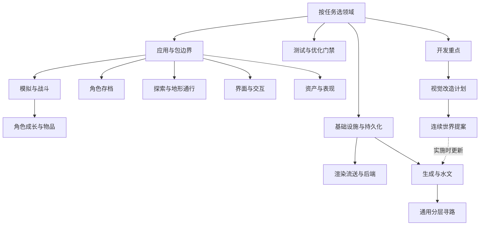

# 项目设计索引

这是唯一设计入口。文档按领域维护架构、依赖、状态/资源所有权、失败边界、编辑注意事项与验证方式；实现步骤、字段全集、参数和生成清单直接读源码及独立预期测试。

运行和公开 API 见 [README.zh-CN.md](../README.zh-CN.md) / [README.md](../README.md)，开发规则见 [AGENTS.md](../AGENTS.md)。[游戏想法](../游戏想法.md)只维护产品定位与核心体验，[CHANGELOG](../CHANGELOG.md)保留发布历史。

当前 main 仍运行六边形版本。[连续世界基座](decisions/continuous-world-foundation.md)是待实施提案；冻结基线的运行代码为 8ce5429，范围及缺口见[版本说明](../CHANGELOG.md#六边形世界基线冻结--2026-09-29)，不代表写实世界或完整性能目标已验收。

## 分支与归档

`main` 是唯一长期开发主线；`release/2026-09-29-hex-world-baseline` 固定在 `88e8a5a`，只用于旧世界复现和对照。新任务从 main 创建短期分支，完成并合入后删除；不把冻结分支作为开发入口。

2026-09-30 已将 `feat/rpg-survivor-combat` 和 `design/continuous-world-foundation` 的全部提交收拢到 main，移除这两个已完成分支。其他旧分支改为以下附注标签；其中三个实验仍有独有代码，仅留存历史，没有合入当前产品。

| 原分支 | 归档标签 | 提交与内容 |
|---|---|---|
| `feat/industrial-app` | `archive/industrial-app-2026-09-06` | `6f3a86e`；旧工业探索应用 |
| `surface-v2` | `archive/surface-v2-2026-08-31` | `08c5d67`；旧地表替换实验 |
| `backup/surface-v2-before-rollback-20260830` | `archive/surface-v2-before-rollback-2026-08-30` | `f3f6930`；回滚前地表编译、水文与导航实验 |
| `release/2026-09-05-vegetation-surface` | `archive/vegetation-surface-2026-09-05` | `7ca0a53`；已包含在 main 中的早期植被/地表基线 |

`archive/*` 标签保留原提交及其完整历史，不代表发布或验收；需要继续实验时，从对应标签新建分支。分支整理不重写历史、不复制旧实现目录。

## 阅读关系

## 游戏设计与修改入口

[apps/survivor/src](../apps/survivor/src/) 中 core 管纯数据规则，app 管会话与仓库，worker 管线程协议，adapters 接地图库，presentation 管 React/Three.js。核心不依赖表现层，游戏状态不进入基础库。

| 领域 | 所属设计 | 主要代码入口 |
|---|---|---|
| 包边界、启动、输入、发布、关闭 | [应用与会话](app-development.md) | [app](../apps/survivor/src/app/)、[adapters](../apps/survivor/src/adapters/) |
| ECS、AI、线程、技能构筑/施法、结算/状态 | [战斗模拟与技能](game/combat-architecture.md) | [CombatSimulation](../apps/survivor/src/core/CombatSimulation.ts)、[worker](../apps/survivor/src/worker/)、[SkillSystem](../apps/survivor/src/core/SkillSystem.ts)、[CombatResolution](../apps/survivor/src/core/CombatResolution.ts) |
| 地域、成长、职业、装备/库存、打造与校准 | [角色与物品](game/items.md) | [CharacterState](../apps/survivor/src/core/CharacterState.ts)、[CombatStats](../apps/survivor/src/core/CombatStats.ts)、[CombatRewards](../apps/survivor/src/core/CombatRewards.ts) |
| 角色检查点、副本提交、永久灵境 | [角色存档](game/character-saves.md) | [CharacterCheckpoint](../apps/survivor/src/core/CharacterCheckpoint.ts)、[CharacterRepository](../apps/survivor/src/app/CharacterRepository.ts)、[SpiritRepository](../apps/survivor/src/worker/SpiritRepository.ts) |
| 探索/旅行、家园/副本、移动/出生/遮挡 | [探索与地形通行](game/exploration-and-homestead.md) | [Exploration](../apps/survivor/src/core/Exploration.ts)、[RegionalWorld](../apps/survivor/src/core/RegionalWorld.ts)、[CombatTerrain](../apps/survivor/src/core/CombatTerrain.ts) |
| 窗口、HUD、输入、可访问性与 UI 性能 | [界面与交互](game/interface-design.md) | [presentation](../apps/survivor/src/presentation/) |
| 模型/动作/声音、环境、离线构建与许可 | [资产与表现](game/assets.md) | [源资产](../apps/survivor/assets/)、[构建脚本](../scripts/lib/)、[CombatLayer](../apps/survivor/src/presentation/CombatLayer.ts) |
| 已有能力、缺口、后续顺序 | [开发重点](game/development-priorities.md) | 对照各领域实现；计划不等于完成 |
| 写实暗黑世界与游戏 UI 的项目方案 | [视觉改造](game/visual-overhaul.md) | 阶段状态及验收目标见方案 |

## 基础库设计与修改入口

根 [src](../src/) 中 runtime 管生命周期/调度/预算，world 管生成/流送/地表/导航，rendering/objects/shaders 管绘制，persistence 管世代存储。公开 API 以[包入口](app-development.md#包与构建入口)为界，不能仅因仓库内无调用者就删除。

| 领域 | 所属设计 | 主要代码入口 |
|---|---|---|
| 生命周期、租约、预算、调度、存储与事件 | [基础设施](foundation-infrastructure.md) | [runtime](../src/runtime/)、[persistence](../src/persistence/)、[WorldDeltaStore](../src/world/WorldDeltaStore.ts)、[EventEmitter](../src/EventEmitter.ts) |
| 源/渲染区块、LOD、材质、光照、总览与后端 | [渲染流送](render-streaming.md) | [WorldStreamer](../src/world/WorldStreamer.ts)、[rendering](../src/rendering/) |
| 世界身份、拓扑、地表、编辑与河网决策 | [世界生成](world-style-generation-v1.md) | [WorldSurfaceResolver](../src/world/WorldSurfaceResolver.ts)、[WorldSurfaceView](../src/world/WorldSurfaceView.ts)、[WorldWaterSampler](../src/world/WorldWaterSampler.ts) |
| 跨未加载区块的路线与摘要 | [分层寻路](hierarchical-pathfinding.md) | [HierarchicalPathfinder](../src/world/HierarchicalPathfinder.ts) |
| 下一代世界技术、仓库结构与实施门槛 | [连续世界提案](decisions/continuous-world-foundation.md) | 未实施；现有世界/渲染/适配器为对照 |

库事件与战斗结算、地图增量与角色存档、通用路线与游戏局部通行保持独立所有者；合并文档不合并运行时状态。

## 验证与本地产物

[测试策略](testing.md#change-based-local-validation)集中维护检查选择、命令、测量口径和[优化门禁流程](testing.md#优化门禁)。文档改动至少运行 npm run check:docs 与 git diff --check，迁移门禁引用另跑 check:optimization-gates；链接通过不替代代码语义审查。

[optimization-gates.json](optimization-gates.json)仍读取[河网需求触发输入](evidence/automatic-river-generation/2026-09-04.json)，其需求依据及决策已并入[世界生成](world-style-generation-v1.md#决策与需求依据)。只保留当前校验必需的输入，不另拆观察/报告文档。

历史报告、截图和视频不留在当前文档树，需要时从 Git 查阅或按策略重新采样；新输出放 Git 忽略的本地目录，审查后清理。固定样本、独立预期和预算阈值随测试维护，旧通过记录不证明当前提交通过，Node CPU 时间不代表浏览器帧率。

## 资产与许可

资产设计只维护输入、处理及使用边界；机器清单保留版本、哈希与来源，原始许可不合并进设计正文。

| 资料 | 用途 |
|---|---|
| [LICENSE](../LICENSE) | 代码许可，不替代素材许可 |
| [共用纹理来源](../public/textures/sources.json) | 演示/游戏共享纹理的明确构建输入 |
| [游戏环境来源](../apps/survivor/assets/environment/sources.json)、[扫描资产许可原文](../apps/survivor/assets/environment/polyhaven-CC0.txt) | 地表、树木及副本扫描石材的离线输入与归属 |
| [离线树木生成器](../scripts/vendor/README.md)、[上游许可](../scripts/vendor/ez-tree-LICENSE.txt) | 固定版本与复现方式 |
| [环境归属原文](../apps/survivor/assets/environment/texture-attribution.md) | 上游归属，不等同于当前加载清单 |
| [技能素材来源](../apps/survivor/assets/effects/sources.json)、[原始许可](../apps/survivor/assets/effects/kenney-LICENSE.txt) | 特效输入及分发边界 |
| [家园来源](../apps/survivor/assets/homestead/sources.json)、[原始许可](../apps/survivor/assets/homestead/License.txt) | 模型输入与归属 |
| [音效来源](../apps/survivor/assets/audio/sources.json) | 项目原创波形合成与许可 |

`dist/`、`apps/survivor/dist/`、`apps/survivor/.assets/` 和 `public/js/` 是可重建产物；`test-results/`、`playwright-report/` 是本地测试输出。`assets-source/` 是原始构建输入，根 `public/` 还包含演示源码、共享资产及受跟踪模型，不能整目录当缓存删除。研究脚本、素材来源和许可也不按报告清理。

## 维护边界

- 一个领域一份主要设计，相邻领域链接引用；新规则优先写回所属章节，不为一次优化、一次修复或验收单独开文档。
- 保留结构、所有权、不变量、容量/失败语义和修改/验证入口；参数表、私有步骤、接口字段和生成统计交给源码、测试或机器清单。
- 当前能力、未来方案明确区分；开发顺序归开发重点，视觉/连续世界方案不冒充已实现能力。历史演进查 Git，不保留被替代正文或纯跳转文件。
- 改代码同步所属设计；合并/删除同步本页、关系图及所有引用。许可与仍被校验读取的输入按各自职责保留。
- 不新增协作指南或分目录索引作为中转。按 AGENTS 检查差异、验证并提交。
