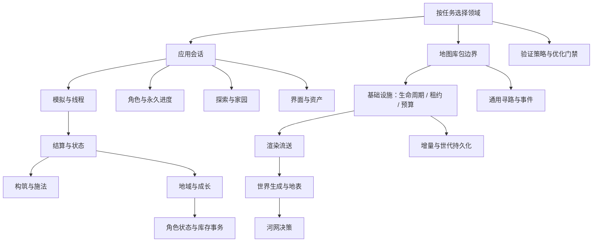

# 项目文档结构与设计索引

这是唯一设计入口。先按下表定位所属设计，再直达代码和测试；文档说明架构、所有权、跨模块约束、修改注意事项与验证方式，具体实现直接读源码。

项目介绍、运行方法与公开 API 见 [README.zh-CN.md](../README.zh-CN.md) / [README.md](../README.md)；开发基准见 [AGENTS.md](../AGENTS.md)。[游戏想法](../游戏想法.md)描述玩家体验，[CHANGELOG](../CHANGELOG.md)保留发布历史，均不作为内部实现手册。

## 阅读关系

每个领域只留一份主要设计，相邻领域链接引用。当前规则、未来计划和历史证据分开维护；按任务阅读对应分支，不需要顺次通读全部文档。

## 游戏：设计与修改入口

游戏位于 [apps/survivor/src](../apps/survivor/src/)：core 管纯数据规则，app 管会话与仓库，worker 管线程协议，adapters 接入地图库，presentation 管 React/Three.js 表现。游戏状态属于应用层，基础库不拥有背包、技能或任务。

| 要修改的领域 | 主要设计 | 代码入口 |
|---|---|---|
| 会话、输入、启动与恢复 | [应用集成](app-development.md) | [app](../apps/survivor/src/app/)、[adapters](../apps/survivor/src/adapters/) |
| 配置、ECS、AI、自动战斗、Worker | [模拟与 AI](game/simulation-and-ai.md) | [GameConfig](../apps/survivor/src/core/GameConfig.ts)、[CombatSimulation](../apps/survivor/src/core/CombatSimulation.ts)、[worker](../apps/survivor/src/worker/) |
| 伤害、生命、状态与结算事实 | [战斗架构](game/combat-architecture.md) | [CombatResolution](../apps/survivor/src/core/CombatResolution.ts)、[StatusSystem](../apps/survivor/src/core/StatusSystem.ts) |
| 构筑事务、施法与特效 | [技能与效果](game/skills-and-effects.md) | [SkillBuild](../apps/survivor/src/core/SkillBuild.ts)、[SkillSystem](../apps/survivor/src/core/SkillSystem.ts) |
| 地域、成长、奖励与数值校准 | [战斗与成长](game/combat-and-progression.md) | [RegionalWorld](../apps/survivor/src/core/RegionalWorld.ts)、[CombatRewards](../apps/survivor/src/core/CombatRewards.ts)、[CombatStats](../apps/survivor/src/core/CombatStats.ts) |
| 角色事务、库存、配装、回收与打造 | [物品合同](game/items.md) | [CharacterState](../apps/survivor/src/core/CharacterState.ts)、[AutomaticLoadout](../apps/survivor/src/core/AutomaticLoadout.ts)、[Crafting](../apps/survivor/src/core/Crafting.ts) |
| 存档、副本提交与永久灵境 | [角色存档](game/character-saves.md) | [CharacterCheckpoint](../apps/survivor/src/core/CharacterCheckpoint.ts)、[CharacterRepository](../apps/survivor/src/app/CharacterRepository.ts)、[SpiritRepository](../apps/survivor/src/worker/SpiritRepository.ts) |
| 探索迷雾、家园、旅行与副本 | [探索与家园](game/exploration-and-homestead.md) | [core](../apps/survivor/src/core/)、[app](../apps/survivor/src/app/)中的探索和旅行模块 |
| 移动、遮挡、出生与可达性 | [地形通行](game/terrain-navigation.md) | [CombatTerrain](../apps/survivor/src/core/CombatTerrain.ts)、[SurfaceMotion](../apps/survivor/src/core/SurfaceMotion.ts) |
| 窗口、交互、HUD 与可访问性 | [界面设计](game/interface-design.md)、[UI 性能](game/ui-performance.md) | [presentation](../apps/survivor/src/presentation/) |
| 模型、动作、声音与资源处理 | [角色资产](game/actor-assets.md)、[环境资产](game/environment-assets.md) | [assets](../apps/survivor/assets/)、[构建脚本](../scripts/) |
| 项目进度与尚未完成的能力 | [开发重点](game/development-priorities.md) | 对照以上领域；计划不代表实现 |

## 地图库：设计与修改入口

根 [src](../src/) 中 runtime 管生命周期/调度/预算，world 管生成/流送/地表/导航，rendering、objects、shaders 管绘制，persistence 管检查点。公开 API 以包入口为边界，不能仅因仓库内无调用者就删除。

| 要修改的领域 | 主要设计 | 代码入口 |
|---|---|---|
| 公开入口、依赖与构建 | [包边界](package-boundaries.md) | [index](../src/index.ts)、[persistence](../src/persistence.ts)、[pathfinding](../src/pathfinding.ts)、[package.json](../package.json) |
| 生命周期、会话、租约、预算与调度 | [基础设施](foundation-infrastructure.md) | [runtime](../src/runtime/)、[RenderWorldController](../src/rendering/RenderWorldController.ts)、[ChunkResidencyCoordinator](../src/world/ChunkResidencyCoordinator.ts) |
| 冻结协议、世代保存与验收 | [基础合同](foundation-v1-freeze.md) | [GenerationCheckpointCoordinator](../src/persistence/GenerationCheckpointCoordinator.ts)、[WorldGeneratorVersion](../src/world/WorldGeneratorVersion.ts) |
| 源区块、LOD、材质、总览与渲染层 | [渲染流送](render-streaming.md) | [WorldStreamer](../src/world/WorldStreamer.ts)、[rendering](../src/rendering/) |
| 生成确定性、地表、编辑与拓扑 | [世界生成](world-style-generation-v1.md) | [WorldSurfaceResolver](../src/world/WorldSurfaceResolver.ts)、[WorldSurfaceView](../src/world/WorldSurfaceView.ts) |
| 河流算法的选择与限制 | [河网决策](decisions/coarse-drainage-water-network.md) | [WorldWaterSampler](../src/world/WorldWaterSampler.ts) |
| 地图稀疏覆盖与存储 | [世界增量](world-delta-persistence.md) | [WorldDeltaStore](../src/world/WorldDeltaStore.ts)、[WorldEditingFacade](../src/world/WorldEditingFacade.ts) |
| 跨未加载区块的路径查询 | [分层寻路](hierarchical-pathfinding.md) | [HierarchicalPathfinder](../src/world/HierarchicalPathfinder.ts) |
| 类型化通知与派发失败 | [事件合同](event-contracts.md) | [EventEmitter](../src/EventEmitter.ts)、[EventMaps](../src/EventMaps.ts) |

不要混淆：库事件通知与战斗结算事实、地图增量与角色存档、通用路径查询与游戏局部通行，各有独立所有者。基础合同仍有效，不是可以按日期删除的历史说明。

## 验证与性能决策

从[测试策略的变更矩阵](testing.md#change-based-local-validation)选择检查；命令只在该页及 package.json 维护。文档改动至少运行 npm run check:docs 与 git diff --check，并人工核对代码语义。

[优化门禁](optimization-gates.md)及[结构化登记](optimization-gates.json)定义何时值得增加复杂度；[渲染后端评估](render-backend-evaluation.md)保留 WebGL2/WebGPU 的决策和测量入口。历史通过记录不是当前版本的验收结果，Node CPU 耗时也不是浏览器帧率。

## 证据

仅在复核设计取舍或测量时阅读：

- [世界风格证据](evidence/world-style-generation.md)：固定样本和阈值调整依据。
- [河流问题观察](evidence/automatic-river-generation/user-observation.md)、[河道跟进](evidence/automatic-river-generation/natural-course-followup.md)、[门禁证据](evidence/automatic-river-generation/2026-09-04.json)：河网决策引用的历史资料。
- [游戏原始测量目录](game/measurements/)：各阶段的环境、原始样本与回放；文件名定位主题，当前适用范围以所属设计为准。
- [战斗校准报告](game/measurements/combat-balance.json)、[管线对照](game/measurements/combat-pipeline-optimization.json)、[被动接入测量](game/measurements/utility-passive-skills.json)：数值、CPU 和 UI 是不同口径，不能互相代替。
- [CPU 尾延迟记录](game/measurements/performance-tail-latency.json)、[首轮优化对照](game/measurements/performance-tail-optimization.json)：逐轮分位、峰值序号、超预算统计、独立阶段/GC 诊断及旧版回放对照；复现命令见测试策略，不作为浏览器帧率证明。
- [玩法区块分批记录](game/measurements/regional-streaming.json)：提前准备前后 CPU 对照、异步切片/等待与确定性回放，保留 P99 和均值代价及冷启动限制。
- [怪物绕障与占位对照](game/measurements/enemy-navigation.json)：凹墙到达、围攻重叠与同场景 CPU 成本；行为改善与计算开销分别报告，不代表浏览器帧率。

## 资产与许可

资产设计只维护输入、处理及使用边界；机器清单保留版本、哈希与来源，原始许可不合并进设计正文。

| 资料 | 用途 |
|---|---|
| [LICENSE](../LICENSE) | 代码许可，不替代素材许可 |
| [共用纹理来源](../public/textures/sources.json) | 演示/游戏共享纹理的明确构建输入 |
| [离线树木生成器](../scripts/vendor/README.md)、[上游许可](../scripts/vendor/ez-tree-LICENSE.txt) | 固定版本与复现方式 |
| [环境归属原文](../apps/survivor/assets/environment/texture-attribution.md) | 上游归属，不等同于当前加载清单 |
| [技能素材来源](../apps/survivor/assets/effects/sources.json)、[原始许可](../apps/survivor/assets/effects/kenney-LICENSE.txt) | 特效输入及分发边界 |
| [家园来源](../apps/survivor/assets/homestead/sources.json)、[原始许可](../apps/survivor/assets/homestead/License.txt) | 模型输入与归属 |
| [音效来源](../apps/survivor/assets/audio/sources.json) | 项目原创波形合成与许可 |

dist/ 与 apps/survivor/.assets/ 是生成产物；根 public/ 混合演示输入与受跟踪产物，不能整目录当缓存删除。

## 文档维护边界

- 保留架构/依赖方向、状态与资源所有权、跨模块不变量、容量及失败语义、修改入口和验证方式；这些是代码之外需要共同遵守的约束。
- 数值表、接口字段全集、私有函数步骤、源码目录逐项复述交给代码；独立预期交给测试，测量数值交给原始报告。正文通过链接定位，不维护第二份实现。
- 改动先对照代码和所属设计，再同步受影响的合同；文档描述当前实现，未完成事项统一进入开发重点，不能将建议写成既有能力。
- 一个行为只在所属设计解释，相邻领域只引用。文档可合并时直接合并，不留纯跳转文件、不增加协作指南或分目录索引。
- 新增、移动或删除文档同步本页、关系图和引用。被替代且无证据用途的方案可删，历史查 Git；许可、有效决策和仍支撑测量的证据保留。
- check:docs 检查本地链接、标题锚点和 docs 可达性；它不证明设计正确，仍需人工审查代码一致性、Mermaid 与资产归属。最后按 AGENTS 要求提交。
