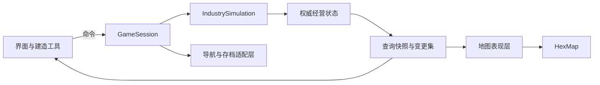

# App 开发设计：异星工业与虫洞巨构

状态：应用架构与开发合同；独立入口、会话与固定时钟、三类矿藏与起步区域筛选，以及
七类建筑、建造操作、直接采集入库、初级冶炼和能源网络已实现。已落地行为见
[应用入口](./game/application-shell.md)、[矿藏勘察](./game/mineral-survey.md)和
[基地建造与采矿](./game/construction-and-mining.md)及[能源与加工](./game/energy-and-production.md)。
制造、研究、运输和游戏存档待实现。
玩法目标、首版范围和内容方向以 [游戏想法](../游戏想法.md)为准；本文定义代码组织、
权威状态、结算顺序和基建接入方式。下文明确标记当前能力，其余经营模块、多阶段结算
和存档接入仍为后续设计。

当前库提供地图渲染、世界生成、寻路与持久化。区块模拟子包、军队行军和持久化战役
示例已移除，游戏应用自行实现统一的工业模拟。现有 `GameEngine` 仍提供单位控制与
视野功能；工业应用直接组合 `HexMap` 和公开服务，不依赖这套单位操作入口。

## 1. 架构与基建边界

采用模块化单体：纯数据经营核心、配置化内容、基建适配层和独立表现层。一个游戏会话
只有一份权威经营状态和一个经营时钟。园区库存、电网与运输按业务关系组织，地图区块
用于空间索引和流送，不决定经济结算的频率或归属。

| 已有能力 | 实际代码与合同 | 应用责任 |
|---|---|---|
| 世界生成与地形查询 | [WorldSource](../src/world/WorldSource.ts)、[世界风格](./world-style-generation-v1.md) | 登陆区、矿藏、生物点、阶段资源可达性 |
| 六边形邻接和拓扑 | [neighbors](../src/helpers/neighbors.ts)、[topology](../src/helpers/topology.ts) | 多格占地、六向旋转、接入点与建造校验 |
| 模型与覆盖层 | [WorldRenderLayer](../src/rendering/WorldRenderLayer.ts)、[渲染合同](./render-streaming.md) | 建筑、车辆、资源点、建造预览与服务范围 |
| 远距离寻路 | [HierarchicalPathfinder](../src/world/HierarchicalPathfinder.ts)、[导航合同](./hierarchical-pathfinding.md) | 建筑通行约束、园区连通、运输调度、路线失效 |
| 世界增量 | [WorldDeltaContract](../src/world/WorldDeltaContract.ts)、[增量持久化](./world-delta-persistence.md) | 通过编辑入口保存实际地形与植被变化 |
| 一致性存档 | [GenerationCheckpointCoordinator](../src/persistence/GenerationCheckpointCoordinator.ts)、[世代合同](./foundation-v1-freeze.md) | 游戏快照、互斥捕获、版本校验、恢复后的索引重建 |
| 生命周期与资源预算 | [基础设施设计](./foundation-infrastructure.md)、[包边界](./package-boundaries.md) | 会话所有权、取消、模型资源账户与释放 |

应用从 `three-hex-map`、`three-hex-map/pathfinding` 和
`three-hex-map/persistence` 的公开入口导入基建。工业规则不会进入根库入口、
地形生成载荷或 `HexMap` 实例。接入过程中发现公开合同的实际缺口时，单独定义最小
基建变更及其验证范围，不复制基建内部实现。

## 2. 工程组织与依赖方向

游戏应用已有独立入口、构建配置、资产与测试。根库保持现有构建职责；应用以本地
包依赖消费库输出，开发构建顺序显式保证依赖就绪，避免引用提交的演示生成文件。

以下是按功能逐步建立的目标结构，当前实际文件以 [应用入口合同](./game/application-shell.md)
的代码映射为准。

```text
src/                              # 当前地图基建
apps/expedition/
  package.json
  src/
    app/
      bootstrap.tsx               # 已实现：创建并连接依赖、退出
      GameSession.ts              # 已实现：时间/建造命令、采集推进、加载边界
      WorldView.ts                # 已实现：地图、只读建造地形与表现边界
    core/
      GameClock.ts                # 已实现：固定时钟、暂停与倍率
      resources/MineralField.ts   # 已实现：确定性初始矿藏；开采增量归 Industry
      simulation/                 # IndustrySimulation、GameState、固定 tick
      commands/                   # 玩家命令、检查与提交
      spatial/footprint.ts        # 已实现：多格占地、六向旋转与坐标转换
      construction/Industry.ts    # 已实现：建造、服务、采矿/冶炼批次与逐 tick 分配
      inventory/InventoryLedger.ts # 已实现：容量、原子扣料与入库；预留待接入
      production/                 # 复杂加工接入后拆分；初级批次当前由 Industry 持有
      power/PowerGrid.ts          # 已实现：连接图、昼夜发电、设备储能与功率分配
      logistics/                  # 园区、线路、运力、在途货物
      exploration/                # 勘察、采样、测序
      research/                   # 科技条件、研究与解锁
      projects/                   # 巨构安装、调试与验收
      queries/                    # 面板快照、统计与瓶颈查询
      ports/                      # 核心所需的地形、路线等接口
    content/                      # 已有 minerals、items、buildings、recipes、energy；科技待接入
    scenarios/                    # 已有 landingSurvey.ts；后期场景约束待接入
    adapters/                     # 连接地图、导航和存档服务
    presentation/
      layers/                     # 已有 MineralLayer、BuildingLayer、BuildingPreview
      interaction/                # 待实现：复杂编辑工具与线路编辑
      BuildToolbar.tsx            # 已实现：底部分类页签、成本与旋转提示
      BuildingInspector.tsx       # 已实现：设备、配方、优先级、启停和拆除
      EnergyPanel.tsx             # 已实现：昼夜、独立电网和实际储能
      App.tsx                     # 已实现：勘察、库存、建筑面板与时间控制
      ui/                         # 待实现：经营管理面板
  tests/
docs/game/                        # 随模块实现建立正式合同文档
```

目录和文件随实际功能创建，不预建空模块。初期 `core` 是应用内部模块，不额外拆成
多个发布包。采用 TypeScript；界面采用 React，应用构建采用 Vite，地图继续使用
现有 Three.js/WebGL2 路径。React 19.2.8、Vite 8.2.2 已由 npm workspace 与根锁文件
管理，运行入口为 `npm run app:dev`。

依赖规则：

- `core` 不导入 Three.js、React、DOM、IndexedDB 或基建内部模块。
- `core/ports` 只定义实际业务所需的数据与能力，不暴露场景对象。
- `adapters` 实现这些接口，负责坐标转换、异步工作、版本与资源所有权。
- `presentation` 读取查询快照并发送命令，不直接修改经营表。
- `app` 是组合入口，持有会话生命周期和串行状态边界。



## 3. 状态模型与写入所有权

建筑按“内容定义、实例、能力组件”组织。定义描述占地、端口、支持的配方、建造成本、
额定功率和模型标识；实例保存稳定 ID、定义 ID、位置、朝向和当前业务状态。系统批量
处理具有相应能力的实例，例如生产、储能、发电、仓储、研究和测序。

新增设备优先复用实际能力与配方；需要不同运行规则时，在对应业务模块增加行为。
首版不建设通用 ECS、运行时插件系统或多层建筑继承树。

| 数据 | 权威所有者 | 保存内容 |
|---|---|---|
| 建筑与施工 | construction/Industry | 已有稳定 ID、锚点、朝向、完整占地与实际扣料；分阶段施工、升级待实现 |
| 物资 | inventory/InventoryLedger | 已有基地共享库存与容量；多所有者、预留与容量承诺待实现 |
| 生产批次 | 当前 Industry；后续 production | 已有采矿周期与冶炼批次，后者持有实际配方、进度和一批投入/待交付产物 |
| 矿藏 | MineralField 与 Industry | 前者重建初始矿点，后者持有按矿点 ID 记录的已开采量 |
| 电池 | power/PowerGrid | 已实现：按建筑 ID 保存整数 J；容量、充/放电功率来自定义，网络分组不拥有电量 |
| 园区与运输 | logistics | 明确归属、线路策略、运输批次、载货与路线进度 |
| 探索与研究 | exploration、research | 任务、样本、序列档案、研究进度、已解锁 ID |
| 巨构 | projects | 安装投入、模块状态、验收阶段、当前调试进度 |

空间占地表、电网连通分组、路线反向索引、产能查询缓存和模型对象均为派生数据。
保存必要的业务选择，例如建筑的园区归属；可从权威数据重建的索引不重复存档。
`TileInfo.city` 只包含城市显示信息，不承担建筑、库存或生产状态。

物品数量使用有明确单位的安全整数；液体、能量等连续量选择固定最小计量单位，并
保存跨 tick 的换算余数。内容校验限制数值和中间乘积范围，禁止负库存、非有限值或
溢出进入状态。配方转换按物品类别及投入/产出核账，不以不同物品的数量之和判断守恒。

## 4. 会话、命令与固定 tick

当前 `GameSession` 持有 `GameClock`、`Industry`、地图适配接口与只读快照，支持时间、
矿区定位、建造选择、旋转、放置、拆除及设备配方/优先级/启停命令。`bootstrap.tsx` 持有 React、页面事件、
B/R/Esc 快捷键和动画循环。先落地唯一指挥中心再推进时间，每次发布 tick 前完成实际
采矿、冶炼和电力结算。当前由 `Industry` 组织有序阶段，`PowerGrid` 负责能源；后续
复杂经营系统出现时再拆出统一 `IndustrySimulation` 与存档协调器。
状态变更经同一串行边界执行。典型命令包括 `PlaceBuilding`、`CancelConstruction`、
`SetRecipe`、`CreateTransportRoute`、`StartResearch` 和 `StartProjectTrial`。

命令分为检查与提交：地形或导航数据不足时先准备数据；提交时在边界内再次核对相关
版本、材料和占地。异步等待期间不锁住整个游戏。过期请求不能发布到新会话；预览成功
也不代表稍后的实际放置一定成功。缺料、无路、占地冲突等正常失败返回明确的原因码
和相关对象，界面负责翻译与展示。

当前 `Industry.advance(ticks)` 是纯业务执行，不在 tick 中读取渲染地形、等待存储或
寻路。基地与电网连通在布局改变时重算，正常 tick 按优先级及同级建造顺序分配
材料和完整功率，再推进采矿、加工和充放电。加工产物与新采原料下一 tick 才能用于
启动新加工批次；细节见 [能源与加工](./game/energy-and-production.md)。
后续 `IndustrySimulation.step()` 沿用这一边界。初始步长为当前时钟采用的 100ms；
所有参与经营的区域使用同一步长。以下六阶段属于后续加工与多模块调度设计，尚未实现。

| 顺序 | 阶段 | 可见性与约束 |
|---|---|---|
| 1 | 应用已就绪命令与上一 tick 的完成结果 | 到货和产物在此成为可用库存；操作顺序稳定 |
| 2 | 更新被标记的空间与连接关系 | 拆建导致的断路、园区服务变化、电网拆分在本轮工作前生效 |
| 3 | 收集工作请求 | 检查输入、输出空间、燃料、科技和运行状态，形成材料与功率需求 |
| 4 | 分配资源 | 结合材料与电力条件决定获准工作，同优先级使用界面可见的稳定顺序 |
| 5 | 推进作业 | 提交实际投入、燃料和电量消耗，推进加工、施工、运输、研究与调试 |
| 6 | 提交进度和待完成结果 | 记录完成标识与统计，发布变更集；本轮产物下一 tick 可用 |

跨模块争用同一物资时共用分配规则。未获得执行条件的新请求释放临时分配，不扣除
输入或虚占本轮电力。运行中的批次保留已投入材料与进度。资源分配策略必须明确到
生成设备、工业负载和恢复供给所需设施的先后关系，不能依赖模块遍历的偶然顺序。

暂停停止 `step()`，规划、取消和设置命令仍串行执行。加速提高目标 tick 频率，预算
不足时降低实际经营速度并展示实际倍率；经营时钟只增加已完成的 tick，不按墙钟
补发收益或让某些区域单独跳过结算。调度保持有界，不无限积累现实时间追赶任务。

页面隐藏时自动暂停，恢复可见时重新建立现实时间基准；用户主动暂停的状态不被自动
恢复覆盖。页面关闭、加载存档和暂停期间都不计算离线收益。浏览器后台动画回调行为
见 [requestAnimationFrame](https://developer.mozilla.org/en-US/docs/Web/API/Window/requestAnimationFrame)。

异步导航结果在就绪后经命令边界安装，检查请求 ID、会话世代和所读布局版本。
确定性测试使用相同的初始状态、随机种子及已接受的命令/外部结果序列；不把不同设备上
异步任务的完成时刻假定为相同。

## 5. 库存、生产与施工

`InventoryLedger` 独占物资修改权。它与基建管理 CPU/GPU 字节的
`ResourceBudgetLedger` 是不同领域的账本。

当前实现按本轮需求采用即时建造和采集直接入仓库：校验通过后一次扣料并建立实体，
不创建施工计划或空的预留系统。指挥中心免费且不可拆，提供 2,000 容量与一次起步物资；
仓库每座增加 5,000 容量。采矿机每 10 tick 采集至多 5 单位，扣减有限矿量并入库；
满仓、断路和耗尽时停止。拆除按实际扣料全额返还，并先检查剩余容量。
数值、原子边界和代码入口见 [建造合同](./game/construction-and-mining.md)。

初级冶炼已接入三份配置配方，库存扩展为三种原矿与三种加工品。批次获准工作后一次
扣料，完成后持有最多一批产物等待入库；切换配方不改变旧批次，缺电不推进进度。
拆除退还未完成输入或已完成产物，并先检查全部回收量。储能站使用三种真实加工品
建造；采矿机继续直接入库。

以下预留、分阶段施工和多库存转移属于后续扩展，不是当前采矿/冶炼的前置条件：

- 存量包含已预留物资；可用量为存量减预留量，预留不额外增加物品。
- 每条预留有所有者与用途。投入时同时减少存量和对应预留，并记录实际投入。
- 多项材料的检查与提交是一项操作，不允许扣到一半才发现另一项不足。
- 园区库存、设备缓存和运输载货分别有明确所有者；相同物资不能同时属于两个位置。
- 回收以实际投入为上限，舍入规则固定；恢复存档后仍能继续正确取消与回收。

施工计划提交时预留材料与用地，施工按进度投入。取消释放未投入材料，投入部分按
明确规则结算；指挥中心首版不可拆除。升级使用可记录的停工阶段，不直接替换一个
正在工作的定义而丢失旧批次。

生产在批次开始时一次扣除输入，随后保存配方、已投入明细和进度。输出只提交一次。
设备输出缓存是有限库存；无空间时停止相应加工或输出转移，已经产生的物资仍保留
所有权。切换配方或取消订单时先结算当前批次，不能让旧配方投入生成新配方产物。

当前采集已核对矿点余量，实际入库量不超过剩余量和容量。后续统一生产批次时保持
已投入进度和物资守恒，采集直接入库的规则需同步到相应合同。森林木材
是有限资源，清除植被通过世界增量入口同步表现；木材加工副产物独立按配方产出。
工业水通过取水能力限流，不生成逐单位水实体。

## 6. 园区与物流

当前只有一个基地共享库存。新增建筑要求在指挥中心外缘 32 步的可达范围内，
路径受地形和完整建筑占地约束；堵路使已有采矿机与冶炼厂停工，拆除后重新检查。实际搬运时间、
多园区和运输载体尚未实现，下面定义后续物流阶段。

园区有稳定 ID 和独立库存。指挥中心、物流站提供服务入口；覆盖重叠不会自动合并
园区。建筑明确归属一个园区，并同时满足服务范围与作业端可达性。断路改变服务状态，
不会把库存复制到新园区。

园区内部搬运通过账本在设备缓存与园区库存间结算，不逐件模拟。跨园区线路保存物品、
供给优先级、目标库存和运力。运输载体具有容量及任务状态，往返与装卸时间进入实际
吞吐量；只有空闲且完成返回的载体才能再次发货。

发货原子地完成源库存扣除与运输载货建立。到达后载货减少、目标库存增加；目标容量
不足时继续持货等待。目的地容量承诺、实际载货和未接收的预期到货分开记录，预期
到货不成为可消费库存。

断路时保留货物和位置，进入等待或重规划。取消线路先停止新发货，再完成现有货物的
送达或返运；没有明确接收点时保留待处理运输，不能删除货物或直接回填源库存。
拆除仓储必须同时检查现有库存、剩余容量和在途接收义务。

车辆外观根据权威路线进度插值。镜头外不创建车辆模型，但运输使用同一经营时间。
首版只实现园区库存与一种自动地面运输，不同时建设多套物流实体系统。

## 7. 电力与经营压力

当前已实现指挥中心 60 kW 工业电源、120 kW 光能发电站、辐射站、6,000 kJ 储能站，
以及 20 kW 采矿与 60 kW 冶炼负载。简单昼夜为三分钟白昼、一分钟夜间。只有节点
连接图可以合并电网，设备绑定单一最近节点，储能保存在建筑实例 ID 下。优先级和
启停可操作，缺电保留进度；功率、电量、拓扑与验证的正式合同见
[能源与加工](./game/energy-and-production.md)。燃料、冷却、升级模块及多种电站仍待实现。

发电站和辐射站构成连接图，只在建造、拆除或连接参数变化时更新拓扑。普通负载和
电池接入一个节点，不能把两个网络连起来；电量属于电池实例，网络分裂/合并只改变
连接分组。辐射站停电后保留连接。

同一网络每 tick 检查发电燃料与冷却条件，再决定可供功率。发电优先供给负载；富余
电力在容量和充电功率限制内储存；不足时在储能量和放电功率限制内补足。一个电池在
同一 tick 不能同时充放电。仍有缺口时按玩家优先级和稳定同级顺序暂停设备。

功率与能量采用不同字段和单位：消耗能量来自实际供电功率乘经营步长。研究、施工和
巨构与生产共用实际工业供电；生活保障使用指挥中心独立基础电源，不参与工业争抢。
首版压力集中在昼夜供电、储能与运力；温度、风况等规则随实际配方和设备接入。

## 8. 建造空间与导航失效

当前 `footprint.ts` 已实现 even-q 错列坐标与局部轴坐标的双向转换、六向旋转，
预览和提交共用完整占地，覆盖负坐标与跨 source chunk。`Industry` 的占地索引与
有界服务 BFS 读取勘察保留的 `96×96` 只读地形窗口；窗口外明确拒绝建造。
本轮没有地形编辑、环形工业地图或运输路线；以下是这些能力接入后的导航合同。

基建采用平顶错列六边形坐标。建筑定义以局部轴坐标或立方体坐标描述占地及资源端、
作业端、物流与供电接入点，预计算六个朝向，落地时统一转换到现有规范化坐标。
预览、选中、碰撞、服务范围和导航读取同一占地结果，覆盖跨区块、负坐标与环形接缝。

待建计划与施工/完工实体分别记录用地预留和实际通行阻挡。首版用地从计划提交时保留，
实际阻挡从施工开始生效；施工开始前重新检查作业端可达性。阻断既有线路的操作展示
影响，提交后立即使相关路线进入等待/重规划。取消计划释放用地，拆除实体更新阻挡。

当前 `ProceduralWorldNavigationIndex` 采样基础地形，不能直接代表含建筑和地形编辑的
工业地图。应用实现 `WorldNavigationIndex` 适配器，并向寻路器提供一致的通行、移动
成本和 `expectedRevision` 规则：

1. 未编辑地形可沿用现有 Worker 基础区块采样，再叠加建筑占地规则。
2. 已编辑地形必须读取当前增量；可通过 source 的共享租约读取合成后的详细格子，
   构建摘要后释放租约，不挂载沿途渲染对象。
3. 摘要和详细寻路使用相同的地形、阻挡与成本规则；缓存按区块有界保存。
4. 影响通行或成本的修改更新应用移动版本，同时失效相关区块及边界相邻摘要。
5. 线路建立区块到路线的反向索引，失效只触达相关路线。运输下一段移动前检查路线
   有效性，不能穿过已生效的阻挡。

导航版本由应用的统一编辑边界维护，涵盖地形增量、占地和道路成本；不能继续使用
固定零增量版本。恢复时重建导航索引并重新验证保留路线，晚到的旧请求由会话世代拒绝。

## 9. 内容、场景与科技

物品、建筑、配方、科技、序列和巨构阶段使用稳定内容 ID。定义经过强类型检查与加载
校验；运行时实例只引用 ID，不复制整份静态配置，也不保存模型路径作为业务身份。

内容校验包含引用完整性、数值范围、配方与设备能力匹配、端口与占地关系，以及科技
前置图无环。生产配方允许有实际用途的回收环；另从登陆蓝图和可达资源做阶段闭包，
发现只能依赖自身高级产物启动的工艺死锁。

当前已实现铁矿、铜矿、石材三类矿藏，以及起步空地、林地、三类储量和第二片金属矿区的
有界筛选；具体参数与代码见 [矿藏勘察合同](./game/mineral-survey.md)。煤炭、石英等随
实际配方阶段加入，首版不提前扩充矿种。

后续 `scenarios` 继续补齐生物点与其他登陆条件。内容生成的种子、版本、
坐标和对象身份决定结果，不受区块访问次序影响。选择登陆区前完成初始矿量、可建设
空间、第二矿区路线与主线序列来源的检查；条件不足时明确报告场景生成失败，不能
无限重试随机种子或在游玩中临时刷新必需资源。

勘察任务保存路线、续航预算、任务阶段和样本。样本解析为永久序列档案；研究引用
序列条件，同时消费真实试制材料、电力和时间。重复解析相同序列不会重复解锁收益。
新工艺解锁后由玩家选择配方，不自动打断正在运行的生产线。

巨构状态区分一次性安装、模块验收和持续调试。前两者保留已完成成果；调试消耗实际
功率、冷却及稳定介质，短缺保留已验收阶段，当前步骤按定义暂停或重试。启动命令由
玩家发出，不能仅凭库存能量达到阈值就绕过持续功率与供料检查。

## 10. 存档与恢复

当前建筑、物资、加工批次、电量和时钟只存在于会话内，重新勘察或刷新会开始新游戏。
接下来单独接入一致性存档：应用实现一个必需的 `game-state` 参与者，连同
`createWorldDeltaGenerationParticipant()` 在同一世代保存。游戏快照包含：

- 经营 tick、ID 分配状态、必要随机状态、内容版本与场景版本。
- 建筑、施工/升级投入、库存、预留、容量承诺和生产批次。
- 矿藏变化、储能、园区归属、运力、路线与在途货物。
- 勘察与解析任务、序列档案、研究解锁和巨构阶段。
- 已接受且尚待生效的业务命令或等价任务状态，以及本轮待完成结果。

Promise、模型、GPU 缓冲和派生索引不存档；尚未完成的外部查询保存逻辑请求状态，
恢复后重新准备并检查版本。

`withWorldState` 在串行边界内捕获完整的脱离活状态的快照。不要在已持有该边界时
递归入队等待自己；按协调器合同选择外部调用 checkpoint，或在已独占操作内直接
执行受校验的捕获回调。不可变 staging 和 manifest 发布阶段允许游戏继续推进。

恢复先验证 descriptor、参与者版本、checksum、内容引用、物资所有权和跨对象引用，
应用保持在恢复状态直到所有参与者及重建完成。协调器不提供跨参与者回滚；恢复失败
时不得把部分恢复的会话作为可玩状态发布。版本不一致明确拒绝，首版不实现旧存档
迁移、兼容入口或降级路径。

退出时停止接受新操作，完成已接受的提交并保存，再释放应用资源、导航和地图会话。
正常显式退出可等待该过程；浏览器强制关闭不能保证异步存档完成，因此运行中需要
周期性自动存档和手动保存，不能只依赖 `beforeunload`。

## 11. 表现、查询与性能

建筑层使用现有 `WorldRenderLayer` 生命周期，通过 host 的 `addObject/removeObject`
管理对象并响应地表高度变化。分块对象按调度合同计费；非区块模型通过
`map.createResourceAccount()` 计费。异步资产完成时检查会话世代，卸载释放自身持有的
对象与资源句柄；模型消失不删除经营实体。

共享几何体和材质的建筑按空间分组使用实例化渲染，更新受影响的实例范围。
[Three.js InstancedMesh](https://threejs.org/docs/pages/InstancedMesh.html) 提供相应能力。
大型巨构按实际模块和施工阶段表现，不为每件投入物资生成实体。

查询模块生成按对象、园区或网络划分的只读快照，以版本缓存；界面只订阅正在展示的
数据。React 通过 [useSyncExternalStore](https://react.dev/reference/react/useSyncExternalStore)
连接快照，复用未变化的引用。车辆与特效插值在表现层逐帧执行，不让整个经营状态
跟随 React 渲染周期复制或更新。

停工原因使用结构化记录，例如原因码、物品 ID、缺口数量、相关设备或线路 ID。
“缺高分子 → 化工厂缺原油 → 外围线路运力不足”的查询按需追溯，并通过访问集合与
深度/数量预算约束回收链和共享上游。产量采用实际批次计数与有界时间窗口统计。

性能工作按真实业务负载推进：

- 只更新相关能力组件和工作集合；不每帧遍历全地图，也不每 tick 深拷贝整个状态。
- 电网连接、园区连通与导航摘要按脏数据更新，正常 tick 结算运行数值。
- 远处工业状态继续参与计算；读取地形需要租约，持续生产不要求地形或模型常驻。
- 首版工业核心集中在一个执行线程，地形沿用现有 Worker 池。是否迁移工业执行器、
  增加数据布局优化或事件跳跃，由真实热点决定，不预建多线程通信和通用调度框架。
- 应用基准覆盖稳定生产、仓库满、能源短缺、跨区运输和布局重算，逐步增加建筑规模，
  记录目标设备、倍率、tick 中位数/P95/P99、重算峰值、内存、GC 与渲染时间。

性能门槛在确定目标设备和首版内容后建立；空系统实体数量不能替代实际工厂承载能力。
现有基建 benchmark 继续保护地图热路径，应用测量单独归档。

## 12. 可玩阶段与验收

| 阶段 | 可玩的结果 | 必须验证的合同 |
|---|---|---|
| 应用入口（已实现） | 真实地表勘察、选中、暂停/倍率和星球重载 | 刷新率一致、隐藏不补算、竞争加载与关闭不发布旧状态；见 [入口合同](./game/application-shell.md) |
| 矿藏与起步区域（已实现） | 三类矿藏、逐格储量、矿区定位和登陆推荐 | 生成与装卸顺序无关，资源按地表路径可达，失败不补刷；见 [矿藏合同](./game/mineral-survey.md) |
| 基地建造与采矿（已实现） | B 分类建造、指挥中心、采矿机、扩容仓库与直接入库 | 六向占地、原子扣料、满仓/断路/耗尽、暂停/倍率、拆除退款与跨区块渲染；见 [建造合同](./game/construction-and-mining.md) |
| 能源与初级加工（已实现） | 光能、辐射站、储能、昼夜与优先级，三种冶炼配方生产储能建材 | 功率/容量独立、拆网不复制电量、缺电不扣料、切配方不换旧投入、满仓等待；见 [能源合同](./game/energy-and-production.md) |
| 一致性保存与制造 | 半批次/电量恢复、制造车间及后续加工 | 批次投入和产出守恒，镜头外继续生产，恢复后库存、批次和电量一致 |
| 经营取舍 | 光能、储能、优先级、第二园区与自动运输 | 电网拆分不复制电量，物资保持归属，往返影响吞吐，堵路与容量不足可解释 |
| 首版完整循环 | 采样、测序、精炼科技、替换工艺、基座模块试制 | 主线内容可达，永久序列不重复获益，工艺改变真实产能，跨系统恢复一致 |

业务测试优先直接驱动纯数据核心：相同输入推进相同 tick 得到相同结果；30/60/144Hz
表现驱动不改变指定经营 tick 的库存；相机移动和模型卸载不影响生产与到货；取消、
升级、重复完成处理和存档恢复不造成重复记账。地形/导航异步版本使用受控 Promise
验证失效时序。浏览器 E2E 验证实际操作、地图表现、IndexedDB 和重新加载后的经营结果。

基建修改遵循 [测试策略](./testing.md)。每个应用模块实现时补充 `docs/game` 中对应
合同，记录实际代码入口、状态转换与验证方法，并更新本文及游戏想法中的实现状态。
仍未实现的部分继续标明为设计，避免把目录规划或接口草案写成当前能力。
