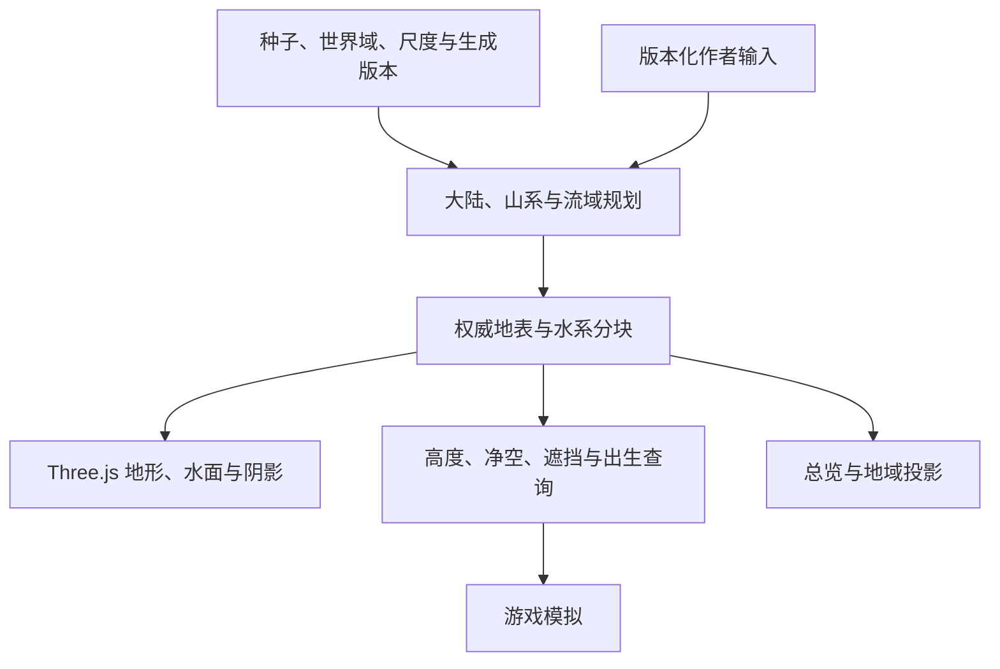

# 连续世界基座与仓库演进设计

导航：[文档索引](../README.md#foundation) · [视觉目标](../game/visual-overhaul.md) · [开发重点](../game/development-priorities.md)

状态：2026-09-30 设计提案，尚未实现。当前运行代码仍是六边形世界；已完成基线留存、仓库职责梳理、设计、首批仓库清理及主线收拢。源码尚未迁入拟议目录，未创建空包，也不把拟议接口描述成现有能力。

本文唯一负责新世界的技术路线、仓库组织、跨层数据合同和实施门槛。当前运行合同继续以索引中的世界生成、渲染流送、地形通行及存档设计为准；落地一个阶段，就同步其所属设计，并从本文移除已被接管的实现细节。

## 基线与决策边界

原游戏开发的代码基线为 `8ce5429`。保留分支 `release/2026-09-29-hex-world-baseline` 的冻结说明提交为 `88e8a5a`，与该代码提交相比只有文档变化；冻结范围、检查范围及未完成事项见 [版本说明](../../CHANGELOG.md#六边形世界基线冻结--2026-09-29)。该分支用于复现对照，不继续功能开发，不表示产品或性能验收通过。

游戏开发、当前设计和仓库清理已统一到 `main`，后续从 main 创建短期任务分支，先推荐同仓实施；冻结与旧实验的留存位置归[分支与归档](../README.md#branches)。已确定的产品约束是写实暗黑、桌面独显、原生 2560×1440 / 60 FPS，以及有意义的山脉、海域和河流；局部画质与完整游戏帧时必须分别验收。开发验证使用单实例短场景，不自行启动本机全量压测。

以下选项尚无用户定案，不以默认值暗中改变产品：

| 选项 | 设计建议与影响 |
|---|---|
| 有限大陆还是无限连续探索 | 推荐有限大大陆的宏观规划与按需细化；现游戏为无限荒野。若保留无限，必须增加层级流域和跨区域出入口合同，不能各渲染块独立排水。首个有限技术样板不等于改变产品世界边界 |
| 浏览器是否必须、是否评估原生引擎 | 先以现有 Three.js/WebGL2 验证数据与绘制基座；若浏览器不是硬约束，应对比成熟引擎的编辑、流送与资产工具成本，再扩大自建规模 |
| 世界尺度与最小细节 | 首个样板确定世界单位、角色尺度、移动速度、近景采样误差及远景轮廓范围；不能把现有显示单位直接解释为米 |

本轮不改变现有拓扑、包名、存档或发布配置。未来格式变更只保留一套新规则，旧版本留在冻结分支；不建设兼容层、双格式存档或运行时静默降级。

## 仓库选择与整理范围

当前根包是可发布的 `three-hex-map`，同时拥有库源码、浏览器演示、Worker 构建和共享资产；`apps/survivor` 通过 `file:../..` 消费它。游戏对该包的依赖不仅在 adapters，还包括会话、表现、持久化与 Worker 协议。直接复制游戏到空仓会把这些依赖一起带走，并不能获得清晰边界。

| 方案 | 收益与实际成本 | 结论 |
|---|---|---|
| 现仓独立分支，逐步改为以游戏为主的 workspace | 保留可追溯历史和测试；数据、绘制、游戏接线可原子提交。必须清理根包和演示职责，不能只新建目录 | 首选，先完成可玩技术样板 |
| 现在新建仓库并复制现有实现 | 名称与发布身份可独立，但生成/资产/Worker/存档边界仍要改；增加双仓同步和证据追踪成本 | 当前没有减少技术工作的收益 |
| 样板成立后再拆仓 | 在包依赖、平台与发布目标明确后迁移，可带入必要历史与来源 | 若确有独立维护、分发或引擎切换需求再执行 |

已清理浏览器构建产物的 Git 副本、过时的 README 截图及不属于当前工具链的忽略模板；演示构建/启动与产物验证同步调整，合同归[包边界](../app-development.md#包与构建入口)。原始资产、有效测量和当前消费者所需的六边形实现继续保留。

源码重排必须跟随实际消费者和构建闭环，不先复制一份 `legacy/`，不让同一职责在两个仓库或目录长期双写。

拟议结构如下，目录尚未创建，包默认私有，公开分发入口另按真实消费者确定：

```text
apps/survivor/       游戏会话、模拟、UI 与适配器
apps/world-lab/      地形样板和诊断入口，使用同一生产生成/渲染模块
packages/world/     世界数据、生成、查询、协议及无 Three.js 依赖的运行机制
packages/render-three/  Three.js 地形/水体/环境绘制和 GPU 资源所有权
scripts/            可复现资产构建、检查与测量
docs/               唯一索引、领域合同与有效证据
```

根包最终只负责 workspace 编排。`world` 内部区分纯计算与 Worker/存储适配，导入纯计算模块不得创建线程、访问 DOM 或打开数据库；通用机制先作为有消费者的内部模块，不再预拆多个基础包。`render-three` 消费世界数据，游戏通过 adapters 接入两者；游戏状态继续归应用。

| 现有部分 | 整理方向与完成条件 |
|---|---|
| `src/runtime` 与 `src/persistence` | 审计状态/资源所有权后复用；有地格耦合的缓存和增量另改协议，不宣称整体可原样搬走 |
| `src/world` | 提取确定性、任务与世界身份机制；替换地格编码、扇面高度及整格水体权威，河网算法按新合同重做 |
| `src/rendering`、`src/objects`、`src/shaders` | 复用宿主、输出与资源机制，替换地形几何/材质接线；先隔离 HexMap 依赖再迁入渲染包 |
| 游戏 core/app/worker/adapters/presentation | 保留领域边界；检查所有包导入、世界切换、Worker 入口和存档，不仅修改适配器文件 |
| 根 `public/` 与演示构建 | 区分演示输入、共享资产和受跟踪产物。world-lab 取代对应验收消费者后再退役旧演示路径，不能当缓存整目录删除 |
| 测试、来源清单和许可证 | 测试随被保护合同迁移；保留协议、取消、容量和独立预期。资产迁移同步来源/构建，保留 LICENSE 及第三方归属原文 |

路径重排时同批更新 package exports、workspace 依赖、Worker URL、tsconfig、构建输入、启动脚本与 CI。尚有消费者的入口不以“旧”作为删除理由；淘汰入口须列明替代调用方，并在该批提交后只有一套生产路径。

## 技术路线与 Three.js 边界

推荐权威连续地表、独立水系数据、规则高程瓦片与四叉树 LOD；六边形仅保留在确实需要它的玩法地域层。更换采样网格本身不产生侵蚀地貌，地貌结构生成与绘制组织分开建设。

| 能力 | 现有基础与缺口 | 本轮设计取舍 |
|---|---|---|
| 地形几何 | WebGL2 能绘制规则网格和采样高度纹理；当前只有六边形 LOD | 自建瓦片层级、误差选择、边界拼接和连续过渡；不把 `THREE.LOD` 当地形系统 |
| 生成与侵蚀 | 已有有界 Worker；没有完整高程/流域载荷 | 权威生成先在 CPU Worker 中有界执行并缓存；宏观规划先行，细节按区准备，不在渲染帧内做多轮侵蚀 |
| GPU 与线程交接 | 渲染提交和上传仍需预算；Worker 不消除 GPU 上传尖峰 | 传输紧凑数组、共享规则网格和限定驻留量；批次上传及首次着色器准备纳入样板记录 |
| 材质与水面 | 已有 PBR、天空、阴影和自定义 shader | 控制材质采样、批次数和透明覆盖；连续河岸/水位从数据生成，不依赖一格一块水面 |
| 大气 | 现有 `SceneOutput` 是 HDR 颜色与深度 renderbuffer | 体积雾先补可采样深度、MSAA 深度解析和有界积分目标，再做深度感知合成；与水面/透明特效一起验收 |
| WebGPU | 当前地形/水/草及光照钩子依赖 GLSL 和 `onBeforeCompile` | 不把换后端作为高度场前置条件；若新负载触发后端门槛，评估 TSL、后处理和资产路径的完整移植 |

[Three.js LOD](https://threejs.org/docs/pages/LOD.html)提供对象距离切换；[GPUComputationRenderer](https://threejs.org/docs/pages/GPUComputationRenderer.html)采用片元计算与往返纹理，并非现成地形生成器；[WebGPU 迁移说明](https://threejs.org/manual/pages/webgpurenderer)要求迁移自定义材质和后处理。后端当前规则归[后端评估](../render-streaming.md#渲染后端与优化门禁)，旧裁剪基准不能证明新地形与体积雾的成本。

全体素及任意破坏不进入首批：当前没有支撑其存储、提取和碰撞成本的玩法需求。高度场一个水平位置只有一个地面高度；悬挑/洞穴需要独立几何及对应碰撞合同，不能只叠显示模型便宣称支持多层通行。Geometry Clipmaps 可作为后续测量候选，不同时开发两套地形 LOD。

## 世界数据与权威边界



权威内容包含地形高程、材质/生态依据，以及具有稳定身份的河段、汇流和水位数据。渲染网格、导航采样、总览和植被都是派生结果，不各自维护另一套噪声、河岸或地表。地域等级六边形消费连续世界位置，不再决定山体形状或整格水陆。

- **坐标与尺度**：逻辑采用规范整数块坐标加局部位置；进入 GPU 时转换为浮动原点附近的坐标。高程单位、编码精度、共享采样点和插值规则写入版本合同；不同请求顺序不能改变边界，法线计算所需邻域有明确所有者和上限。
- **渲染与碰撞**：近景可通行区域使用同源高程与明确插值，细化误差须受角色接地容差约束；远景 LOD 只改变显示精度，不能改变模拟海拔。 shader 微位移有界并进入裁剪与阴影规则，不能提供隐藏的通行地形。
- **水体**：河床高度、水面纵剖面、宽深及岸线来自同一河段。分开表达固体地表与水面；平滑湖面可以没有坡降，普通河段不得逆坡，瀑布属于显式落差。波纹仅为视觉细节。水深与水域覆盖决定通行，小地图不得再把窄河扩成整格水面。
- **载荷与所有权**：世界块为带身份/revision 的不可变数组及有界河段引用。Worker 发布后，ArrayBuffer 转移与必要副本明确计账，转移方不继续读取已移交内容；CPU 查询保留权威采样，不依赖逐帧 GPU 回读。
- **失败与提交**：加载、生成、上传和启用是不同阶段；发布校验会话世代、世界身份和 revision。过期结果释放，未准备完整的地形不能先启用遭遇或把查询结果猜成平地。失败按现有会话语义报告；取消不得留下部分可用世界。
- **持久化**：可重建块进入有界缓存，作者输入和游戏状态分别持久化。新内容身份包含域、尺度、算法版本及规范参数；旧地格增量不伪装成连续高程编辑。跨世界角色提交继续遵守应用事务，不改变库存、技能和奖励归属。

首批不建设通用实时地形雕刻器。world-lab 只提供实际需要的种子/参数输入、山脊与河段约束及诊断图；这些输入必须可保存、重建和参与世界身份，不能手改临时网格作为唯一制作结果。

## 山系与流域生成

生成顺序是大陆/海盆与抬升范围 → 山系/分水岭/盆地出口 → 支流和干流关系及落差 → 河谷切割与有界侵蚀/堆积 → 分块高程和生态分布。山脊与河谷相互约束；噪声补充细节，不承担全部地貌结构。

有限大陆先在受控分辨率的宏观域建立流域关系，再生成细节；不把整片高精度大陆常驻内存。内流盆地、湖泊和出海口必须有明确语义；不能随意把失败河道变成水洼，也不能用排水势能下降代替真实河床落差检查。

若产品保留无限世界，宏观层必须能在有界查询中给出稳定流域身份和跨区出入口，并限制河系影响范围；扩大探索不能倒改已生成下游。局部侵蚀需要共享边界条件和受控邻域，单纯增加瓦片重叠不能保证任意长程水文一致性。该路线需要单独验证，当前不承诺无限域上的全球物理排水解。

可参考[水文驱动地形生成](https://doi.org/10.1145/2461912.2461996)和[抬升与河流侵蚀](https://onlinelibrary.wiley.com/doi/10.1111/cgf.12820)的结构设计。参考论文证明方法存在，不代表本项目已有实现、浏览器运行成本或最终美术品质。

## 资源与验证预算

样板继续以原生 1440p 输出；体积雾内部低分辨率积分须单独注明。依据实际硬件能力校验纹理尺寸、格式和采样资源，不假设一张超大高度图能容纳世界，也不依赖显卡标称显存作为浏览器可用额度。

现有 GPU 上限由 [GameConfig](../../apps/survivor/src/core/GameConfig.ts) 配置；[SceneOutput](../../src/rendering/SceneOutput.ts) 的 HDR 颜色、深度和 MSAA 目标与地形资源共用账本。新基座必须重新测量完整工作集，不能把旧画面的资源余量当作新增能力的预算承诺，账本估算也不等于驱动显存。

第一阶段先登记 CPU 权威数组/传输副本、GPU 高程/法线/材质、阴影与大气目标的最坏驻留量，再决定采样密度与可见范围。新资源必须有账户、上限、峰值重建成本及销毁路径；不把新旧完整地形长期同时驻留，不仅靠抬高总预算掩盖成本。抗锯齿取舍需同时比较画质、深度链与显存。

测量分开记录宏观生成、区块生成、等待、传输/上传、主线程、模拟与 GPU；CPU/GPU 时间不简单相加。除 P95 外记录 P99、最长帧和跨区尖峰，列明样本、硬件、浏览器、分辨率与输入版本。小样板通过不能代替全游戏 60 FPS 验收。

## 实施顺序与退出条件

| 阶段 | 最小交付 | 进入下一阶段的证据 |
|---|---|---|
| D0 决策与合同 | 本文、仓库迁移清单；明确产品域/平台，确定尺度、采样误差和预算 | 数据/线程/持久化边界清楚，有限样板范围已界定；不预建空框架 |
| D1 地表与绘制闭环 | world-lab 使用同一生产模块，几个相邻高程块、至少两档 LOD、角色高度与攻击查询 | 共享边界/法线一致，低镜头无裂缝和明显跳变，负坐标/重建/原点移动不变形，CPU 与 GPU 地表一致 |
| D2 山系与水文样板 | 山脊→山口→峡谷支流→汇流平原→入海口，包含跨块河段和连续岸坡 | 河网连通且落差合理，河床在水面下，汇流/岸线不因块切分变化；游戏路线可以实际走通 |
| D3 流送与游戏接线 | 接入世界切换、存档身份、出生、植被和小地图，完成实际包边界迁移 | 取消/迟到/快速移动/传送均不发布部分世界，反复卸载资源有界；定向真实 Worker/浏览器回归通过 |
| D4 大气与完整画面 | 同样板加入有深度遮挡的雾、水面和现有战斗表现 | 地平线和穿雾无薄片白线，危险预警可读，原生 1440p 下画质/帧时/资源共同验收 |
| D5 扩展与退役 | 推广生成域，删除已被替代的旧入口、测试和构建输出，必要时再拆仓 | 无旧生产调用方，包/构建/文档/资产来源一致，冻结分支仍可独立复现 |

阶段按结果推进，不以代码量或日期宣称完成。若地貌形态不成立，先修生成；若预算不成立，依据归因调整数据和渲染组织，必要时评估后端/引擎，而不是继续叠加高成本效果。

测试按[变更验证矩阵](../testing.md#change-based-local-validation)执行：确定性、共享边界、权威查询、协议/取消、容量/释放和真实像素是不同保护。旧六边形坐标断言只随功能退役删除，不能删掉仍有效的行为保护。D1–D4 首轮采用单浏览器、短路线和定向检查；本轮仅文档检查，不运行这些尚未实现的样板或本机全量压测。
