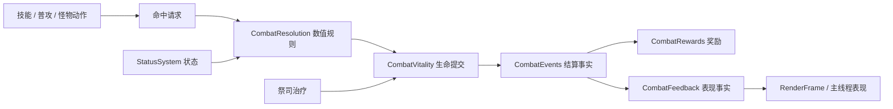

# 战斗结算、状态与后续系统边界

导航：[总导航 · 游戏设计](../README.md#game) · [按任务阅读](../README.md#routes)

2026-09-15 实施。对应 `core/{CombatResolution,CombatVitality,CombatEvents,CombatFeedback,CombatRewards,StatusSystem}.ts` 及 `CombatSimulation`、`CombatWorld`、`SkillSystem`、`EnemyActions` 的接入。
本文的“当前”均指已经接入的代码；最后一节是后续开发顺序。

## 当前职责

| 模块 | 拥有的状态与职责 |
|---|---|
| `CombatSimulation` | 会话命令、固定阶段顺序、背包/打造、等级/经验/属性成长、快照与角色存档协调 |
| `CombatWorld` | 实体身份、组件、空间查询、地形入口，以及有界命中/事件/表现缓冲 |
| `CombatResolution` | 命中、防御、暴击抵抗、姿态减伤、吸血与反伤规则；玩家受击保护与被动盾冷却 |
| `CombatVitality` | 生命扣除/治疗的实际值、死亡事实和实体移除；不计算装备公式、掉落或飘字 |
| `StatusSystem` | 减速、保护减伤、吸收结界的来源、强度、期限、刷新、耗尽与清理 |
| `CombatEvents` | 模拟内部的伤害、治疗、防御结果、死亡事实，按明确阶段同步消费 |
| `CombatRewards` | 击杀数、金币、灵境进度、物品 ID、地面物品表；依据死亡事实发放经验和随机掉落 |
| `CombatFeedback` | 将结算事实映射为受击闪白和飘字；不参与数值规则 |

高频角色与弹道继续采用当前有界 SoA ECS，组件组合仍在出生时确定。Buff 是组件数据，不靠反复增删组件改变实体类型。
技能树、背包、套装配方、任务进度和剧情节点适合独立领域对象；它们没有必要逐 tick 遍历全部实体，也不要求替换 ECS 库。
低频物品和角色命令目前仍在 `CombatSimulation`，尚未完成整个角色领域拆分。

## 结算与事件合同

命中缓冲继续保存完整实体句柄；目标死亡或卸载后的请求不作用于复用该槽的新实体。已释放弹道保留原来源，即使来源已经失效仍可造成伤害；反伤必须再次解析原来源并确认其存活。

玩家攻击按既有顺序计算岩卫正面姿态、命中、输出修正和保护减伤；`CombatVitality.damage` 将生命钳制在零并返回实际损失。吸血使用这个实际值，治疗不超过最大生命。敌方受击结算后提交死亡，立即移出查询和空间索引。
玩家受击依次处理疾行/受击保护、闪避、被动盾、暴击/格挡/防御、保护减伤和结界吸收。反伤直接提交生命损失，不再触发命中、吸血或新的反伤；玩家与攻击者同时死亡时，先记录反伤击杀，再记录玩家死亡。死亡只提交一次。

`CombatEvents` 的每项记录包含种类、来源/目标完整句柄、tick、实际量、坐标、暴击/防御结果和目标的怪物种类、等级、精英/Boss 标记。来源原因区分直接攻击、吸血、反伤、祭司献血和祭司治疗。死亡信息在实体移除前复制，奖励读取事件值，不回读已回收的槽。
当前直接攻击尚未携带具体技能 ID、元素或命中部位；这不是完整的通用技能效果描述语言。

缓冲容量为 `2×MAX_ENEMIES+4=1796`：覆盖一个动作阶段每只祭司的献血/治疗两项，以及一次伤害/反伤/双方死亡事务。采用预分配 TypedArray，正常命中不创建逐条事件对象，也没有订阅表、异步广播或无界历史。
祭司治疗在原动作顺序立即提交生命，动作阶段后的伤害结算先消费这些事实。每笔伤害及其派生效果完成后立即消费，再处理下一笔命中；因此击杀掉落仍在下一次命中掷骰前消耗同一个随机流。

消费者只能同步读取当前缓冲项，不得保存索引或数组作为长期事件历史。奖励消费可以创建经验/掉落实体；不得从消费者递归结算伤害或调用生命修改方法，入口会明确拒绝重入。未来被动触发需要另设有界请求阶段和触发规则，不能直接在回调里互相造成伤害。
事件超量属于权威错误，明确抛出；`CombatEffects`/`CombatText` 满额仍只影响表现。两类缓冲不能合并，视觉丢弃不得使击杀奖励或后续任务丢失。

当前公共生命入口已用于战斗伤害、吸血、反伤和祭司治疗。药剂、自然回复、升级及换装时的生命比例重算仍由角色命令管理，不产生上述战斗治疗事件；接入“受到任意治疗时触发”的被动前必须统一这些语义。

## 状态合同

三个状态种类各有每实体一个实例，使用按种类分段的强度/期限/来源数组和稠密活跃列表。每 tick 只扫描活跃项，到期采用末项交换删除；移除角色清空全部状态，防止槽复用污染。应用接口用完整目标句柄，未知/过期目标不产生效果；非法强度、种类、来源或期限明确报错。

| 状态 | 强度含义 | 重复应用 | 当前消费者 |
|---|---|---|---|
| Slow | 速度降低比例 `(0,1]` | 取较强强度和较晚期限；较弱刷新保留强效果来源，相同强度用新来源 | 霜环；怪物移动与冲锋；脉冲读取未到期减速触发碎裂 |
| Protection | 伤害降低比例 `(0,1]` | 同上 | 祭司保护；双方伤害结算 |
| Barrier | 正数吸收值 | 仍有剩余值时拒绝覆盖；耗尽/到期立即清除后可重新施加 | 玩家守护结界 |

“取强并延时”意味着弱效果可以延长原强效果；当前刷新规则不按每个来源独立计时。效果施加后不要求来源继续存在，剩余强度也不会因来源换装重算。
状态系统当前没有独立多层、每来源多实例、周期伤害、驱散、免疫类别或属性修饰器；增加这些需求时要给出独立规则和容量，不把它们塞进现有强度字段。涡旋、刃阵的周期范围命中由 `SkillSystem` 的三项有界持续施放状态拥有，不作为附着实体的周期伤害 Buff；每次施放结算后消费命中及事件缓冲，再处理下一项。

`slowUntil/slowScale/wardUntil` 是现有消费者使用的投影，唯一写入者为 `StatusSystem`。`wardUntil` 表示祭司保护，不是玩家吸收结界。结界剩余值由 `SkillSystem` 读取状态模块后放入现有技能快照；其所有权已经移出技能对象。耗尽同时清空期限，HUD 不再显示空结界的剩余秒数。

## 保存与表现

角色存档的结界剩余值/期限继续由技能检查点承载，恢复时按已保存 tick 重建仍有效的 Barrier，受击保护与被动盾恢复到 `CombatResolution`，经济字段恢复到 `CombatRewards`。八技能扩展使用 version 2，不保存实体句柄、怪物状态、临时事件缓冲或地面/随身持续施放，不新增格式兼容层；具体保存范围见[角色存档](character-saves.md)。
`CombatEvents` 仅在模拟 Worker 内部消费；主线程接收有界表现帧和低频 UI 快照。内部结算事实不占用额外的表现帧字段、绘制批次或 Worker。动作时间线与技能外观由表现事实控制，尚未实现全套技能表现适配层或角色死亡演出。

## 后续接入顺序

前两项的目标规则统一见[四系技能树与状态设计（待实现）](skill-tree-and-status.md)：包含具体节点、点数/洗点、状态合并、来源快照、触发预算及分阶段验收。本文上方仍是现行实现合同，不能用目标方案解释当前三种状态的实际行为。

1. **技能树与属性修饰器。** 拆分角色成长和构筑配置，按目标方案实现节点事务及技能参数编译，只在构筑变化时重算。现有八技能和四槽提供首批验证消费者，再逐系替换目录和界面。
2. **完整 Buff 与被动。** 与技能树共同设计结算上下文，按冰霜、火焰、雷电/星辰纵向切片接入状态和触发规则；不先建立无消费者的效果框架。当前吸血/反伤是显式规则，不宣称已有通用被动触发器。
3. **套装与连携。** 装备变化时激活套装规则，复用属性修饰器；连携必须定义动作/效果条件、窗口、资源和优先级，以同一结算结果验证，不通过特效重叠判断触发。
4. **任务主线与剧情引导。** 任务消费击杀、物品和世界交互等明确事件，保存稳定的任务/地点进度；剧情读取任务阶段并提交受校验的命令。当前只有战斗事件，没有完整任务事件、地点稳定 ID 或世界进度持久化，不能以 ECS 句柄作为长期任务目标 ID。

每一步先接入一段可游玩的内容验证规则，再扩充数量；通行寻路、战斗占位和主角演出仍按[开发重点](development-priorities.md)继续。

## 验证

`StatusSystem.test.ts` 覆盖强度/来源/期限、独立过期、吸收耗尽、目标槽复用和非法输入。
`CombatEvents.test.ts` 覆盖实际扣血/治疗、过量伤害吸血、重复死亡、相互致死、失效来源、防重入和结界存档；现有战斗、祭司、技能、物品、灵境与 Worker 顺序测试继续执行。
人群基准只测 AI/移动/攻击生成并丢弃命中，同时推进状态并消费事件；赶路基准包含完整结算。二者不能混称为完整围攻性能，也不代表浏览器帧率。当前命令及触发范围见[测试策略](../testing.md)。

固定种子回放比较玩法快照和随机数检查点；事件重构允许排除快照失效版本和空结界期限，但不能排除生命、奖励或随机状态的差异。历史对照版本、场景、终止条件与 CPU 原始样本见[测量索引](../README.md#evidence)，回放不替代数值平衡报告。
飘字测试保护命中当帧和暂停时的时间精度，浏览器验证实例绘制批次；开发页检查通过奖励模块投放物品，验证实际 Vite 模块与未打包 Worker。
