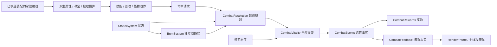

# 战斗结算、状态与后续系统边界

导航：[总导航 · 游戏设计](../README.md#game) · [按任务阅读](../README.md#routes)

2026-09-23 更新。对应 `core/{CombatResolution,CombatVitality,CombatEvents,CombatFeedback,CombatRewards,StatusSystem,BurnSystem}.ts` 及 `CombatSimulation`、`CombatWorld`、`SkillSystem`、`FireCasting`、`LightningCasting`、`StarCasting`、`EnemyActions` 的接入。
本文的“当前”均指已经接入的代码；最后一节是后续开发顺序。

## 当前职责

| 模块 | 拥有的状态与职责 |
|---|---|
| `CombatSimulation` | 会话命令、固定阶段顺序、背包/打造、等级/经验/属性成长、快照与角色存档协调 |
| `CombatWorld` | 实体身份、组件、空间查询、地形入口，以及有界命中/事件/表现缓冲 |
| `CombatResolution` | 命中、防御、暴击抵抗、姿态减伤、吸血与反伤规则；玩家受击保护与被动盾冷却 |
| `CombatVitality` | 生命扣除/治疗的实际值、死亡事实和实体移除；不计算装备公式、掉落或飘字 |
| `StatusSystem` | 十二种标量状态与灼烧投影的统一所有者：来源、控制分类、期限、刷新、耗尽与清理 |
| `SkillSystem` / `PassiveSkills` | 拥有独立被动槽，低频编译已装配常驻属性、寻宝评分与全域拾取开关；与定时 StatusSystem 实例分离，数值/装卸合同见[技能与效果](skills-and-effects.md#通用主动与常驻被动) |
| `BurnSystem` | 灼烧分组和独立层、输出快照、周期相位、期限、替换与消费；由 StatusSystem 持有 |
| `CombatEvents` | 模拟内部的伤害、治疗、防御结果、死亡事实，按明确阶段同步消费 |
| `CombatRewards` | 击杀数、金币、灵境进度、物品 ID、地面物品表；依据死亡事实发放经验和随机掉落 |
| `CombatFeedback` | 将结算事实映射为受击闪白和飘字；不参与数值规则 |

高频角色与弹道继续采用当前有界 SoA ECS，组件组合仍在出生时确定。Buff 是组件数据，不靠反复增删组件改变实体类型。
技能树、背包、套装配方、任务进度和剧情节点适合独立领域对象；它们没有必要逐 tick 遍历全部实体，也不要求替换 ECS 库。
低频物品和角色命令目前仍在 `CombatSimulation`，尚未完成整个角色领域拆分。

## 结算与事件合同

命中缓冲继续保存完整实体句柄；目标死亡或卸载后的请求不作用于复用该槽的新实体。已释放弹道保留原来源，即使来源已经失效仍可造成伤害；反伤必须再次解析原来源并确认其存活。

玩家攻击按既有顺序计算岩卫正面姿态、命中、输出修正和保护减伤；`CombatVitality.damage` 将生命钳制在零并返回实际损失。吸血使用这个实际值，治疗不超过最大生命。敌方受击结算后提交死亡，立即移出查询和空间索引。
玩家受击依次处理疾行/受击保护、闪避、被动盾、暴击/格挡/防御、保护减伤和结界吸收。反伤直接提交生命损失，不再触发命中、吸血或新的反伤；玩家与攻击者同时死亡时，先记录反伤击杀，再记录玩家死亡。死亡只提交一次。

`CombatEvents` 的每项记录包含种类、来源/目标完整句柄、tick、实际量、坐标、暴击/防御结果和目标的怪物种类、等级、精英/Boss 标记。来源原因区分直接攻击、吸血、反伤、祭司献血、祭司治疗和灼烧。死亡信息在实体移除前复制，奖励读取事件值，不回读已回收的槽。
当前直接攻击尚未携带具体技能 ID、元素或命中部位；这不是完整的通用技能效果描述语言。

缓冲容量为 `2×MAX_ENEMIES+4=1796`：覆盖一个动作阶段每只祭司的献血/治疗两项，以及一次伤害/反伤/双方死亡事务。采用预分配 TypedArray，正常命中不创建逐条事件对象，也没有订阅表、异步广播或无界历史。
祭司治疗在原动作顺序立即提交生命，动作阶段后的伤害结算先消费这些事实。每笔伤害及其派生效果完成后立即消费，再处理下一笔命中；因此击杀掉落仍在下一次命中掷骰前消耗同一个随机流。

消费者只能同步读取当前缓冲项，不得保存索引或数组作为长期事件历史。奖励消费可以创建经验/掉落实体；不得从消费者递归结算伤害或调用生命修改方法，入口会明确拒绝重入。未来被动触发需要另设有界请求阶段和触发规则，不能直接在回调里互相造成伤害。
事件超量属于权威错误，明确抛出；`CombatEffects`/`CombatText` 满额仍只影响表现。两类缓冲不能合并，视觉丢弃不得使击杀奖励或后续任务丢失。

当前公共生命入口已用于战斗伤害、吸血、反伤和祭司治疗。药剂、自然回复、升级及换装时的生命比例重算仍由角色命令管理，不产生上述战斗治疗事件；接入“受到任意治疗时触发”的被动前必须统一这些语义。

## 状态合同

`StatusSystem` 拥有下表十二种标量状态及 Burning 周期状态，定义分别声明是否有益、是否控制、强度上限和来源容量。标量数据为预分配 TypedArray、每种/实体最多四个来源槽及稠密活跃列表；Burning 必须通过 `burns.apply` 写入独立层，不能走普通强度刷新入口。强化次数和破盾回护量使用独立的定容数组。
缓存最近到期 tick，平稳无到期时 O(1) 返回；到期仅扫描活跃项，交换删除。目标必须用完整句柄；目标失效返回 false，非法参数抛错；实体移除清状态及控制档案，复用槽不继承。

| 状态 | 强度 / 分类 | 来源与重复规则 | 消费者 |
|---|---|---|---|
| Slow | 最多 .6 减速，减益/软控 | 四来源独立到期，投影取最强 | 怪物/玩家移动，脉冲连携 |
| Protection | 最多 1 的减伤，增益 | 四来源独立到期，投影取最强 | 祭司、双方受击 |
| Barrier | 正吸收量，增益 | 一份，只接受高于剩余量的整体替换；结界技能额外拒绝存续重放；耗尽/到期清除 | 结界、壁垒、破盾回护 |
| Chill | 每来源至多 5 寒意，减益/软控 | 四来源；同来源累计并刷新，每层减速 6%，不同来源取最强减速 | 冰技能、移动投影 |
| Frozen | 1，减益/硬控 | 一份；已冻结不刷新，Boss 或抵抗期拒绝 | 禁止移动/新施法，打断未出手攻击 |
| ControlResistance | 1，增益 | 冻结到期或被碎冰消费后 3s，阻止再次冻结 | 硬控准入 |
| Conductive | 1，减益/非控制 | 一份；重复获得整体替换来源和期限，不叠层 | 雷电后跳选敌、附着电流 |
| StaticGuard | 最多 .05 减伤，增益/非控制 | 一份；重复获得整体替换来源、强度和期限，不叠层 | 雷电命中保护、双方受击与周期伤害、电环 |
| StarEnergy | 1–3 整数层，增益/非控制 | 一份；累加至三层并刷新 8s，灌注消费全部 | 星辉命中、星能环绕 |
| Empowered | 最多 .8 额外输出，1–8 次，增益/非控制 | 一份；强度/次数/期限整体替换，详见下节；期限至多 15s | 技能起手快照、次数 HUD/金色星轨 |
| AstralGuard | 最多 .5 减伤，增益/非控制 | 一份；较弱拒绝，同强/较强整体替换，不给强效果续弱期限 | 庇护/壁垒、几何防护环 |
| Weakened | 最多 .3 输出削弱，减益/非控制 | 四来源独立计时，同来源整体刷新，取最强 | 双方直接命中结算、头顶破环 |
| Burning | 周期伤害，减益/非控制 | 四来源独立分组，每组最多八层，具体见下节 | 火法、周期结算、引爆、附着火焰 |

同来源普通刷新**整体替换强度和期限**，不拆开取最大；不同来源各自计时，弱效果绝不延长强效果。
满四来源时只接受比最弱来源更强的新效果；同强按较早期限选替换候选，新效果不强于候选则拒绝；已有来源仍可刷新。
效果不要求来源继续存活，已生效强度不随来源换装重算。状态不是逐 tick 的 JS 对象或独立定时器。

同来源积累到 5 寒意时消费该来源积累，尝试冻结；冻结/抵抗期间不会靠刷新延长硬控。
普通冻结最长 2s，精英时长乘 .5，Boss 硬控免疫且软减速上限 20%。Boss 寒意满层保留减速，不清空积累。
玩家寒冰韧性与星体坚韧相加，缩短自身新获得的减速、寒意、冻结时长，旧状态期限不重算；状态剩余时间读档时不再次乘抗性。
所有截止时间为整数 tick；自然冻结到期的抵抗从原结束 tick 计算，跳过多个 tick 不额外延长。

`slowUntil/slowScale/wardUntil/frozenUntil/conductiveUntil/staticGuardUntil` 为唯一状态拥有者维护的只读消费投影。`wardUntil` 表示 Protection，不是吸收结界；`canAct/canMove` 统一读取冻结门禁。
标量到期阶段用固定容量标记和目标槽列表去重：先删除本次到期来源，再对每个变化目标重算一次投影，返回前完成发布。自然解冻新增的 ControlResistance 直接读来源记录，与 Barrier 一样没有独立移动/表现投影，施加时不触发整套投影重算。其他附加、消费冻结、移除保护和目标清理仍立即可见；这里不是把死亡、护盾或控制判断延迟到帧尾。
冻结在 AI 决策前取消尚未到出手时刻的攻击，保留原攻击 CD；移动/冲锋暂停。已经释放的弹道与地面攻击保留实际生命周期，不追溯撤回。
取消、耗尽、到期、灼烧消费、次数与净化为显式分支，没有通用移除回调或触发链。沉默、元素抗性和通用被动触发仍是后续计划。
范围周期伤害归技能场，其数量、时间线和装配限制见[技能合同](skills-and-effects.md#施法时间线与战斗提交)；与附着在受击者身上的灼烧分别拥有生命周期。

冰法通过有界命中缓冲传递寒意量/期限、冻结时长、冻结增伤和是否消费冻结。直接附加在命中通过、目标存活后执行；闪避不消费冻结。
霜环/零度区域控制作为独立效果执行，不能与直接命中附加混用。具体技能数值与施法时序见[技能合同](skills-and-effects.md)。

## 灼烧与引爆合同

灼烧到期投影同样使用固定容量脏目标列表，只访问本批实际变化的目标，不扫描全部实体容量。每批捕获跳伤和更新投影后才调用伤害回调，回调可清理、复用目标槽或补加新的灼烧；新增层参加之后的时间批次，不混入已经捕获的旧目标命中。来源分组计数仍使用小型 TypedArray 整段清零，伤害顺序和同源合并规则不变。

一份灼烧层保存完整目标句柄、来源分组、已快照的每跳输出、到期 tick 与下一跳 tick。火系起手快照全部攻击属性，直接命中通过后、目标仍存活时增加一层；被结界全吸收也属于成功命中，闪避不附加。硬控免疫不阻止灼烧。来源死亡/卸载不移除已经附着在其他目标的层，目标死亡/卸载则立即清掉其全部层。

每目标最多四个来源，新增第五来源拒绝；每来源基础五层，燎原专精最多八层。未满加层；已满时，计算各旧层尚未结算的每跳量之和，新层总量不低于最弱旧层才替换该层；相同总量选择先到期、再选择较小池索引。不会刷新其他层，不预发任何一跳，较低层数上限不会追溯删掉旧构筑留下的层。
基础持续 4s、每 .5s 一跳，第一跳在施加后 .5s，包含恰好到期的最后一跳；侧路延长持续，尾段不足完整周期只保留状态，不额外跳伤。施加使用整数 tick，非法来源、强度、时长或层数上限显式拒绝。

每 tick 先处理标量到期，再按时间捕获到期的灼烧周期，推进下一跳并删除到期层，然后提交伤害。每层时钟仍然独立；**同一 tick、同一目标、同一来源的跳伤先求和，再进行一次防御/生命提交**，因为此路径没有逐命中触发器，减伤和护盾吸收对该求和等价。分组按完整目标句柄、来源分组排序，捕获完整句柄后即使前一笔造成死亡/槽复用，也不会误伤新实体。
普通帧只比较最近事件时间；到期时扫描活跃层，排序的是到期来源组。固定全局层池上限 `(MAX_ENEMIES+1)×4×8=28,704`，稠密活跃表、空闲表和每实体短链表复用 TypedArray；待提交队列按实体×四来源有界预分配。不为每层创建对象、计时器、事件订阅或 Worker。

每跳基础量取起手攻击×该技能灼烧倍率×输出增伤×普通/精英增伤快照，不包含直接伤害掷骰、暴击、致命、生命提取或吸血。每次结算读取目标当时的有效保护和 Barrier；目标为玩家时另读取当前护甲/减伤，不触发闪避、格挡、被动盾、.55s 受击保护、疾行免伤、反伤或任何命中附加。周期通过 `CombatVitality` 发出 `EffectCause.Burn`，死亡及掉落沿同一事件通路且只执行一次。玩家死亡立即停止后续模拟与 Z 自动战斗。

引爆只在直接命中成功后消费本人全部灼烧，将未结算的基础量×转化率加到本次直接伤害的输出修正之后，再统一经过目标保护与结界。该附加量不再乘施放者增伤、暴击、致命或生命提取；作为本次直接命中的生命损失参与一次吸血，不创建第二次攻击或反伤链。其他来源继续存续；闪避不消费；没有剩余量不生成引爆表现。自然到期、替换、目标移除、洗点都不会调用引爆路径。
火系耐热体魄直接命中后刷新本人 Protection，两秒期限，不由灼烧触发；减少该节点时仅移除其自体来源保护。没有额外的通用被动触发框架。

## 雷电命中与防护合同

雷电通过有界命中缓冲传递 `lightningValues` 和可选聚焦记录，与火系共用 `castStats` 起手攻击快照。命中后再累计本次轰击对该完整目标句柄的聚焦次数，闪避不累计，目标槽复用不继承；聚焦只修正该笔直接伤害，不制造额外命中。范围、连锁、目标预算与衰减统一归[雷电树](skills-and-effects.md#雷电树)。

成功直接命中后、目标仍存活时附加 Conductive；结界全吸收仍算成功，闪避不附加，Boss 可以导电。导电只提高后续传导候选优先级，不属于控制，不触发减速、冻结或额外伤害；再次施加采用本次来源与完整期限，来源失效不提前清除，目标移除立即清除。
学习静电防护后，雷电成功直接命中刷新本人三秒 StaticGuard，按本次起手节点快照每点 1%、最多 5%。闪避不触发，结界吸收或击杀仍触发；附着灼烧等周期伤害不刷新。减少该节点或洗点仅移除 StaticGuard，不能清掉火系自体 Protection 或祭司保护。
双方直接受击与灼烧周期统一调用 `status.protection`，取仍有效的 Protection、StaticGuard、AstralGuard 最强值，不相加、不额外相乘；各状态独立保存和到期，强保护消失后弱保护可接替。各系自体防护有独立类别，避免来源句柄相同而互相覆盖。

## 星辰强化防护与净化合同

星辉弹成功命中（含击杀、盾全吸收）后，同次施放共用的 `StarImpact` 只允许获得一次星能；闪避不获得。存活目标同时获得虚弱，刃阵每次成功命中也刷新虚弱。虚弱不属于控制、Boss 可受影响，不改变敌人攻击节奏；直接命中结算读取仍可解析的来源当前虚弱，已消失来源不读取复用槽。它不追溯修改已快照灼烧，不降低反伤。

灌注与共鸣只保留一个 Empowered：更强整体替换；相同强度只接受更多次数，或次数相同而期限更晚；较弱、同强但更少次数拒绝。灌注在出手成功写入强化后才消费星能，失败不吞星能。普通技能仍在起手支付法力/CD；因此前摇被打断保留星能但不退资源。每个伤害技能在全部准入校验成功后扣一次强化，最后一次仍完整生效；空放、中断同样消耗，失败施放、普通射击、疾行、纯辅助不消耗。
强化合入本次 `castStats.damageIncrease` 的输出乘区，与原增伤相乘；冰/火/雷/星、脉冲与涡旋全部通过命中缓冲保留起手输出。持续场和所附灼烧使用该快照，后面换装、次数耗尽或强化到期不重算；不再放大引爆消费的已存灼烧输出。没有逐目标、逐弹、逐周期扣次数。

星辰庇护净化只在出手执行，冻结门禁仍阻止起手，不能当成受控时的解控按钮。优先冻结 → 灼烧 → 减速/寒意 → 虚弱/导电；同类按较早期限，再状态 ID、来源 ID 选择。一个标量来源或一个灼烧来源组计一次，后者删除该来源所有层，预算至多五个；冻结移除给予正常控制抵抗，抵抗与其他正面状态不可净化。不触发跳伤、引爆或自然到期回调，未被选中的来源继续计时。

壁垒与结界共用一个 Barrier，壁垒只替换剩余量更少的盾，强度/期限/回护量同时替换，不相加、不继承旧回护。伤害先经防御和最强保护，再经盾吸收，提交溢出生命损失，仍存活才通过 `CombatVitality` 发出一次 `BarrierRecovery` 治疗；普通直接命中及灼烧都走此顺序。到期、替换、清理、洗点不治疗；致死溢出不能复活。庇护独立于盾量，破盾后减伤保留至自身到期。

家园减少任何星辰节点时，清除本人星能、强化、星辰庇护与自体吸收盾，保留外部状态和已付 CD；刃阵未结束或动作忙碌时仍拒绝退款。死亡停止挂机、取消持续施法并清除玩家状态/次数，保留构筑与 CD。跨场景/读档的状态保留规则见下节。

状态附着增加 `starEnergy/empoweredUntil/empoweredCharges/astralGuardUntil/weakenedUntil` 表现投影，仍随双缓冲传输，不为每层或每次强化发消息。选敌至多六项局部排序；刃阵至多一个场、每 .25s 一次空间查询，满人口仍受同一命中缓冲约束。没有逐帧遍历技能树。

## 保存与表现

角色格式 version 10 保存节点、点数、六主动槽、三被动槽、CD、动作恢复以及玩家身上每份状态的剩余 tick/强度/来源分组；强化额外保存剩余次数，Barrier 保存破盾回护快照；灼烧另保存每层输出与距下一跳的 tick，详细校验与场景边界见[角色存档](character-saves.md)。
恢复时自体来源重新对应玩家；外部来源转换成独立的负数来源分组，不可解析为实体或与新世界同号句柄合并。多次读档仍保留分组独立性，不重复施加一次性效果。
灼烧输出已经保存为有限的每跳数值，恢复不再次乘输出加成或控制抗性、不结算离线时间；负数来源只是归属分组，不能作为存活攻击者执行吸血/返还操作。
不保存怪物状态、临时事件或在途技能；保留已付费用和恢复期限，控制负面状态与抵抗不会因读档清掉。

`CombatEvents` 只在模拟 Worker 同步消费。主线程接收低频 UI 快照和固定布局表现帧；冻结投影用于颜色/静止姿态，导电与静电防护投影用于独立附着电流/电环，状态标签和施法条用于 HUD。视觉、草稿与后端状态之间没有反向伤害依赖。

## 后续接入顺序

后续完整效果目标见[扩展计划](skill-tree-and-status.md)。当前规则以上述状态合同及[技能合同](skills-and-effects.md)为准。

1. **四系分支已接入。** 独立节点事务、可达性验证、修正编译、星图六槽和共享动作都有实际消费者；星辰新增次数、净化、虚弱与破盾回护。
2. **继续效果协议与平衡。** 全部主动伤害保留起手输出快照。按真实新增消费者补齐沉默、元素协议和有界被动触发队列；当前吸血/反伤/回护仍为显式规则，不宣称已有通用被动触发器。
3. **套装与连携。** 装备变化时激活套装规则，复用属性修饰器；连携必须定义动作/效果条件、窗口、资源和优先级，以同一结算结果验证，不通过特效重叠判断触发。
4. **任务主线与剧情引导。** 任务消费击杀、物品和世界交互等明确事件，保存稳定的任务/地点进度；剧情读取任务阶段并提交受校验的命令。当前只有战斗事件，没有完整任务事件、地点稳定 ID 或世界进度持久化，不能以 ECS 句柄作为长期任务目标 ID。

每一步先接入一段可游玩的内容验证规则，再扩充数量；通行寻路、战斗占位和主角演出仍按[开发重点](development-priorities.md)继续。

## 验证

`StatusSystem.test.ts` 覆盖强度/来源/期限、独立过期、吸收耗尽、目标槽复用和非法输入。
同步多来源到期另检查下一阶段的移动/减伤/抵抗可见性；`BurnSystem.test.ts` 检查到期回调补加层和后续批次的投影。`node --expose-gc scripts/benchmark-survivor-pipeline.mjs <基线提交>` 对照标量到期、稀疏/满量灼烧及快照复用，并严格比较 1,200 tick 的角色检查点与完整玩法快照；[原始测量](measurements/combat-pipeline-optimization.json) 区分 CPU 微基准与浏览器观测。
`CombatEvents.test.ts` 覆盖实际扣血/治疗、过量伤害吸血、重复死亡、相互致死、失效来源、防重入和结界存档；现有战斗、祭司、技能、物品、灵境与 Worker 顺序测试继续执行。
人群基准只测 AI/移动/攻击生成并丢弃命中，同时推进状态并消费事件；赶路基准包含完整结算。二者不能混称为完整围攻性能，也不代表浏览器帧率。当前命令及触发范围见[测试策略](../testing.md)。

固定种子回放比较玩法快照和随机数检查点；事件重构允许排除快照失效版本和空结界期限，但不能排除生命、奖励或随机状态的差异。历史对照版本、场景、终止条件与 CPU 原始样本见[测量索引](../README.md#evidence)，回放不替代数值平衡报告。
飘字测试保护命中当帧和暂停时的时间精度，浏览器验证实例绘制批次；开发页检查通过奖励模块投放物品，验证实际 Vite 模块与未打包 Worker。
