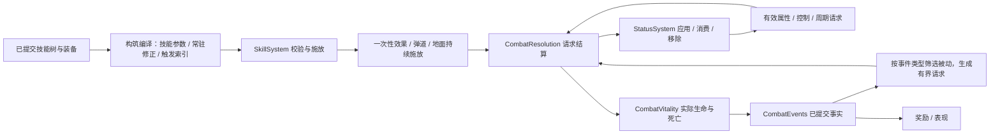

# 四系技能树、Buff 与被动设计

导航：[总导航 · 游戏设计](../README.md#game) · [开发顺序](development-priorities.md)

**状态：2026-09-25 复核，四系技能树、通用主动与可装配常驻被动已实现，其余为扩展设计。** 六主动槽与三被动槽、148 节点及共享施法动作以[技能合同](skills-and-effects.md)为准；十三类状态、次数、净化与来源合并以[战斗架构](combat-architecture.md)为准；当前保存边界见[角色存档](character-saves.md)。本文保留后续完整 Buff/触发被动协议与交互目标，已落地规则只引用所属合同，不能把未实施部分当成现有能力。

技能树、效果和被动统一设计，实施按可玩的纵向切片推进。四系为**冰霜、火焰、雷电、星辰**；技能点仍然每次角色升级获得 1 点。本文的节点结构、来源归属和生命周期是实现目标；具体倍率、门槛、持续时间及容量数字是首轮调校值，必须经行为测试与实测验证，不能当作平衡或性能已经通过的证据。

## 1. 当前接点与后续边界

`SkillBuild` 已拥有点数/节点/revision 和编译修正，`SkillSystem` 拥有六主动槽与三常驻被动槽、CD、施法动作和持续场；冰霜执行在 `FrostCasting`，火焰在 `FireCasting`，雷电在 `LightningCasting`，星辰在 `StarCasting`，独立灼烧层由 `StatusSystem` 持有的 `BurnSystem` 管理。
`StatusSystem` 已实现来源独立到期、增益/减益/控制标签和普通/精英/Boss 档案。`CombatResolution` 已有全系起手输出快照、命中附加、灼烧周期/消费、防护和破盾回护；尚无通用技能 ID/元素/派生效果协议。
减速、冻结、灼烧、导电、静电防护和星辰状态已经按实际状态显示，引爆、落雷与星辰释放由结算的瞬态事实播放；当前表现与容量见[技能合同](skills-and-effects.md)。
构筑不进入逐 tick 的行为树；自动战斗读取当前技能值。三个通用术式脉冲、涡旋、疾风步各有独立十级成长，另有九种可装配常驻被动（50/100/150 级三槽），当前规则见技能合同；结界和刃阵已移入星辰树。旧单点升级命令已由完整构筑事务替代。
不新增 Worker，不更换 ECS，不建立运行时脚本、网络或无消费者的套装框架。

## 2. 点数、前置与构筑规则

当前点数账本、购买顺序可达性、节点上限、互斥、家园退款、revision、六槽与单终极规则统一见[当前成长合同](skills-and-effects.md#技能配置与成长)。
四系均已采用 34 节点结构，分别统计本系投入；混系互不提供前置投入。将来道具/任务送点时增加明确的授予账本，当前每级一点。
当前四系共 136 节点、28 主动，加上三个通用主动和九个常驻被动，共 148 节点、31 主动。点数容量及互斥约束见技能合同；结构上限不能替代无效收益检查与中后期平衡。
当前洗点已清理节点提供的自体保护与星辰临时强化/次数，不触发爆炸或耗尽治疗，保留技能 CD；具体规则见战斗架构。通用常驻被动退款清空归零槽位并重算属性；后续事件触发的被动实例仍需按所属节点和移除原因清理。

## 3. 侧路修正的后续目标

已实现的节点、数值及专精分别见[冰霜树](skills-and-effects.md#冰霜树)、[火焰树](skills-and-effects.md#火焰树)、[雷电树](skills-and-effects.md#雷电树)、[星辰树](skills-and-effects.md#星辰树)和[通用主动与常驻被动](skills-and-effects.md#通用主动与常驻被动)。本节只描述后续统一修正目标，不再复述各系已完成的迁移步骤。

下表保留后续统一修正类型的目标，当前四系侧路公式以技能合同为准。名称表达不同技能风格，不为每个侧路创建独立处理器。

| 修正类型 | 每点初值与上限 |
|---|---|
| 威力（寒锋、炽焰、电势等） | 绑定技能对应的直接伤害或护盾基础量增加 4%；属于同一加法桶，不能每个节点分别乘算 |
| 范围（广域、溅射、环域等） | 对应半径/线宽/传导距离增加 5%；所有树修正合计最高增加 50%，不扩大寻怪驻留范围 |
| 数量（冰屑、弹群、跳跃、分叉等） | 每级增加 1 个技能声明的弹道/穿透/落雷/链目标；分叉只增加整个电网的不同目标预算；普通弹道单次至多 6 枚、穿透至多 8 个、落雷至多 8 次；达到硬上限时 UI 明示边际收益为零并禁止为零收益继续购买 |
| 节流 / 急咏 / 复苏 | 分别每点减少 3% 法力 / 2% 基础冷却 / 2% 终极基础冷却；消耗和冷却都不按节点连乘 |
| 持续（绵延、余烬、长燃、延烧、回旋等） | 每点增加 10% 持续时间；周期次数取完整周期数，保留不足一周期的末段存在时间，不虚报额外伤害；延烧/余烬修饰所附灼烧，其余修饰对应场地/环形持续施放 |
| 控制（深寒、冻凝、缓释） | 分别每点增加 10% 寒意积累 / 10% 寒意积累 / 10% 寒意持续；不绕过冻结时长与抵抗上限 |
| 引爆（蓄能） | 每点增加 4 个百分点的本人灼烧剩余量转化率，与爆燃合计受 80% 上限约束 |
| 周期间隔（速燃） | 每点缩短 3% 周期间隔，最短 0.25 秒；伤害总量随次数变化，预览必须显示实际次数与总量 |
| 连锁衰减（续流） | 每点将后跳保留比例增加 0.02，上限 0.95；聚焦每点给同次轰击后续命中增加 3% 直接伤害，累计最高 15% |
| 强化（增幅、共振） | 每点增加 2 个百分点的次数强化倍率；一次施放最终只能选择一个强化组实例 |
| 强化次数（蓄星、星次数） | 每点增加 1 次，单状态至多 8 次；恒定/周转分别延长次数状态 10% / 减少基础冷却 2% |
| 防护（厚壁、坚壁、持守、久护、净化、回护） | 厚壁/穹顶为护盾威力；坚壁每点增加 2 个百分点的庇护减伤；持守/久护/延展为持续；净化每点增加 1 个可驱散实例，最多 5 个；回护每点在符合耗尽条件时治疗最大生命的 1% |

数量节点必须在配置检查时预留它的完整成长空间。若混系或其他修正使其达到上限，草稿展示失效点并允许家园退款；752 是四系考虑互斥专精后的理论上限，未计通用主动与常驻被动的 108 点，不保证每种混搭都能同时买满。无法获得收益的等级不作为消耗点数的手段。

公共被动的未来统一目标为四类：本系伤害/护盾量每点 +3%；本系法力消耗每点 -2%；本系持续或星辰护盾量每点 +5%；对应元素受伤每点 -2%。**已实现的冰韧性、耐热体魄和静电防护采用技能合同中的控制时长/命中保护规则，不是元素抗性。** 第一类不放大增伤/减伤百分比；第三类星辰护盾与第一类同桶。后续元素协议只含物理/冰霜/火焰/雷电/星辰，旧攻击必须明确标注元素，不能靠未填字段猜测。

冷却统一为 `ceilTicks(max(技能最短冷却, 基础CD × (1-clamp(树与Buff冷却缩减,0,0.4)) / (1+有效施法速度)))`；普通主动最短 0.5 秒、终极最短 10 秒。现有施法速度上限与溢出规则继续归 `CombatStats`。法力减耗合计上限 50%，最终至少消耗 1 点。具体主动基础伤害、法力与 CD 的当前值归技能合同，后续调整须用完整遭遇验证。

## 4. 技能树界面

已接入的星图连线、草稿预览、前置导航、方向键、定位和六槽拖放以[界面设计](interface-design.md)及[技能交互合同](skills-and-effects.md#构筑提交与交互)为准。
当前其他学派页只显示实际可用术式，标明专属分支尚待扩展；没有点了不生效的空节点。
四系已使用独立色调与完整树形；未来加入搜索、缩放、可点节点过滤、退款影响清单时，继续保证关闭入口与装配区固定、窄屏可操作。
当前 HUD 显示十三类状态、灼烧/星能层数、强化倍率/剩余次数、庇护/虚弱比例、剩余时间与施法条。未来完整 Buff 展示继续补充可驱散性、来源和叠加原因。

## 5. 技能、被动、Buff 的从属关系

以下为后续完整协议。当前已实现四系及通用主动输出快照、显式命中附加、有界传导、灼烧周期层、强化次数与净化；尚无通用触发器、完整元素协议和装备被动脚本。

这里的箭头是阶段依赖，**不是回调递归**。一次原始请求先完成事实与奖励消费，再按固定次序处理派生请求，之后才进入下一次原始命中，保留当前随机数与奖励顺序可复核的边界。

| 类别 | 持有者与例子 | 生命周期 |
|---|---|---|
| 永久构筑 | 节点等级、常驻被动、装备属性 | 构筑变化时重算，不创建永久 Buff 每 tick 扫描 |
| 主动技能 | 释放条件、资源、冷却、弹道/范围与效果列表 | `SkillSystem` 拥有一次施放；成功提交时生成上下文 |
| 一次性效果 | 直接伤害、爆炸、治疗、净化、消费灼烧 | 结算一次即结束；爆炸不是持续 Buff |
| 场地持续效果 | 暴风雪、火墙、雷暴力场 | 施放实例拥有中心/范围/周期，查询当时区域；离开范围不再被命中 |
| 附着状态 | 寒意、冻结、灼烧、减伤、吸收盾 | `StatusSystem` 拥有目标实例，来源离开范围不自动移除 |
| 次数状态 | 星能灌注、群星共鸣 | 同时有剩余次数和到期 tick，先耗尽者移除 |
| 触发被动 | 护盾被伤害耗尽后治疗、符合条件的碎裂 | 构筑对象提供触发索引；运行时持有独立内置 CD 和去重信息 |

### 5.1 定义、实例与施放快照

只读目录保存稳定 ID、标签、节点依赖、修正类型和效果参数。节点 ID 使用“系/主动/侧路”的稳定标识，不用会重复的显示名称索引；依赖是无环图，启动校验所有引用、等级范围、互斥组和消费上限。运行时实例只保存目标/来源、强度或层数据、到期/下次周期、次数及上下文引用。定义可以共享，**剩余时长、层数、冷却和施放状态不能共享**。

每次效果请求明确携带：

| 字段 | 含义 |
|---|---|
| 来源实体完整句柄、来源阵营 | 谁发出效果；槽号不能替代带 generation 的身份 |
| 归属角色 ID（有角色归属时） | 谁获得击杀/统计信用；来源失效仍可追溯，但不能借此恢复实体 |
| 目标实体完整句柄 | 谁受到本次效果；失效则本次请求结束，不作用于复用槽 |
| 技能 ID、效果 ID、元素、效果类别 | 来自哪一技能/被动，物理还是元素，直接/周期/反伤等 |
| 根施放 ID、执行序号、派生标记 | 一个多弹、多段、持续施放的共同根，以及当前是哪一次命中 |
| 输出快照 | 施放者攻击、相关永久/临时增伤、暴击参数、绑定技能修正、可触发被动版本 |
| 可触发位集 | 本次是否允许命中被动、暴击被动、吸血、反伤等，不从表现类型推断 |

攻击方在**成功施放时快照**；周期灼烧每一层继承施加它的快照，后续换装不会改变旧层。防御方在**每次实际结算时**读取当时护盾、减伤、易伤与控制。发射后来源死亡的弹道/灼烧可以继续造成伤害并保留归属；给来源治疗、返还资源或加 Buff 时必须再次确认来源仍存活。玩家死亡后仍依现有会话规则停止战斗推进和自动战斗。

快照只保存该效果所需的标量和触发配置，不保留整个旧构筑或无限增长的版本历史；容量随施放、弹道和状态槽有界，实例释放时解除引用。条件增伤的条件在命中时读取目标，所用系数来自攻击方快照。

伤害分为“请求量、护盾吸收量、实际生命损失、过量伤害”，不要共用一个 `amount`。吸血按实际生命损失；护盾受击被动读实际吸收；满血治疗的实际量为 0，不触发“获得有效治疗”。药剂、自然回复也要提交带原因的生命变化事实；升级/换装保持比例是资源调整，不是假装获得一次治疗。

### 5.2 修正计算

永久属性按等级/属性点 → 装备/宝珠 → 常驻节点计算，只在输入变化时重算。技能侧路编译到该技能参数；临时 Buff 生成小型有效属性投影。多个同类“增加伤害”先相加，同类减耗先相加；只有明确标为独立倍率的专精取舍、暴击和目标承伤桶才相乘。

目标的同组保护取最强，不相加；不同减伤类别按剩余伤害相乘，再服从现有数值合同的对应上限，综合常规减伤首轮上限 85%（免疫单独处理）。易伤上限 50%。不把护盾算成减伤，也不把减速算成冻结。

自动穿戴/宝珠比较使用当前**永久构筑**下的同一个评价上下文，临时暴击增益、濒死状态或剩余强化次数不参与换装排序。尚未有实测模型的控制、范围、灼烧收益不能伪装成精确 DPS；先展示分项，扩展装备评分时单独验证，避免此轮顺手重写背包算法。

## 6. Buff 的刷新、叠层与消费

本节为新增效果的目标。已有十三类状态的实际分类、来源容量、寒意阈值、控制档案和到期行为归[状态合同](combat-architecture.md#状态合同)；已实现部分以该合同为准，下表未实现的状态表达后续扩展需求。

持续时间不是冷却。每个状态分别定义 `duration`、`period`、`maxStacks`、合并键、满层策略、驱散标签；技能冷却归技能，被动内置冷却归被动。没有省略字段后的隐式“默认刷新”。

### 6.1 首批状态表

| 状态 | 分组 / 上限 | 再次获得时的处理 | 结束与效果 |
|---|---|---|---|
| 普通减速 | 每目标每效果族保留至多 4 个来源实例；有效值取最强，常规减速上限 60% | 同来源同强度刷新自身期限；强弱不同替换该来源实例的整组强度/期限，不拼接；不同来源独立计时 | 强效果结束后，仍存在的弱效果自然接替；满 4 来源时只用更强候选替换最弱，平手保留旧实例 |
| 寒意 | `(目标, 来源)` 分组，至多 4 个来源；每组积累上限 5，持续 3 秒 | 同来源增加积累并刷新该组；每点积累提供 6% 减速，多个来源取最强而不求和 | 本来源达 5 时消费 5 点并尝试冻结；基础/区域技能对同目标附加间隔见其定义；抵抗时不能存一发必中冻结 |
| 冻结 | 每目标 1 个；普通敌人基础 1 秒，最终至多 2 秒，精英时长减半 | 冻结期间重复尝试不延时、不排队；结束后硬控抵抗 3 秒 | 禁移动、禁新动作；只中断允许中断的前摇，既有飞行弹道/已提交地面效果继续；硬控抵抗不可驱散 |
| 灼烧（已实现） | 当前来源、层数与周期规则见[灼烧合同](combat-architecture.md#灼烧与引爆合同) | 强弱替换、期限及周期相位已接入 | 同来源同刻合并提交、本人消费、输出快照与死亡已接入 |
| 导电 / 静电防护（已实现） | 当前容量与分类见[雷电合同](combat-architecture.md#雷电命中与防护合同) | 独立状态、来源与完整期限替换已接入 | 导电选敌与保护取强、保存及表现已接入 |
| 星能 / 强化次数 / 星辰庇护 / 虚弱（已实现） | 容量与分类见[星辰合同](combat-architecture.md#星辰强化防护与净化合同) | 强弱整组替换、蓄能和有限次数已接入 | 跨系施放快照、减伤取强、净化与退款清理已接入 |
| 增伤 / 易伤 | 按修正组分开；同目标同组最多 4 来源 | 同来源整体更新；跨来源同组取最强并独立到期，满组规则同普通减速 | 明确修饰施放者输出还是目标承伤，不混用同一比例字段 |
| 保护减伤 | 同目标同组最多 4 来源，有效取最强 | 每来源整体更新并独立计时，满组规则同普通减速 | 弱保护不能延长强保护；不同组按统一减伤公式合成 |
| 吸收护盾 | 首版每目标一个吸收池，来源/技能可追踪 | 普通结界有剩余盾时拒绝；终极盾只在新值大于旧剩余时整体替换，不累加、不保留旧期限；同次终极的减伤独立应用 | 伤害耗尽为 `depleted`；到期为 `expired`；替换为 `replaced`，只有声明的结束原因可触发后续 |

一个技能在目标上可以同时造成直接伤害、灼烧和导电，但每个子效果独立声明是否要求命中成功/实际扣血/可受控。首版“命中附加”要求攻击命中且目标未死亡；被护盾完全吸收仍算命中，闪避不附加。霜环与绝对零度的区域控制明确独立于伤害命中率；目标死亡或具有对应免疫仍拒绝。

寒意与普通减速一起取最强，不连乘成近乎静止。Boss 默认硬控免疫、减速最多 20%，仍可接受合法伤害/灼烧/导电；不把冻结自动变成尚未实现的 Boss 失衡条。控制档案由怪物/Boss 动作设计拥有；不可中断阶段继续执行，Buff 不直接调用阶段转换。界面区分“免疫”与“未命中”。

多人/召唤接入前需重新审视当前灼烧来源上限，不悄悄合并来源或挪用击杀归属；当前不实现这些未请求系统。

### 6.2 时间、移除与确定性

- 所有模拟时间使用 120Hz 的整数 tick；暂停冻结，离线不推进，不能使用 `Date.now` 或每状态 `setTimeout`。状态采用末项交换删除时，不能让存储顺序决定结算顺序。
- 同 tick 周期项按到期 tick、目标完整句柄、效果 ID、来源句柄、层序号排序；复用预分配的到期索引缓冲，只排序实际到期项。
- 到期 tick 恰好有最后一跳时，先捕获这笔已到期周期请求，再移除到期状态、更新有效防御投影，最后结算周期请求。因此 4 秒/0.5 秒的灼烧准确结算 8 跳；同 tick 的新攻击读不到已到期增减益。不因画面帧慢跳过应有伤害；继续沿用模拟固定步长与追赶上限。
- 移除原因显式区分 `expired / consumed / depleted / dispelled / replaced / death / despawn / respec / worldReset`。通用的“移除时”不能偷偷包含死亡爆炸、换装爆炸和读档爆炸。
- 目标死亡/卸载先使其失去可命中资格，再清理全部状态与投影；已排队请求再次验证完整句柄。来源消失不删除目标身上已提交的 DoT，目标消失则直接取消。
- 驱散按状态定义的正负和标签匹配，控制抵抗等系统状态不可驱散。多个可驱散实例按“硬控 → DoT → 减速 → 其他”、到期时间、稳定 ID 选择；一次驱散一个灼烧来源组会移除其全部层，不算触发自然到期。

### 6.3 容量与失败语义

只为战斗角色配置状态槽，不给弹道、金币、经验球分配完整 Buff 表。首轮预算每角色最多 32 个状态实例；每个灼烧来源组的至多 8 层使用有界层数据，不按层创建实体。8 个槽预留给冻结/硬控抵抗/护盾及角色专用状态，24 个用于通用来源实例；配置校验确保预留类同时需求不超 8，不让普通减速占满后阻止护盾。

满组规则先于总槽限制。通用槽耗尽时拒绝新增实例并累计按原因分类的诊断，允许更新已有实例；不驱逐别人的控制/护盾、不扩大数组、不回滚同次攻击已经提交的伤害。玩家纯增益技能先检查自己的状态能否接受，再支付资源；包含多个增益时，至少一个效果能产生变化才允许施放，成功接受的效果一次提交，拒绝项明确记录。攻击附带状态返回逐效果结果，不把“伤害命中但状态因上限拒绝”伪报成整体施法失败。

未知定义、非有限数值、负层数、非法周期属于编程/配置错误，在启动校验或权威入口明确拒绝；过期目标、目标免疫、满层拒绝属于正常战斗结果。新增一种效果必须同时提供消费者、合并策略、上限、移除语义和行为测试，不接受只有标签而无执行逻辑的空节点。

## 7. 被动触发与结算顺序

被动分为常驻数值、技能专属修正、条件数值、事件触发四种。前两种在构筑变化时编译；条件数值使用已声明的目标状态/血线谓词；只有事件触发进入运行时索引，按事件类别只访问相关被动，不遍历所有节点。

一次施放依次校验存活、装配/解锁、控制状态、目标资格、资源、冷却和施放容量；成功时一次提交资源、冷却与强化次数，生成输出快照。一次命中先检查身份/敌我/遮挡及命中，再读取目标状态、计算伤害与护盾，提交实际生命；消费灼烧/冻结等与该命中相关的效果必须在这一事务里预留并只提交一次，不能让并列弹道消费同一份层。

死亡事实在普通后置“命中附加 Buff”之前提交，死目标不再挂新状态；需要死后爆炸的被动读取死亡事实中复制的坐标/来源/状态摘要，不重新读取被回收槽。奖励恰好发放一次，不受爆炸特效是否还有容量影响。

| 原因 | 命中/暴击类被动 | 吸血/反伤 | 击杀与资源 |
|---|---|---|---|
| 原始直接攻击，包括明确的区域周期命中 | 允许；每被动声明概率、内置 CD 和去重范围 | 沿该技能声明，默认直接伤害可吸血、可被反伤 | 正常提交击杀 |
| 灼烧周期 | 首版不触发命中/暴击被动，不暴击 | 首版不吸血、不触发反伤 | 正常提交击杀；仅可触发显式允许 DoT 的击杀被动 |
| 被动产生的额外伤害/爆炸 | 不再触发攻击、受击或击杀类派生被动 | 不吸血、不反伤 | 仍有正常击杀奖励和统计 |
| 反伤 | 不触发攻击/反伤链 | 不吸血、不再反伤 | 正常击杀奖励 |
| 治疗/护盾消费/状态结束 | 只进入对应事实类型的被动索引 | 不伪装成攻击 | 只有实际量与匹配的结束原因能触发 |

每个被动默认每个根施放最多触发一次，确需按目标触发的定义必须注明目标上限；长时间存在的 DoT 以每次周期执行作为其允许的击杀触发窗口，仍保留原根施放归属。普通主动的全部弹道/目标共用一个根窗口；声明可逐周期触发的效果以“根施放 ID＋周期序号”分窗，同周期全部目标共用。单个根窗口最多 8 次派生效果，每个派生范围至多 16 个最近目标，同距按完整句柄。所有派生伤害、治疗、状态操作继承窗口，不能申请新根绕过上限；内置 CD 仍跨窗口有效。耗尽触发次数是明示的玩法上限，记录计数，不能变成静默丢队列。连锁闪电等原始主动的多跳按技能容量结算，不挤占被动额度。

派生请求排队后在当前原始请求的事实消费结束再执行，不递归调用 `CombatResolution`。使用有界队列；容量由合法触发数量乘最大展开量推导，初版至少容纳 128 个派生命中，逐目标结算/排空事件。队列超限是实现错误，不能覆盖旧项或借用 128 项视觉特效池。反伤继续保留其当前明确的相互致死顺序，不趁新增 Buff 改动该规则。

三个必须能手算的例子：

1. 冰枪命中冻结目标：读取冻结 → 计算碎冰加成 → 实际伤害/吸血/死亡 → 普通附加寒意（目标仍活着才执行）。普通冰枪不消费冻结，只有声明“消费冻结”的极寒破碎才会移除。
2. 陨星引爆：命中成功 → 预留本人灼烧层 → 计算未结算的基础周期量与引爆比例 → 只经过一次当时目标防御 → 提交伤害并消费对应层。未命中不消费，其他来源的灼烧照常存在。
3. 星能灌注后释放火墙：施放时扣一次强化次数并快照倍率 → 后续火墙命中和所附灼烧继承该快照 → 后面换装或强化到期不重算旧层；不会每跳再扣一次次数或再乘一次灌注。

## 8. 性能、线程与保存

### 8.1 热路径

- 136 个节点仅在加点、洗点、装备/宝珠变动时校验和编译，产出按技能索引的参数、永久属性和事件触发索引。运行时不遍历树、不深拷贝整套构筑。
- 状态继续使用有界 TypedArray、空闲槽和活跃项列表；扫描实际活跃实例，到期后交换删除。没有活跃周期/到期项时用最早待处理 tick 快速跳过；在实测证明需要前不加时间轮、堆或额外 Worker。
- 移速、控制位、保护倍率等投影只在相关状态改变时重算，并在当前结算读取前生效；移动/命中直接读投影，不能每次遍历完整 Buff 表。按目标分桶的实例索引避免重算一个角色时扫描世界。
- 范围技能和传导继续复用空间索引与有界候选缓冲，明确边界、遮挡、最近优先和同距句柄顺序；不扫描全部怪物寻找一个近邻。冻结不会把实体移出空间索引。
- 后续周期技能间隔至少 0.25 秒，每技能最多 1 个；全四系同时四场是待内容调校的目标，当前各系运行数量见技能合同，不宣称已存在四场总门禁。
- Worker 拥有全部玩法状态。主线程只接收构筑 revision、玩家可见状态快照和有界表现；受击瞬间的 HUD 不能反向驱动伤害。沿用快照 10Hz，视觉插值不改变 tick。
- 无状态时空集合快速返回；平稳推进中不创建逐状态/逐跳 JS 对象。效果少时也不能为了最大容量每帧清整张大数组。

### 8.2 存档和生命周期

新格式保存节点等级、已授予/未用点数的可校验账目、装配、技能与被动冷却，以及声明可持久化的玩家状态；不保存编译缓存、UI 草稿、实体句柄、请求队列、怪物 Buff 和在途施放。新格式落地时直接提升版本、拒绝旧格式，按项目要求不做迁移或降级。

玩家临时状态逐定义声明保存策略：首批自体星能、强化次数、护盾和减伤保留剩余 tick/值/次数，重建为新玩家句柄；负面伤害/控制及硬控抵抗也必须保留，避免读档清 Debuff 或绕过抵抗。来自未重建敌人的负面效果保存有限的来源描述和输出快照，不把过期敌人句柄绑定到新实体；其返还/吸血等来源操作不可执行。过图采用明确的 `worldReset` 清理战场附着物，玩家身上声明可保存的正负状态均按同一策略携带；恢复不重复施加一次性效果。

死亡清理运行状态与次数，保留学点和技能/被动剩余冷却；主动 Z 自动战斗停止，F 和手动接管规则沿现有合同。Boss 续战所保存的成员生命/位置继续由副本拥有，Buff 扩展不额外改变副本进度或还原战场的承诺。真正接入保存时同步[角色存档](character-saves.md)及 Worker 校验，不能只修改技能面板。

## 9. 实施顺序与验收

| 剩余阶段 | 可玩的交付与边界 |
|---|---|
| 1. 全量调校 | 基于现有 148 节点、31 主动和九种常驻被动，测开局/中期/200 级与混系构筑、Boss 控制档案、挂机及自动装备评分 |
| 2. 具体触发被动与效果协议 | 先选择真实技能消费者，再补通用技能 ID/元素/派生来源、触发预算与移除原因；不把建完整框架作为玩法验证前置 |
| 3. 状态交互与持久化 | 随新增效果补来源/层数展示、保存策略与 Worker 校验，继续复用当前构筑事务和存档入口 |

每阶段同时交付代码、所属合同与必要测试，不先堆空白节点或给按钮接无效处理器。旧目录、单点升级命令和旧 UI 的替换已经完成；脉冲、涡旋和疾风步保留为有独立成长的通用主动，不属于待删除的旧功能。玩家技能树不是行为树，自动战斗仍消费它的结果。

验收重点：

1. **构筑**：0 点/跨多级/满级/互斥/退前置/跨系门槛/最终整图有效；1 级不凭空赠点；重复及过期 revision 不重复花点；六槽与一个终极限制一致。
2. **状态**：强弱覆盖不续强、来源独立、满层替换、同 tick 最后一跳、护盾耗尽与到期差异、次数只扣一次、免疫/驱散、目标槽复用、来源死亡与读档。
3. **结算**：过量伤害不多吸血、纯吸收仍可附状态、闪避不吃命中附加、引爆只消费本人且只乘一次增伤、防御按生效时读取、DoT/反伤/被动不无限触发、掉落只结算一次。
4. **交互**：四系树定位、前置说明、草稿/取消/应用、键盘与触屏、窄屏滚动、拖装不施法、洗点不刷新 CD；重要 Buff 的层/次数/时间一致。
5. **性能**：无 Buff、满人口单层减速、满人口多层灼烧、集中同 tick 到期、传导与地面范围重叠、Buff 活跃同时打开技能树；记录活跃实例/层数、实际到期量、派生命中、查询候选、P95/P99 和分配量。保持当前性能门禁，新增场景另存测量证据，不能引用旧 AI-only 基准宣称 Buff 已高性能。

文档检查仅验证链接和索引，不证明未实施效果、四系完整成长或性能已通过。落地检查按[验证矩阵](../testing.md#change-based-local-validation)，涉及结算/存档/Worker/界面及热路径时运行对应的游戏测试、构建、浏览器场景及性能基准。

## 10. 参考及取舍

- [Blizzard：Diablo IV Quarterly Update—September 2020](https://news.blizzard.com/en-us/article/23529210/diablo-iv-quarterly-updateseptember-2020) 是历史开发设计，展示主动、升级和被动在树上的区分与构筑选择。这里只参考可见分支与选择成本，不把当年的预发布方案当成现行暗黑规则，也不引入另一套被动点数。
- [Epic：Gameplay Effects](https://dev.epicgames.com/documentation/unreal-engine/gameplay-effects-for-the-gameplay-ability-system-in-unreal-engine) 区分只读效果定义与运行实例、瞬时/持续/周期效果，并显式配置叠层与期限策略。本设计采用这些分离原则；具体层数、强弱替换、触发预算和紧凑数组实现属于本项目方案，不引入 Unreal GAS 的对象和网络体系。

成熟系统提供的是清晰的归属和生命周期；本项目选择有限效果类型、固定结算阶段、有界存储和具体内容驱动扩展。
