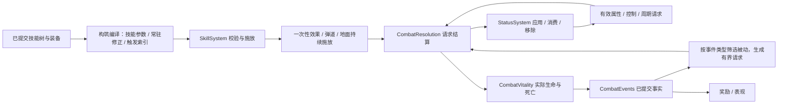

# 四系技能树、Buff 与被动设计

导航：[总导航 · 游戏设计](../README.md#game) · [开发顺序](development-priorities.md)

**状态：待实现的设计，2026-09-19。** 本文定义下一阶段的目标行为，不代表游戏已经具有这些技能或通用 Buff。当前八技能、三种状态、四槽及存档行为分别以[技能与效果](skills-and-effects.md)、[战斗架构](combat-architecture.md)、[角色存档](character-saves.md)和实际代码为准。实现一个阶段时，将已落地规则写回所属运行时合同，并删去本文对应的重复规则，保留尚未实施的内容。

本轮先统一设计技能树、效果和被动的接点，实施按可玩的纵向切片推进。四系为**冰霜、火焰、雷电、星辰**；技能点仍然每次角色升级获得 1 点。本文的节点结构、来源归属和生命周期是实现目标；具体倍率、门槛、持续时间及容量数字是首轮调校值，必须经行为测试与实测验证，不能当作平衡或性能已经通过的证据。

## 1. 与现有代码的接点

| 已有实现 | 扩展方式 |
|---|---|
| `SkillSystem` 保存点数、八技能等级、装配、冷却及持续施放 | 将点数和节点等级交给独立的角色构筑对象；`SkillSystem` 读取编译后的技能参数，继续负责施放和在途技能 |
| `StatusSystem` 的 Slow / Protection / Barrier | 扩展状态定义、实例和有效属性投影；改掉“最强强度与最长期限分别取最大”的隐性续强规则 |
| `CombatResolution` / `CombatVitality` / `CombatEvents` | 补齐技能、元素、来源和触发上下文，保留数值计算、实际生命提交、事实消费的分工 |
| `CombatStats` 与装备、宝珠评分 | 复用同一套永久属性和技能修正计算；临时增伤不能使自动穿戴反复换装 |
| `PlayerAutoCombat`、F 自动施法、四槽、Worker 命令和快照 | 读取最终射程、范围、消耗和冷却；技能树本身不进入每 tick 的行为决策 |
| `EnemyActions` 与 Boss 副本 | 只通过受控的免疫/中断接点处理控制，不在 Buff 内改 Boss 阶段、进度或副本存储 |

不更换 ECS，不新增 Worker，不建立运行时脚本语言，也不为尚无消费者的联网、召唤物继承或装备套装预建框架。当前目录、八技能测试及调用方是实际消费者，不能因为计划替换就先删掉。

## 2. 点数、前置与构筑规则

### 2.1 点数账本

- 沿用当前开局：角色 1 级、未用技能点 0；每升一级加 1，多级升级按实际等级差加点。第一点在 2 级取得，开局由免费普攻承担输出，不另造一套赠点规则。
- 新树的主动节点从 0 级开始，第一点学习技能；每升一阶一律花 1 点。学习和强化共用点数，不另设被动点。
- `已消费点数 = 所有节点等级之和`；当前 `可用总额 = 角色等级 - 1`。将来确有道具或任务赠点时增加独立的已授予总额及原子发奖入口，不提前实现任务奖励账本。
- 四系可混点，各系投入门槛独立计算。点数投入指该系所有已提交节点等级之和；正在购买的这一点不能给自己解锁。
- 保留四个主动槽；被动不占槽。最多装配一个终极技能，可以学习多个终极以便换构筑。公共疾风步保留为不花树点的固定等级机动技能，仍占一个主动槽、仍只能手动释放。
- 技能专属侧路只修改绑定的主动技能，即使其未装配也不外溢到其他技能；全系被动和专精按其明确的作用域生效。

### 2.2 层级与前置

| 节点 | 满级 | 首点前置 | 后续升级 |
|---|---:|---|---|
| 基础主动 | 10 | 角色 2 级 | 有点数即可 |
| 中级主动 | 10 | 角色 8 级、本系已投入 6 点、基础主动 3 级 | 前置始终有效、有点数 |
| 高级主动 | 10 | 角色 20 级、本系已投入 18 点、本分支中级主动 3 级 | 同上 |
| 终极主动 | 5 | 角色 45 级、本系已投入 40 点、本分支高级主动 5 级 | 同上 |
| 每个主动旁的三个侧路被动 | 各 5 | 分别要求绑定主动达到 1 / 3 / 5 级 | 不额外要求角色等级 |
| 每系四个公共被动 | 各 5 | 分别要求本系已投入 2 / 6 / 12 / 18 点 | 门槛扣除该节点自身已投入点数后验证，不能靠自己维持前置 |
| 每分支的专精 | 3 | 角色 30 级、本系已投入 28 点、该分支高级主动 3 级 | 同系两个专精互斥；切换须退回原专精点数 |

除公共被动外，投入门槛同样排除被验证节点自身；实现时统一使用这一规则。分支主动本身不互斥，允许“冰枪输出＋霜环控场”；专精提供取舍，避免点得多就同时获得相反方向的全部优势。购买、退款和读档都验证整张最终图的等级、投入、前置和互斥，不能只验证被点击节点。

每系 7 个主动、21 个专属侧路、4 个公共被动、2 个专精，共 **34 个节点**；四系合计 **136 个节点、28 个主动**。每系结构上的点数容量为 `60 + 105 + 20 + 3 = 188` 点，四系合计 752 点（每系只能选一个 3 点专精；还受第 3.5 节的无效收益限制）。这是有限内容容量，不承诺无限等级都有新节点；超过容量的点数留存，后续靠真实新分支扩容。

一条完整纵向分支，包括基础/中级/高级/终极及其全部侧路、四个公共被动和一个专精，共 `35 + 60 + 20 + 3 = 118` 点。角色 200 级的 199 点可以深挖主分支并搭配另一系；不要求为了终极先点满整条分支。

### 2.3 加点与洗点

K 面板采用**草稿预览 → 一次应用**。单击选节点，详情里的加减按钮修改草稿；明确显示当前等级、草稿等级、剩余点数和最终法力/CD/伤害变化。草稿不影响战斗、不保存、不触发自动换装。关闭时保留本次窗口会话草稿，再提供明确的放弃入口。

首版洗点免费，只允许在家园提交含退款的方案；野外可以提交只增加节点等级的方案。家园仍可能有刚释放的在途技能：有未结束施放时拒绝退款并显示原因。退款不会清空既有技能冷却、被动内置冷却或给生命/法力回满；暂时取消学习的技能仍保留其冷却记录，防止重新学习刷冷却。

减少前置导致后代或其他节点不合法时，预览列出要一并退回的节点和总点数；最终只提交一个合法完整配置，不逐条扣加点。家园退款时清除由已移除节点提供的临时状态与次数，带 `respec` 原因且不触发耗尽/爆炸被动。草稿基于构筑 revision，Worker 收到过期 revision 时拒绝并返回当前状态；双击、重复消息不能重复扣点。

## 3. 四系树的逐级展开

树中 `[主动]` 沿实线向下解锁；每行括号内是该主动的三个侧路被动，依次在主动 1 / 3 / 5 级开放。公共被动是树侧边的四个独立节点；专精从对应高级节点分出，与另一专精互斥。

主动伤害或护盾的等级成长先用线性曲线：普通主动 `基础量 × (1 + 0.06 × (R-1))`，终极 `基础量 × (1 + 0.12 × (R-1))`。控制时长、触发概率、数量不会随主动等级隐式增长，必须在节点上明确列出。下列侧路的数值规则见第 3.5 节；所有倍率与最终上限由同一目录提供给 UI 和模拟。

### 3.1 冰霜：穿刺碎裂 / 减速冻结

```text
[冰霜弹]（寒锋 / 冰屑 / 节流）
├─ 伤害方向
│  └─ [冰枪]（锐冰 / 贯穿 / 急咏）
│     └─ [冰晶风暴]（晶锋 / 扩域 / 绵延）
│        ├─ 专精：碎冰 —— 冰冻目标承受更高直接冰伤，降低本人的冻结积累
│        └─ [极寒破碎]（毁伤 / 崩裂范围 / 复苏）
└─ 控制方向
   └─ [霜环]（霜伤 / 广域 / 深寒）
      └─ [暴风雪]（雪刃 / 雪域 / 冻凝）
         ├─ 专精：永冬 —— 增加冻结积累与时长，降低本人的直接冰伤
         └─ [绝对零度]（寒核 / 极域 / 缓释）
公共：冰霜研习 / 冷静施法 / 冰域掌控 / 寒冰韧性
```

| 主动 | 基本行为及侧路的特殊含义 |
|---|---|
| 冰霜弹 | 远程单体冰弹，命中附加寒意；冰屑增加分散弹道，不允许同次施放对同一目标重复附寒意 |
| 冰枪 | 高倍率直线穿刺；贯穿增加可穿透的不同目标，对已冻结目标的额外收益由碎冰专精控制 |
| 冰晶风暴 | 固定区域内周期冰晶命中，侧重伤害；绵延增加周期次数，每次直接命中有独立执行序号 |
| 极寒破碎 | 一次范围高伤；命中冻结目标额外造成一次碎裂伤害并消耗该冻结，附带寒意仍保留；同次施放每目标至多碎裂一次 |
| 霜环 | 近身环形直接伤害、寒意；深寒增加本次附加的寒意层数，不直接绕过冻结抵抗 |
| 暴风雪 | 固定地面持续区，周期伤害和寒意；冻凝增加积累，寒意受同次施放同目标的 0.5 秒间隔限制 |
| 绝对零度 | 一次范围寒意爆发：对允许冻结的目标尝试直接冻结；抵抗中不延长冻结，Boss 按控制档案处理；缓释延长附带寒意而不无限延长硬控 |

碎冰每级使本人对冻结目标的直接冰伤额外增加 10%，寒意积累统一乘 0.75；永冬每级增加 15% 寒意积累、10% 冻结时长，本人直接冰伤统一乘 0.85。积累允许小数，达到阈值时消费阈值，单次应用最多触发一次冻结。

### 3.2 火焰：灼烧蔓延 / 爆发引爆

```text
[火球]（炽焰 / 溅射 / 节流）
├─ 灼烧方向
│  └─ [灼热射线]（热流 / 延烧 / 速燃）
│     └─ [烈焰火墙]（火势 / 火线 / 余烬）
│        ├─ 专精：燎原 —— 提高灼烧上限与持续输出，降低直接火伤
│        └─ [焚天火域]（焚蚀 / 疆域 / 长燃）
└─ 爆发方向
   └─ [爆裂炎弹]（爆芯 / 弹群 / 急咏）
      └─ [陨星坠落]（陨击 / 冲击范围 / 蓄能）
         ├─ 专精：爆燃 —— 提高直接火伤及引爆转化，降低灼烧持续输出
         └─ [末日炎爆]（终焰 / 毁灭范围 / 复苏）
公共：火焰研习 / 控火节流 / 余热延续 / 耐热体魄
```

| 主动 | 基本行为及侧路的特殊含义 |
|---|---|
| 火球 | 单发碰撞爆炸并附加 1 层灼烧；一次爆炸对一个目标只判定一次 |
| 灼热射线 | 短时引导，定向周期伤害和灼烧；移动/闪避可中断，速燃减少周期间隔但有下限；费用按开始一次支付，取消不退费 |
| 烈焰火墙 | 固定条形区域；每个周期对区域内目标附灼烧；余烬是离开区域后仍正常存续的灼烧，不创建无限地面残留 |
| 焚天火域 | 大范围定时灼烧区；长燃增加固定次数，区域结束不提前移除已经施加的灼烧 |
| 爆裂炎弹 | 多弹小范围爆发；弹群增加弹数，单目标同次施放的伤害命中数由技能上限限制 |
| 陨星坠落 | 保留预告、延迟、固定落点的打法；蓄能为引爆修正：命中时消费本人灼烧，将其剩余基础伤害的一部分加到本次火伤 |
| 末日炎爆 | 大范围直接爆发并消费本人灼烧；不会引爆别人的层；清除原因是 `consumed`，不视为自然到期 |

燎原每级增加 1 层本人灼烧上限及 8% 灼烧伤害，直接火伤统一乘 0.85；爆燃每级增加 10% 直接火伤和 5 个百分点引爆转化率，灼烧伤害统一乘 0.8。基础引爆转化 50%，全来源合计上限 80%；按各层尚未结算的基础周期伤害求和，再统一经过本次目标防御，不能重复乘施放者增伤。

### 3.3 雷电：集中打击 / 连锁传导

```text
[电弧]（电势 / 支路 / 节流）
├─ 伤害方向
│  └─ [雷枪]（高压 / 穿透 / 急咏）
│     └─ [雷霆轰击]（雷威 / 落雷数 / 聚焦）
│        ├─ 专精：过载 —— 提高单点伤害，增加法力消耗
│        └─ [天罚]（天威 / 覆盖 / 复苏）
└─ 传导方向
   └─ [连锁闪电]（初压 / 跳跃 / 远导）
      └─ [雷暴力场]（电场 / 扩域 / 持续）
         ├─ 专精：导流 —— 增加传导能力，降低单次伤害
         └─ [万雷连锁]（主脉 / 分叉 / 续流）
公共：雷电研习 / 电荷节流 / 导电专注 / 静电防护
```

| 主动 | 基本行为及侧路的特殊含义 |
|---|---|
| 电弧 | 短程瞬发；支路增加附近不同目标，不对同一目标回跳 |
| 雷枪 | 直线高伤穿刺，命中附带导电；穿透有硬目标数上限 |
| 雷霆轰击 | 锁定地面多次落雷；聚焦提高命中同一目标的后续倍率，但不能凭空增加落雷次数 |
| 天罚 | 延迟后单点核心和周围范围伤害；核心目标只取核心伤害，不再重复吃外围伤害 |
| 连锁闪电 | 最近可见首目标，后续局部最近且未访问；导电目标优先，同条件按距离、完整句柄排序 |
| 雷暴力场 | 周期脉冲并附导电；每周期最多发起一条短链，属于技能定义的一部分，不用被动互相触发实现 |
| 万雷连锁 | 有界多分支电网，同一执行批次共享访问集合；续流改善衰减，不能使后跳倍率高于首跳 |

过载每级增加 12% 直接雷伤，法力消耗统一乘 1.2；导流每级增加 1 个传导目标及 5% 传导距离，单次直接雷伤统一乘 0.85。普通链总目标上限 12，终极总目标上限 24；这些是整个执行批次的上限，不能每个分叉各算一份。

### 3.4 星辰：技能强化 / 护盾防护

```text
[星辉弹]（星芒 / 星屑 / 节流）
├─ 强化方向
│  └─ [星能灌注]（增幅 / 蓄星 / 恒定）
│     └─ [星环刃阵]（刃芒 / 环域 / 回旋）
│        ├─ 专精：耀星 —— 强化后续主动技能，降低护盾生成量
│        └─ [群星共鸣]（共振 / 星次数 / 周转）
└─ 防护方向
   └─ [守护结界]（厚壁 / 持守 / 节流）
      └─ [星辰庇护]（坚壁 / 久护 / 净化）
         ├─ 专精：守望 —— 提高护盾与减伤，降低直接技能伤害
         └─ [星穹壁垒]（穹顶 / 延展 / 回护）
公共：星辰研习 / 星能节流 / 充盈护盾 / 星体坚韧
```

| 主动 | 基本行为及侧路的特殊含义 |
|---|---|
| 星辉弹 | 基础星辰伤害，命中获得短时星能；星屑增加弹数，同次施放至多获得 1 层星能 |
| 星能灌注 | 消费至多 3 层本人星能，获得“接下来若干次伤害技能强化”的次数状态；没有星能仍可释放基础版本，蓄星提高次数但受上限约束 |
| 星环刃阵 | 跟随玩家的周期环形伤害；回旋增加持续次数，不能靠每个刃片创建一份独立状态 |
| 群星共鸣 | 较强的限时次数强化，可作用于其他三系；与灌注同属强化组，不能两个状态同时给同一次施放乘倍率 |
| 守护结界 | 给自己吸收盾，取施放时最大生命快照；仍有盾时拒绝重复施放，保留当前易理解的规则 |
| 星辰庇护 | 给自己限时减伤；净化在施放瞬间移除允许驱散的负面状态，净化本身不常驻为 Buff |
| 星穹壁垒 | 自身强护盾与限时减伤两个效果；不提供无敌；回护在护盾被伤害耗尽时治疗一次，到期、替换、洗点不触发 |

纯增益主动不能套用伤害成长曲线而出现无效等级：星能灌注基础强化 20%，每个后续主动等级增加 1 个百分点，基础 2 次、每消费一层星能增加 1 次，基础期限 8 秒；群星共鸣基础强化 35%，每个后续主动等级增加 3 个百分点，基础 3 次、期限 10 秒。星辰庇护基础减伤 15%，每个后续主动等级增加 1 个百分点，基础期限 6 秒。守护结界基础盾量为施放时最大生命的 25%、期限 6 秒；星穹壁垒基础盾量为最大生命的 50%、期限 8 秒，附加减伤固定为 20%，盾量按主动等级曲线增长。

耀星每级增加 5 个百分点的次数强化倍率，护盾生成量统一乘 0.85；守望每级增加 10% 护盾生成量和 3 个百分点的星辰庇护减伤，直接技能伤害统一乘 0.9。强化在成功支付资源并提交施放时消耗一次，贯穿本次施放的所有弹道、周期与目标；未成功施放不消耗，主动空放和中途取消会消耗。以上强化倍率叠加上限为额外 80%，单个星辰减伤状态最终不超过 50%，再参与综合减伤计算。

### 3.5 侧路被动、公用数值与容量

三个侧路按表中含义映射到以下有限的修正类型，避免写成任意函数。名称表达不同技能风格，公式归类型目录；首版不把 84 个侧路写成 84 份处理器。

| 修正类型 | 每点初值与上限 |
|---|---|
| 威力（寒锋、炽焰、电势等） | 绑定技能对应的直接伤害或护盾基础量增加 4%；属于同一加法桶，不能每个节点分别乘算 |
| 范围（广域、溅射、环域等） | 对应半径/线宽/传导距离增加 5%；所有树修正合计最高增加 50%，不扩大寻怪驻留范围 |
| 数量（冰屑、弹群、跳跃、分叉等） | 每级增加 1 个技能声明的弹道/穿透/落雷/链目标；分叉只增加整个电网的不同目标预算；普通弹道单次至多 6 枚、穿透至多 8 个、落雷至多 8 次；达到硬上限时 UI 明示边际收益为零并禁止为零收益继续购买 |
| 节流 / 急咏 / 复苏 | 分别每点减少 3% 法力 / 2% 基础冷却 / 2% 终极基础冷却；消耗和冷却都不按节点连乘 |
| 持续（绵延、余烬、长燃、延烧、回旋等） | 每点增加 10% 持续时间；周期次数取完整周期数，保留不足一周期的末段存在时间，不虚报额外伤害；延烧/余烬修饰所附灼烧，其余修饰对应场地/环形持续施放 |
| 控制（深寒、冻凝、缓释） | 分别每点增加 10% 寒意积累 / 10% 寒意积累 / 10% 寒意持续；不绕过冻结时长与抵抗上限 |
| 引爆（蓄能） | 每点增加 4 个百分点的本人灼烧剩余量转化率，与爆燃合计受 80% 上限约束 |
| 周期间隔（速燃） | 每点缩短 3% 周期间隔，最短 0.25 秒；伤害总量随次数变化，预览必须显示实际次数与总量 |
| 连锁衰减（续流） | 每点将后跳保留比例增加 0.02，上限 0.95；聚焦每点给同次轰击后续命中增加 3% 直接伤害，累计最高 15% |
| 强化（增幅、共振） | 每点增加 2 个百分点的次数强化倍率；一次施放最终只能选择一个强化组实例 |
| 强化次数（蓄星、星次数） | 每点增加 1 次，单状态至多 8 次；恒定/周转分别延长次数状态 10% / 减少基础冷却 2% |
| 防护（厚壁、坚壁、持守、久护、净化、回护） | 厚壁/穹顶为护盾威力；坚壁每点增加 2 个百分点的庇护减伤；持守/久护/延展为持续；净化每点增加 1 个可驱散实例，最多 5 个；回护每点在符合耗尽条件时治疗最大生命的 1% |

数量节点必须在配置检查时预留它的完整成长空间。若混系或其他修正使其达到上限，草稿展示失效点并允许家园退款；因此 752 是内容名义点容量，不保证每种混搭都能同时买满。无法获得收益的等级不作为消耗点数的手段。

公共被动按每系前述名称顺序固定为四类：本系伤害/护盾量每点 +3%；本系法力消耗每点 -2%；冰霜为寒意持续、火焰为灼烧持续、雷电为导电持续、星辰为护盾量，每点 +5%；受到对应元素的伤害每点 -2%。第一类不放大增伤/减伤百分比，避免支持倍率反复乘算；第三类星辰被动与第一类护盾加成同桶相加。首版元素只有物理/冰霜/火焰/雷电/星辰，不把旧的“虚空”作为第五棵树悄悄保留。旧攻击入口必须明确标注元素；不能靠未填字段猜测类型。

冷却统一为 `ceilTicks(max(技能最短冷却, 基础CD × (1-clamp(树与Buff冷却缩减,0,0.4)) / (1+有效施法速度)))`；普通主动最短 0.5 秒、终极最短 10 秒。现有施法速度上限与溢出规则继续归 `CombatStats`。法力减耗合计上限 50%，最终至少消耗 1 点。具体主动基础伤害、法力与 CD 表在各系落地时以完整遭遇调校，不将当前八技能数值机械复制到 28 个技能。

## 4. 技能树界面

```text
┌ 冰霜  火焰  雷电  星辰       剩余 12 点   草稿花费 3 点 ┐
│ 本系投入 28 / 下层要求 40          搜索  定位已学  缩放 │
├ 公共被动 ┬ 基础主动 → 两条向下展开的主干 ┬ 节点详情    ┤
│ 研习 3/5 │  [冰霜弹 5/10]              │ 当前 → 下级 │
│ 节流 2/5 │   ├[冰枪]       └[霜环]    │ 总伤害/范围 │
│ ...      │     ├ ○ ○ ○       ├ ○ ○ ○ │ 法力/CD/次数│
│          │  [冰晶风暴]     [暴风雪]    │ 前置与差额  │
│          │     ◇碎冰         ◇永冬    │ 作用于谁    │
│          │  [极寒破碎]     [绝对零度]  │ [-]  [+]    │
├──────────┴────────────────────────────┴─────────────┤
│ 主动槽 [1] [2] [3] [4]       撤销草稿   洗点   应用   │
└─────────────────────────────────────────────────────┘
```

- 主动用方框、侧路/公共被动用圆框、专精用菱形；等级文本和图标并用，不能只靠颜色。已学、可学、前置不足、互斥、草稿五种状态可明确区分。
- 默认看到本系基础至下一层；主干纵向滚动，侧路就地展开/折叠，保留当前节点位置；选终极能高亮所需路径。全树缩略图用于定位，不强迫在巨大画布上找按钮。
- 详情显示独立的“本级→下级”和“整套草稿→当前构筑”；伤害百分比注明乘攻击力还是最大生命，周期显示每跳、间隔、次数和总量；减耗/CD 显示最终数值及上限。
- 锁定提示写“还需本系 7 点、冰枪 3 级”，可点前置定位。搜索名称或“冻结/灼烧/减耗/护盾”等作用标签；没有额外收益的等级说明具体上限。
- 已学习主动继续拖入四槽，键盘与 Pointer Capture 沿用现有装配语义。方向键在相邻节点间移动，Enter 打开详情，按钮负责加点；节点点击不顺便施法或花点。
- 窄屏改为单系纵向树，详情用底部面板；保留点数和应用区，内容可滚动。模态输入不穿透给 WASD、1–4 或 Z。
- Buff HUD 只显示玩家重要状态，给出图标、层数/次数、剩余时间和护盾量；同种多来源合并展示但详情区分来源。怪物头顶只展示关键控制/灼烧/导电，不为每个实例建 DOM。
- 静态树只随所选系和构筑 revision 更新；倒计时由既有模拟时钟插值显示，不能让技能树跟 120Hz 结算一起重渲染。图、文案和规则来自同一节点目录。

## 5. 技能、被动、Buff 的从属关系



这里的箭头是阶段依赖，**不是回调递归**。一次原始请求先完成事实与奖励消费，再按固定次序处理派生请求，之后才进入下一次原始命中，保留当前随机数与奖励顺序可复核的边界。

| 类别 | 持有者与例子 | 生命周期 |
|---|---|---|
| 永久构筑 | 节点等级、常驻被动、装备属性 | 构筑变化时重算，不创建永久 Buff 每 tick 扫描 |
| 主动技能 | 释放条件、资源、冷却、弹道/范围与效果列表 | `SkillSystem` 拥有一次施放；成功提交时生成上下文 |
| 一次性效果 | 直接伤害、爆炸、治疗、净化、消费灼烧 | 结算一次即结束；爆炸不是持续 Buff |
| 场地持续效果 | 暴风雪、火墙、雷暴力场 | 施放实例拥有中心/范围/周期，查询当时区域；离开范围不再被命中 |
| 附着状态 | 寒意、冻结、灼烧、减伤、吸收盾 | `StatusSystem` 拥有目标实例，来源离开范围不自动移除 |
| 次数状态 | 星能灌注、群星共鸣 | 同时有剩余次数和到期 tick，先耗尽者移除 |
| 触发被动 | 护盾被伤害耗尽后治疗、符合条件的碎裂 | 构筑对象提供触发索引；运行时持有独立内置 CD 和去重信息 |

### 5.1 定义、实例与施放快照

只读目录保存稳定 ID、标签、节点依赖、修正类型和效果参数。节点 ID 使用“系/主动/侧路”的稳定标识，不用会重复的显示名称索引；依赖是无环图，启动校验所有引用、等级范围、互斥组和消费上限。运行时实例只保存目标/来源、强度或层数据、到期/下次周期、次数及上下文引用。定义可以共享，**剩余时长、层数、冷却和施放状态不能共享**。

每次效果请求明确携带：

| 字段 | 含义 |
|---|---|
| 来源实体完整句柄、来源阵营 | 谁发出效果；槽号不能替代带 generation 的身份 |
| 归属角色 ID（有角色归属时） | 谁获得击杀/统计信用；来源失效仍可追溯，但不能借此恢复实体 |
| 目标实体完整句柄 | 谁受到本次效果；失效则本次请求结束，不作用于复用槽 |
| 技能 ID、效果 ID、元素、效果类别 | 来自哪一技能/被动，物理还是元素，直接/周期/反伤等 |
| 根施放 ID、执行序号、派生标记 | 一个多弹、多段、持续施放的共同根，以及当前是哪一次命中 |
| 输出快照 | 施放者攻击、相关永久/临时增伤、暴击参数、绑定技能修正、可触发被动版本 |
| 可触发位集 | 本次是否允许命中被动、暴击被动、吸血、反伤等，不从表现类型推断 |

攻击方在**成功施放时快照**；周期灼烧每一层继承施加它的快照，后续换装不会改变旧层。防御方在**每次实际结算时**读取当时护盾、减伤、易伤与控制。发射后来源死亡的弹道/灼烧可以继续造成伤害并保留归属；给来源治疗、返还资源或加 Buff 时必须再次确认来源仍存活。玩家死亡后仍依现有会话规则停止战斗推进和自动战斗。

快照只保存该效果所需的标量和触发配置，不保留整个旧构筑或无限增长的版本历史；容量随施放、弹道和状态槽有界，实例释放时解除引用。条件增伤的条件在命中时读取目标，所用系数来自攻击方快照。

伤害分为“请求量、护盾吸收量、实际生命损失、过量伤害”，不要共用一个 `amount`。吸血按实际生命损失；护盾受击被动读实际吸收；满血治疗的实际量为 0，不触发“获得有效治疗”。药剂、自然回复也要提交带原因的生命变化事实；升级/换装保持比例是资源调整，不是假装获得一次治疗。

### 5.2 修正计算

永久属性按等级/属性点 → 装备/宝珠 → 常驻节点计算，只在输入变化时重算。技能侧路编译到该技能参数；临时 Buff 生成小型有效属性投影。多个同类“增加伤害”先相加，同类减耗先相加；只有明确标为独立倍率的专精取舍、暴击和目标承伤桶才相乘。

目标的同组保护取最强，不相加；不同减伤类别按剩余伤害相乘，再服从现有数值合同的对应上限，综合常规减伤首轮上限 85%（免疫单独处理）。易伤上限 50%。不把护盾算成减伤，也不把减速算成冻结。

自动穿戴/宝珠比较使用当前**永久构筑**下的同一个评价上下文，临时暴击增益、濒死状态或剩余强化次数不参与换装排序。尚未有实测模型的控制、范围、灼烧收益不能伪装成精确 DPS；先展示分项，扩展装备评分时单独验证，避免此轮顺手重写背包算法。

## 6. Buff 的刷新、叠层与消费

持续时间不是冷却。每个状态分别定义 `duration`、`period`、`maxStacks`、合并键、满层策略、驱散标签；技能冷却归技能，被动内置冷却归被动。没有省略字段后的隐式“默认刷新”。

### 6.1 首批状态表

| 状态 | 分组 / 上限 | 再次获得时的处理 | 结束与效果 |
|---|---|---|---|
| 普通减速 | 每目标每效果族保留至多 4 个来源实例；有效值取最强，常规减速上限 60% | 同来源同强度刷新自身期限；强弱不同替换该来源实例的整组强度/期限，不拼接；不同来源独立计时 | 强效果结束后，仍存在的弱效果自然接替；满 4 来源时只用更强候选替换最弱，平手保留旧实例 |
| 寒意 | `(目标, 来源)` 分组，至多 4 个来源；每组积累上限 5，持续 3 秒 | 同来源增加积累并刷新该组；每点积累提供 6% 减速，多个来源取最强而不求和 | 本来源达 5 时消费 5 点并尝试冻结；基础/区域技能对同目标附加间隔见其定义；抵抗时不能存一发必中冻结 |
| 冻结 | 每目标 1 个；普通敌人基础 1 秒，最终至多 2 秒，精英时长减半 | 冻结期间重复尝试不延时、不排队；结束后硬控抵抗 3 秒 | 禁移动、禁新动作；只中断允许中断的前摇，既有飞行弹道/已提交地面效果继续；硬控抵抗不可驱散 |
| 灼烧 | `(目标, 来源)` 分组，最多 4 来源；每组基础 5 层、专精最多 8 层；每层独立强度和到期，基础 4 秒、0.5 秒一跳 | 未满加层；满层时新层仅在“剩余基础伤害总量”不低于最弱旧层时替换该层，平手替换较早到期者；不会刷新其他层 | 每层独立周期；可以消费本来源多层引爆；不会因换装备让旧层变强 |
| 导电 | 每目标 1 个，持续 4 秒，不叠层 | 相同定义刷新完整实例并采用本次来源；导电只改变传导候选优先级，不自动生成新闪电 | 到期消失；传导范围、跳数、衰减仍属于施放者技能 |
| 星能 | 自身，最多 3 层，持续 8 秒 | 叠到上限，刷新整组；被灌注消费后扣除实际层数 | 没有自动增加技能伤害；只是有上限的技能资源状态 |
| 技能强化次数 | 自身同一强化组最多 1 个，最多 8 次，持续至多 15 秒 | 更强实例整体替换；同强度只在次数更多、或次数相同且期限更晚时整体替换；较弱拒绝，不延长强效果 | 成功提交伤害技能消耗 1 次；纯护盾/强化自身不消耗；最后一次仍完整强化该次施放 |
| 增伤 / 易伤 | 按修正组分开；同目标同组最多 4 来源 | 同来源整体更新；跨来源同组取最强并独立到期，满组规则同普通减速 | 明确修饰施放者输出还是目标承伤，不混用同一比例字段 |
| 保护减伤 | 同目标同组最多 4 来源，有效取最强 | 每来源整体更新并独立计时，满组规则同普通减速 | 弱保护不能延长强保护；不同组按统一减伤公式合成 |
| 吸收护盾 | 首版每目标一个吸收池，来源/技能可追踪 | 普通结界有剩余盾时拒绝；终极盾只在新值大于旧剩余时整体替换，不累加、不保留旧期限；同次终极的减伤独立应用 | 伤害耗尽为 `depleted`；到期为 `expired`；替换为 `replaced`，只有声明的结束原因可触发后续 |

一个技能在目标上可以同时造成直接伤害、灼烧和导电，但每个子效果独立声明是否要求命中成功/实际扣血/可受控。首版“命中附加”要求攻击命中且目标未死亡；被护盾完全吸收仍算命中，闪避不附加。霜环与绝对零度的区域控制明确独立于伤害命中率；目标死亡或具有对应免疫仍拒绝。

寒意与普通减速一起取最强，不连乘成近乎静止。Boss 默认硬控免疫、减速最多 20%，仍可接受合法伤害/灼烧/导电；不把冻结自动变成尚未实现的 Boss 失衡条。控制档案由怪物/Boss 动作设计拥有；不可中断阶段继续执行，Buff 不直接调用阶段转换。界面区分“免疫”与“未命中”。

灼烧各层从自己的施加 tick 开始计时，刷新或替换不能抢跑下一跳。来源组满 4 时拒绝新的第五来源；这是明确的首版战斗容量，不悄悄合并来源或挪用击杀归属。扩展多人/召唤前需重新审视该上限，当前不实现这些未请求系统。

### 6.2 时间、移除与确定性

- 所有模拟时间使用 120Hz 的整数 tick；暂停冻结，离线不推进，不能使用 `Date.now` 或每状态 `setTimeout`。状态采用末项交换删除时，不能让存储顺序决定结算顺序。
- 同 tick 周期项按到期 tick、目标完整句柄、效果 ID、来源句柄、层序号排序；复用预分配的到期索引缓冲，只排序实际到期项。
- 到期 tick 恰好有最后一跳时，先捕获这笔已到期周期请求，再移除到期状态、更新有效防御投影，最后结算周期请求。因此 4 秒/0.5 秒的灼烧准确结算 8 跳；同 tick 的新攻击读不到已到期增减益。不因画面帧慢跳过应有伤害；继续沿用模拟固定步长与追赶上限。
- 移除原因显式区分 `expired / consumed / depleted / dispelled / replaced / death / despawn / respec / worldReset`。通用的“移除时”不能偷偷包含死亡爆炸、换装爆炸和读档爆炸。
- 目标死亡/卸载先使其失去可命中资格，再清理全部状态与投影；已排队请求再次验证完整句柄。来源消失不删除目标身上已提交的 DoT，目标消失则直接取消。
- 驱散按状态定义的正负和标签匹配，控制抵抗等系统状态不可驱散。多个可驱散实例按“硬控 → DoT → 减速 → 其他”、到期时间、稳定 ID 选择；一次驱散一个灼烧来源组会移除其全部层，不算触发自然到期。

### 6.3 容量与失败语义

只为战斗角色配置状态槽，不给弹道、金币、经验球分配完整 Buff 表。首轮预算每角色最多 32 个状态实例；每个灼烧来源组的至多 8 层使用有界层数据，不按层创建实体。8 个槽预留给冻结/硬控抵抗/护盾及角色专用状态，24 个用于通用来源实例；配置校验确保预留类同时需求不超 8，不让普通减速占满后阻止护盾。

满组规则先于总槽限制。通用槽耗尽时拒绝新增实例并累计按原因分类的诊断，允许更新已有实例；不驱逐别人的控制/护盾、不扩大数组、不回滚同次攻击已经提交的伤害。玩家纯增益技能先检查自己的状态能否接受，再支付资源；包含多个增益时，至少一个效果能产生变化才允许施放，成功接受的效果一次提交，拒绝项明确记录。攻击附带状态返回逐效果结果，不把“伤害命中但状态因上限拒绝”伪报成整体施法失败。

未知定义、非有限数值、负层数、非法周期属于编程/配置错误，在启动校验或权威入口明确拒绝；过期目标、目标免疫、满层拒绝属于正常战斗结果。新增一种效果必须同时提供消费者、合并策略、上限、移除语义和行为测试，不接受只有标签而无执行逻辑的空节点。

## 7. 被动触发与结算顺序

被动分为常驻数值、技能专属修正、条件数值、事件触发四种。前两种在构筑变化时编译；条件数值使用已声明的目标状态/血线谓词；只有事件触发进入运行时索引，按事件类别只访问相关被动，不遍历所有节点。

一次施放依次校验存活、装配/解锁、控制状态、目标资格、资源、冷却和施放容量；成功时一次提交资源、冷却与强化次数，生成输出快照。一次命中先检查身份/敌我/遮挡及命中，再读取目标状态、计算伤害与护盾，提交实际生命；消费灼烧/冻结等与该命中相关的效果必须在这一事务里预留并只提交一次，不能让并列弹道消费同一份层。

死亡事实在普通后置“命中附加 Buff”之前提交，死目标不再挂新状态；需要死后爆炸的被动读取死亡事实中复制的坐标/来源/状态摘要，不重新读取被回收槽。奖励恰好发放一次，不受爆炸特效是否还有容量影响。

| 原因 | 命中/暴击类被动 | 吸血/反伤 | 击杀与资源 |
|---|---|---|---|
| 原始直接攻击，包括明确的区域周期命中 | 允许；每被动声明概率、内置 CD 和去重范围 | 沿该技能声明，默认直接伤害可吸血、可被反伤 | 正常提交击杀 |
| 灼烧周期 | 首版不触发命中/暴击被动，不暴击 | 首版不吸血、不触发反伤 | 正常提交击杀；仅可触发显式允许 DoT 的击杀被动 |
| 被动产生的额外伤害/爆炸 | 不再触发攻击、受击或击杀类派生被动 | 不吸血、不反伤 | 仍有正常击杀奖励和统计 |
| 反伤 | 不触发攻击/反伤链 | 不吸血、不再反伤 | 正常击杀奖励 |
| 治疗/护盾消费/状态结束 | 只进入对应事实类型的被动索引 | 不伪装成攻击 | 只有实际量与匹配的结束原因能触发 |

每个被动默认每个根施放最多触发一次，确需按目标触发的定义必须注明目标上限；长时间存在的 DoT 以每次周期执行作为其允许的击杀触发窗口，仍保留原根施放归属。普通主动的全部弹道/目标共用一个根窗口；声明可逐周期触发的效果以“根施放 ID＋周期序号”分窗，同周期全部目标共用。单个根窗口最多 8 次派生效果，每个派生范围至多 16 个最近目标，同距按完整句柄。所有派生伤害、治疗、状态操作继承窗口，不能申请新根绕过上限；内置 CD 仍跨窗口有效。耗尽触发次数是明示的玩法上限，记录计数，不能变成静默丢队列。连锁闪电等原始主动的多跳按技能容量结算，不挤占被动额度。

派生请求排队后在当前原始请求的事实消费结束再执行，不递归调用 `CombatResolution`。使用有界队列；容量由合法触发数量乘最大展开量推导，初版至少容纳 128 个派生命中，逐目标结算/排空事件。队列超限是实现错误，不能覆盖旧项或借用 128 项视觉特效池。反伤继续保留其当前明确的相互致死顺序，不趁新增 Buff 改动该规则。

三个必须能手算的例子：

1. 冰枪命中冻结目标：读取冻结 → 计算碎冰加成 → 实际伤害/吸血/死亡 → 普通附加寒意（目标仍活着才执行）。普通冰枪不消费冻结，只有声明“消费冻结”的极寒破碎才会移除。
2. 陨星引爆：命中成功 → 预留本人灼烧层 → 计算未结算的基础周期量与引爆比例 → 只经过一次当时目标防御 → 提交伤害并消费对应层。未命中不消费，其他来源的灼烧照常存在。
3. 星能灌注后释放火墙：施放时扣一次强化次数并快照倍率 → 后续火墙命中和所附灼烧继承该快照 → 后面换装或强化到期不重算旧层；不会每跳再扣一次次数或再乘一次灌注。

## 8. 性能、线程与保存

### 8.1 热路径

- 136 个节点仅在加点、洗点、装备/宝珠变动时校验和编译，产出按技能索引的参数、永久属性和事件触发索引。运行时不遍历树、不深拷贝整套构筑。
- 状态继续使用有界 TypedArray、空闲槽和活跃项列表；扫描实际活跃实例，到期后交换删除。没有活跃周期/到期项时用最早待处理 tick 快速跳过；在实测证明需要前不加时间轮、堆或额外 Worker。
- 移速、控制位、保护倍率等投影只在相关状态改变时重算，并在当前结算读取前生效；移动/命中直接读投影，不能每次遍历完整 Buff 表。按目标分桶的实例索引避免重算一个角色时扫描世界。
- 范围技能和传导继续复用空间索引与有界候选缓冲，明确边界、遮挡、最近优先和同距句柄顺序；不扫描全部怪物寻找一个近邻。冻结不会把实体移出空间索引。
- 周期伤害首批间隔至少 0.25 秒；同种场地持续施放每技能最多 1 个，玩家同时最多 4 个，首版无持续技能叠场。预分配运行槽按法定装配上限推导。
- Worker 拥有全部玩法状态。主线程只接收构筑 revision、玩家可见状态快照和有界表现；受击瞬间的 HUD 不能反向驱动伤害。沿用快照 10Hz，视觉插值不改变 tick。
- 无状态时空集合快速返回；平稳推进中不创建逐状态/逐跳 JS 对象。效果少时也不能为了最大容量每帧清整张大数组。

### 8.2 存档和生命周期

新格式保存节点等级、已授予/未用点数的可校验账目、装配、技能与被动冷却，以及声明可持久化的玩家状态；不保存编译缓存、UI 草稿、实体句柄、请求队列、怪物 Buff 和在途施放。新格式落地时直接提升版本、拒绝旧格式，按项目要求不做迁移或降级。

玩家临时状态逐定义声明保存策略：首批自体星能、强化次数、护盾和减伤保留剩余 tick/值/次数，重建为新玩家句柄；负面伤害/控制及硬控抵抗也必须保留，避免读档清 Debuff 或绕过抵抗。来自未重建敌人的负面效果保存有限的来源描述和输出快照，不把过期敌人句柄绑定到新实体；其返还/吸血等来源操作不可执行。过图采用明确的 `worldReset` 清理战场附着物，玩家身上声明可保存的正负状态均按同一策略携带；恢复不重复施加一次性效果。

死亡清理运行状态与次数，保留学点和技能/被动剩余冷却；主动 Z 自动战斗停止，F 和手动接管规则沿现有合同。Boss 续战所保存的成员生命/位置继续由副本拥有，Buff 扩展不额外改变副本进度或还原战场的承诺。真正接入保存时同步[角色存档](character-saves.md)及 Worker 校验，不能只修改技能面板。

## 9. 实施顺序与验收

| 阶段 | 可玩的交付与边界 |
|---|---|
| 1. 构筑与最小效果合同 | 点数账本、节点依赖/退款事务、共享目录、技能参数编译；补全结算上下文，用现有技能验证修正与冷却不被重置 |
| 2. 冰霜纵向切片 | 冰霜树及界面、寒意/冻结/抵抗、伤害/控制两种专精；验证从基础到终极、侧路与手动/自动施法完整流程 |
| 3. 火焰与周期/消费 | 加入独立灼烧层、火墙、引爆与来源归属；用可手算周期验证刷新、满层、消耗和触发上限 |
| 4. 雷电和星辰 | 接入传导去重、强化次数、护盾/减伤/驱散及对应树；验证混系构筑和多目标负载 |
| 5. 全量调校 | 补齐 136 节点目录、四系演出与说明，测开局/中期/200 级构筑、Boss 控制档案、挂机与自动装备评分 |

每阶段同时交付代码、所属合同与必要测试，不先堆空白节点或给按钮接无效处理器。旧八技能逐消费者替换：霜环/连锁/陨星/结界/刃阵可复用行为，脉冲与涡旋的范围/周期实现可供新技能使用；最终旧目录、旧升级命令和旧 UI 有实际替代后一起删除，疾风步保持公共机动定位。玩家技能树不是行为树，自动战斗仍消费它的结果。

验收重点：

1. **构筑**：0 点/跨多级/满级/互斥/退前置/跨系门槛/最终整图有效；1 级不凭空赠点；重复及过期 revision 不重复花点；四槽与一个终极限制一致。
2. **状态**：强弱覆盖不续强、来源独立、满层替换、同 tick 最后一跳、护盾耗尽与到期差异、次数只扣一次、免疫/驱散、目标槽复用、来源死亡与读档。
3. **结算**：过量伤害不多吸血、纯吸收仍可附状态、闪避不吃命中附加、引爆只消费本人且只乘一次增伤、防御按生效时读取、DoT/反伤/被动不无限触发、掉落只结算一次。
4. **交互**：四系树定位、前置说明、草稿/取消/应用、键盘与触屏、窄屏滚动、拖装不施法、洗点不刷新 CD；重要 Buff 的层/次数/时间一致。
5. **性能**：无 Buff、满人口单层减速、满人口多层灼烧、集中同 tick 到期、传导与地面范围重叠、Buff 活跃同时打开技能树；记录活跃实例/层数、实际到期量、派生命中、查询候选、P95/P99 和分配量。保持当前性能门禁，新增场景另存测量证据，不能引用旧 AI-only 基准宣称 Buff 已高性能。

本次仅完成设计；文档检查验证链接和索引，不证明上述玩法或性能已经实现。落地检查按[验证矩阵](../testing.md#change-based-local-validation)，涉及结算/存档/Worker/界面及热路径时运行对应的游戏测试、构建、浏览器场景及性能基准。

## 10. 参考及取舍

- [Blizzard：Diablo IV Quarterly Update—September 2020](https://news.blizzard.com/en-us/article/23529210/diablo-iv-quarterly-updateseptember-2020) 是历史开发设计，展示主动、升级和被动在树上的区分与构筑选择。这里只参考可见分支与选择成本，不把当年的预发布方案当成现行暗黑规则，也不引入另一套被动点数。
- [Epic：Gameplay Effects](https://dev.epicgames.com/documentation/unreal-engine/gameplay-effects-for-the-gameplay-ability-system-in-unreal-engine) 区分只读效果定义与运行实例、瞬时/持续/周期效果，并显式配置叠层与期限策略。本设计采用这些分离原则；具体层数、强弱替换、触发预算和紧凑数组实现属于本项目方案，不引入 Unreal GAS 的对象和网络体系。

成熟系统提供的是清晰的归属和生命周期；本项目选择有限效果类型、固定结算阶段、有界存储和具体内容驱动扩展。
